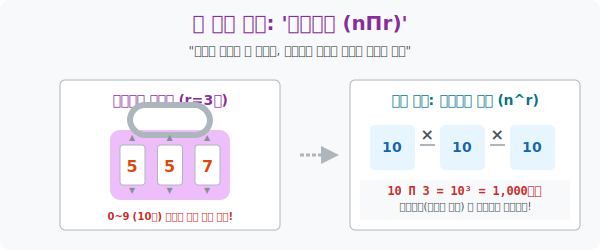

# 4. 무한 리필과 암호 생상의 마법: '중복순열'

## [도입부] 학습 목표 (Learning Objectives)
- 한 번 뽑았던 것을 버리지 않고, 똑같은 놈을 무한정 계속 다시 뽑아 쓸 수(중복) 있는데, 그 놓는 위치(순서) 까지 중요한 어마어마한 경우의 수인 **'중복순열(Permutations with Repetition)'** 을 이해합니다.
- 왜 은행 비밀번호 4자리, 모스부호, 휴대폰 패턴 암호들이 이 중복순열이라는 수학적 엔진 위에 만들어져 있는지, 엄청나게 폭발하는 **'거듭제곱($n^r$)'** 의 폭발력을 계산해 냅니다.
- 파이썬(Python)의 문자열과 리스트 순회 무기인 `itertools.product` 를 활용하여, 무차별 대입(Brute-Force) 으로 3자리 비밀번호 자물쇠를 순식간에 모두 렌더링하고 박살 내는 해킹 코드를 구축해 봅니다.

---

## 1. 비밀번호 자물쇠의 무서운 진실

우리가 흔히 보는 캐리어 가방의 3자리 비밀번호 자물쇠를 떠올려 봅시다.
첫 번째 칸은 $0 \sim 9$ 까지 총 10개의 숫자, 두 번째 칸도 $0 \sim 9$ 까지 10개, 세 번째 칸도 10개입니다.

비밀번호를 `5 - 5 - 7` 로 맞출 수 있나요? 네, 물론입니다! 
앞에서 `5` 를 썼다고 해서 두 번째 칸에서 `5` 를 못 쓰는 게 아닙니다. 완전히 독립적으로 초기화된 똑같은 후보군 10명이 무한 리필되어 대기하고 있습니다. 이것이 바로 **'중복'** 의 허용입니다.

자, 게다가 `5 - 5 - 7` 과 `7 - 5 - 5` 는 같은 비밀번호입니까? 완전 다릅니다. 이 캐리어는 순서가 틀리면 절대 열리지 않습니다. 이것이 바로 위치와 좌표가 중요한 **'순열'** 의 개념입니다.

**두 가지 극강의 조건(무한 리필 + 위치 엄수) 이 합쳐진 조합**, 수학자들은 이것을 '중복순열' 이라 부르며 원주율 기호의 대문자인 $\Pi$ (파이) 를 가져와 **${}_n\Pi_r$** 로 표기합니다.

**[계산의 파괴력]**
* 첫 번째 다이얼 구멍: 10개 가능 (0~9)
* 두 번째 다이얼 구멍: 파묻힌 10개가 무한 재스폰 됨. 또 10개 가능!
* 세 번째 다이얼 구멍: 또 똑같은 10개가 무한 재스폰!
* 곱의 법칙 발동 $\rightarrow$ **$10 \times 10 \times 10 = 10^3 = 1,000$가지!**

공식은 아주 단순명료한 **$n^r$**(거듭제곱) 으로 진화합니다. $r$ 개수 구멍만큼 똑같은 놈($n$) 을 계속 곱해버리면 끝입니다.



<br>

## 2. 모스 부호와 바코드: 정보를 담는 그릇

우리가 지금 눈으로 읽고 있는 모니터 너머의 데이터 세상도 전부 중복순열 덩어리들입니다.
* **이진법(Bit) 의 우주**: $0$ 과 $1$, 기호는 딱 2개뿐입니다($n=2$). 하지만 이 전깃줄을 8개($r=8$) 연결하면? ${}_2\Pi_8 = 2^8 = 256$ 가지의 알파벳과 특수문자를 모두 찍어낼 수 있는 거대한 매트릭스(1 Byte) 가 창조됩니다.
* **모스 부호 (돈, 쯔)**: 짦은 신호($\cdot$) 와 긴 신호($-$) 2가지로 5번을 보냅니다. ${}_2\Pi_5 = 2^5 = 32$ 가지의 비밀 작전 명령이 생성됩니다. 

중복순열은 가장 적은 재료($N$) 만 가지고도, 자리 수($R$) 만 쭉쭉 늘리면 우주의 원자 개수보다 더 많은 정보를 무제한으로 복사해 내뿜을 수 있는 디지털 시대 최고의 프로그래밍 도구입니다.

---

## 3. 💻 파이썬(Python) 데카르트 곱(Cartesian Product) 해킹

자물쇠 번호를 잃어버려서 `000` 부터 `999` 까지 다 돌려봐야 할 때(무차별 대입 공격, Brute Force), 인간의 손가락은 죽어 나가지만 파이썬의 `itertools.product()` 모듈은 0.01초 만에 1,000개의 딕셔너리를 무한 중복 생산해 토해냅니다. 

### 🐍 파이썬 예제: Brute-Force 패스워드 크래커 구축

```python
from itertools import product
import time

print("--- 🔓 파이썬 해킹 머신: 자물쇠 Brute-Force 공격 개시 ---")

# 자물쇠 한 칸에 들어갈 수 있는 후보군 정보 (순열의 n 대상, 파이썬은 문자열 덩어리로 던져도 됨)
keypad = "012345678" + "9" # 가독성을 위해 끊었지만 그냥 '0123456789'

# 캐리어 자물쇠의 자리 수 (순열의 r 슬롯)
slots = 3

print(f" [타겟 분석] 후보 숫자 {len(keypad)}개 콤보 / 구멍 수 {slots}개")
print(f" [수학 분석] 중복순열 공식 n^r = 10^3 = {len(keypad)**slots} 개의 조합 발생 예정")

# 무차별 공격용 무기 product(데카르트 곱) 장전! 
# repeat 옵션에 슬롯 개수를 박아 넣으면, 알아서 중복을 허용해서 긁어모읍니다.
crack_list = list(product(keypad, repeat=slots))

# 내 실제 캐리어 비밀번호
target_pw = "729"

attack_count = 0
start_time = time.time()

print("-" * 50)
# 공격 시작 (0,0,0 부터 9,9,9 까지!)
for attempt_tuple in crack_list:
    attack_count += 1
    # 튜플 ('7', '2', '9') 을 깔끔한 문자열 "729" 로 조립
    guess_pw = "".join(attempt_tuple) 
    
    # 정답 검열! (If 문)
    if guess_pw == target_pw:
        end_time = time.time()
        print(f" 🚨 [침투 성공! BINGO!] {attack_count}번의 공격 끝에 자물쇠가 열렸습니다!")
        print(f"    -> 해제된 비밀번호: [ {guess_pw} ]")
        print(f"    -> 소요 연산 시간: {end_time - start_time:.4f}초만에 박살냄.")
        break  # 찾았으면 더 짤짤이 돌릴 필요 없이 엔진 강제 정지!

# 결과창:
# --- 🔓 파이썬 해킹 머신: 자물쇠 Brute-Force 공격 개시 ---
#  [타겟 분석] 후보 숫자 10개 콤보 / 구멍 수 3개
#  [수학 분석] 중복순열 공식 n^r = 10^3 = 1000 개의 조합 발생 예정
# --------------------------------------------------
#  🚨 [침투 성공! BINGO!] 730번의 공격 끝에 자물쇠가 열렸습니다!
#     -> 해제된 비밀번호: [ 729 ]
#     -> 소요 연산 시간: 0.0002초만에 박살냄.
```

해커들은 여러분이 사이트에 설정한 4자리 은행 핀 번호를 이 파이썬 프로그램을 돌려 단 0.0019초 만에 1만 개의 조합을 모조리 계산하여 뚫어버립니다. (이를 막기 위해 은행은 "5회 이상 틀리면 접속 차단" 이라는 If 문 블로킹을 걸어둔 것입니다!)

---

## [결론] 학습 정리 (Summary)

1. **중복순열 (${}_n\Pi_r = n^r$)**: 똑같은 카드를 무한대로 가져다 써도 되면서, 어느 자리(순서) 에 박히느냐에 따라 전혀 새로운 암호문이 되어버리는 궁극의 조합 복사기입니다.
2. **거듭제곱의 미학**: 1,000개의 데이터 후보군을 3번만 돌려도 $1000 \times 1000 \times 1000 = 10$억이라는 우주적인 경우의 수 폭발량을 낳는 무서운 스케일 업을 보여줍니다.
3. **디지털의 언어**: 비트 컴퓨터의 이진수 변환, QR코드 픽셀의 생성 방식, 바코드의 줄무늬 등 현대 IT 문명을 지탱하는 모든 인코딩(Encoding) 기술의 뼈대가 됩니다.
