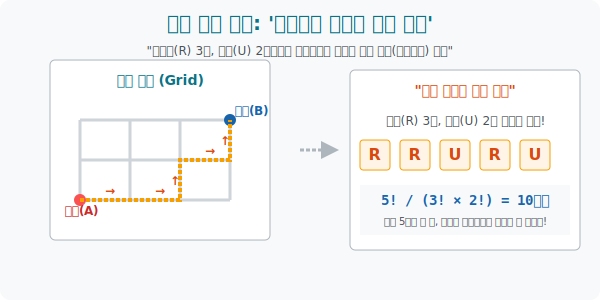

# 5. 미로 탈출과 같은 문자의 해킹: '직사각형 최단 경로'

## [도입부] 학습 목표 (Learning Objectives)
- 바둑판 모양의 뉴욕 시내 도로망을 뚫고 지나가는 네비게이션 시스템의 '최단 경로 찾기' 매커니즘이 사실은 **'같은 문자가 있는 순열(동자순열)'** 의 완벽한 번역 게임이었음을 깨닫습니다.
- 왜 똑같은 문자들이 우글거릴 때는 뒤섞어 봐야 어차피 똑같은 우주이므로 무자비하게 나누기($\div$) 로 팩토리얼($!$) 성을 깎아내려야 하는지 중복 회피 공식을 분해합니다.
- 파이썬(Python)의 수학 엔진인 `math.factorial` 을 엮어서 수백 칸의 미로를 1초 만에 최적화하여 경우의 수를 토해내는 길 찾기 모듈을 코딩해 봅니다.

---

## 1. 도시의 바둑판, 네비게이션의 꼼수

우리는 가로로 3칸(Right), 세로로 2칸(Up) 움직여야만 목적지에 도착할 수 있는 바둑판 미로의 왼쪽 아래 끝(Start) 에 서 있습니다.
어떤 괴짜는 이렇게 갑니다. "오른쪽, 오른쪽, 위, 위, 오른쪽!" $\rightarrow$ `R R U U R`
어떤 기계는 이렇게 갑니다. "위, 오른쪽, 오른쪽, 오른쪽, 위!" $\rightarrow$ `U R R R U`

**[텍스트 변환의 마술 (문자 나열)]**
가만히 보면, 우리가 가는 모든 꼬부랑길의 경우의 수는 결국 단 하나의 절대불변의 법칙으로 수렴합니다.
**"알파벳 R(Right) 3개와 알파벳 U(Up) 2개를 무작위로 1열로 나열하는($5!$) 모든 경우의 수 모음집"** 입니다.
수학자들은 현실의 공간적 미로를, 순식간에 **'5개의 문자 배열하기'** 문제로 강제 압축(Encoding) 시켜버렸습니다.

<br>

## 2. 복제인간들의 반란: 동자순열 (같은 것이 있는 순열)

자, 5개의 문자를 일렬로 세웁니다. 원래대로라면 $5! = 120$ 가지의 줄서기가 맞습니다.
하지만 치명적인 버그가 터졌습니다. **첫 번째 R과 두 번째 R이 서로 자리를 바꾼다고 해서, 120가지 안에 포함될 자격이 있나요?** 아닙니다! 둘 다 그냥 '오른쪽 이동' 이라 눈으로 봤을 때 완전히 똑같은 `R` 지도일 뿐입니다. (구분 불가)

1. **전체 배열**: 일단 무식하게 다르게 생겼다고 가정하고 5개를 깝니다 $\rightarrow$ **$5! = 120$**
2. **R 세 쌍둥이의 폭동 진압**: 그 안에서 자기들끼리 엎치락뒤치락 자리를 바꾸며 뻥튀기 된 가짜 숫자들을 모조리 척결(나누기) 합니다. $\rightarrow$ **$\div 3!$**
3. **U 쌍둥이의 폭동 진압**: 세로로 가는 쌍둥이들끼리 비빈 것도 가짜입니다. $\rightarrow$ **$\div 2!$**
4. **최종 계산식**: **$\frac{5!}{3! \times 2!} = \frac{120}{6 \times 2} = 10가지$**

네비게이션 알고리즘은 이렇게 **"일단 전체를 세우고, 똑같이 생긴 놈들(복제 인간) 의 수만큼 팩토리얼로 나누어 버리는 (깎아 내리는)"** 무자비한 분수 계산기를 탑재하고 움직입니다.



---

## 3. 💻 파이썬(Python)의 최단 경로 AI 길잡이

수백 칸의 도로망(수백 팩토리얼) 은 분모, 분자가 폭주하여 계산기마저 '오버플로우(OverFlow)' 로 터져버리게 만듭니다. 파이썬의 `math.factorial` 무기로 이 몬스터 수식을 1초 만에 깔끔하게 다려봅시다.

### 🐍 파이썬 예제: 미로 최단 경로(동자순열) 매크로 계산기

```python
import math

print("--- 🗺️ 네비게이션 AI: 직사각형 타일 최단 경로 산출기 가동 ---")

# (가시적 세팅) 강남대로의 가로 블록은 7개, 세로 블록은 5개라고 치자!
horizontal_steps = 7  # 문자 R 의 개수
vertical_steps = 5    # 문자 U 의 개수

total_steps = horizontal_steps + vertical_steps
print(f" [경로 파악] 우회전 {horizontal_steps}번, 전진 {vertical_steps}번 -> 총 {total_steps}칸 이동 퀘스트!")

# 수학의 마법 분수식 건설 ( 분자 / (분모1 * 분모2) )
# Division(나누기) 는 파이썬에서 소수점(float)을 만드므로 깔끔하게 정수 몫(//) 기호를 씁니다.
numerator = math.factorial(total_steps)
denominator = math.factorial(horizontal_steps) * math.factorial(vertical_steps)

shortest_paths_count = numerator // denominator

print("-" * 50)
print(f" ✅ [수학적 알고리즘(동자순열) 계산 완료]")
print(f"    당신이 A에서 B로 최단 거리로 갈 수 있는 모든 경우의 수 지도(Map)는")
print(f"    총 💥 {shortest_paths_count}가지 💥 존재합니다.")

# 결과창:
# --- 🗺️ 네비게이션 AI: 직사각형 타일 최단 경로 산출기 가동 ---
#  [경로 파악] 우회전 7번, 전진 5번 -> 총 12칸 이동 퀘스트!
# --------------------------------------------------
#  ✅ [수학적 알고리즘(동자순열) 계산 완료]
#     당신이 A에서 B로 최단 거리로 갈 수 있는 모든 경우의 수 지도(Map)는
#     총 💥 792가지 💥 존재합니다.
```

배달의민족이나 택시 어플의 맵(Map) 은 도로 중간에 공사판(장애물) 이 터질 때 이 계산식을 우회하여 수십만 번 재연산 해가며 내비게이션 선을 실시간으로 갱신하는 것입니다.

---

## [결론] 학습 정리 (Summary)

1. **공간 미로의 텍스트 다운그레이드**: 거대한 현실의 2D 공간 이동을, 우(R), 상(U) 이라는 1차원의 단순한 알파벳 배열 문제로 뜯어고쳐(인코딩) 푸는 발상의 전환입니다.
2. **같은 문자가 있는 순열 (동자순열)**: `banana` 라는 글자를 뒤섞을 때, a가 3개, n이 2개라서 겉보기에 구분이 안 되는 중복 배열들이 어마어마하게 탄생합니다.
3. **폭동 진압 공식**: 우주 전체 배열의 크기($N!$) 를 분자(위) 에 놓고, 헷갈리게 만드는 복제 괴물들의 수($A!, B! \cdots$) 만큼 분모(아래) 로 마구 나누어 깎아 내리는 절대 방어 공식을 가집니다.
