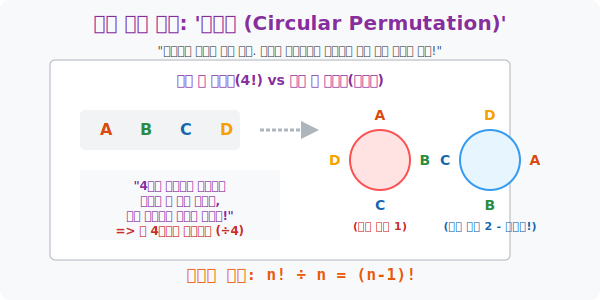

# 6. 시작과 끝이 없는 우주: '원순열 (Circular Permutation)'

## [도입부] 학습 목표 (Learning Objectives)
- 벽이나 꼭대기가 존재하는 '일렬 수직 구조' 의 줄서기와 달리, 동그란 식탁에서는 한 칸씩 빙글 회전시켜도 옆사람과의 관계망이 100% 동일한 우주가 되어버리는 **'원순열의 붕괴점'** 을 깨닫습니다.
- 원이라는 공간의 착시가 만들어낸 '중복된 회전 경우의 수($n$배)' 를 시원하게 나눠버리는 수학계의 갓 공식, 즉 한 놈을 멱살 잡고 의자에 묶어버리는 **$(n-1)!$** 의 위력을 체험합니다.
- 파이썬(Python)의 리스트와 데크(`deque`) 모듈을 회전초밥 기계처럼 돌려보며(`rotate()`), 회전하는 우주 속에서 똑같은 놈 4개가 무식하게 생성되고 파괴되는 시뮬레이터를 짭니다.

---

## 1. 둥근 식탁의 딜레마: 회전하면 다 똑같잖아!

A, B, C, D 4명의 마피아 조직원이 있습니다. 
나란히 서 있는 일자형 벤치에 이 4명을 앉히면 당연히 $4! = 24$ 가지 권력 대형이 생깁니다. A가 맨 왼쪽 우두머리로 앉는 경우와, D가 맨 왼쪽에 앉는 경우는 완전히 다른 세계입니다.

하지만 이번엔 방 중앙에 놓인 둥근 **원탁 식탁**으로 초대했습니다. 이곳엔 '맨 앞' 이나 '맨 뒤' 따위의 절대 기준선이 없습니다. 식탁을 위에서 내려다봅시다.

* 배열 1: (북쪽)A - (동쪽)B - (남쪽)C - (서쪽)D
* 배열 2: (동쪽)A - (남쪽)B - (서쪽)C - (북쪽)D

이 두 배열은 다른 배열일까요? A의 오른쪽엔 여전히 B가 우물거리고, A의 맞은편엔 여전히 C가 째려보고 있습니다. 방금 4명 전체가 일어나서 옆으로 **시계방향으로 딱 한 칸씩 엉덩이를 옮겼을 뿐**, 4명의 상호 시야각과 인간관계는 소름 돋게 전과 100% 똑같습니다.

**[돌아버린 중복의 세계]**
4명이 식탁에 앉으면, 똑같은 인간관계 세팅인데 빙글빙글 각도만 다르게 틀어진 놈들이 **무조건 4세트씩 겹쳐 나오게(중복) 됩니다.** (5명이면 5세트, $n$명이면 무조건 $n$세트!) 
이 거대한 환영 분신술을 작살 내려면 '나누기' 무기를 꺼내야 합니다.

* 일렬로 앉혔다 쳐! ($\mathbf{4!}$) 
* 근데 회전하니까 4개씩 복제인간이 생겼네? 분모로 4를 까버려! $\rightarrow$ $\mathbf{4! \div 4}$
* $4 \times 3 \times 2 \times 1$ 에서 4를 도려내니, 남은 건 **$3 \times 2 \times 1 = 3!$ (6가지)**

이것이 바로 아무 죄 없는 한 명(A) 을 보스로 임명해 밧줄로 의자에 꽝 묶어버리고(기준 고정), 나머지 3명만 그 주위로 일렬 줄 세우기를 시키는 마법의 **원순열 공식: $(n-1)!$** 입니다.



<br>

## 2. 💻 파이썬(Python) Deque(데크) 회전초밥 모듈

세상의 모든 데이터를 선(Line) 처럼 1열 배열로 다루는 `List` 의 한계를 부수고, 파이썬에서 마치 목걸이처럼 처음과 끝이 연결된 환형(Circular) 리스트를 뺑뺑 돌리려면 `collections.deque` 를 소환해야 합니다.

### 🐍 파이썬 예제: 회전 중복(Circular Shift) 붕괴 시뮬레이터

```python
from collections import deque
import itertools

print("--- 🌀 원탁의 기사(원순열) 회전 보정기 가동 ---")

knights = ['A', 'B', 'C', 'D']
n = len(knights)

# 일단 일렬로 24(4!) 가지로 무식하게 깐다
all_linear = list(itertools.permutations(knights))

# 회전을 시켜도 똑같은 녀석들을 쳐내기 위해, 순수 혈통만 담을 창고(Set)
unique_circular_tables = set()

# 24마리의 가짜 후보들을 하나씩 원탁에 앉혀본다
for arr in all_linear:
    table = deque(arr)  # 리스트를 회전 기능이 달린 '데크(deque)' 장치에 장착!
    
    # 지금 앉은 배열에서 나올 수 있는 모든 4번의 회전형 깡통 문자열을 만든다
    # 예: ABCD, BCDA, CDAB, DABC
    rotations = []
    for _ in range(n):
        table.rotate(1) # 시계 방향으로 1칸 회전!
        rotations.append(tuple(table))
        
    # [하이라이트 스킬] 파이썬의 min() 에 문자열 배열 4개를 던지면, 
    # 알파벳순(사전순) 으로 가장 빠른 1놈(예: ABCD) 만 대푯값으로 뽑아줌! 
    # 나머지 3개의 짭퉁 회전 세트는 쓰레기통으로 버림.
    representative_table = min(rotations)
    unique_circular_tables.add(representative_table)

print(f" [상태 보고] 일렬 줄서기(선형) 로 세운 전체 인원: {len(all_linear)}가지 우주 (4!)")
print("-" * 50)
print(f" 🎯 [수학적 필터링] 회전시켜도 똑같은 가짜 우주를 쳐낸 '고유의 원탁' 세팅 수:")
print(f"    -> 진짜 모임은 총 {len(unique_circular_tables)}가지뿐입니다. ((4-1)! = 6)")

for i, real_table in enumerate(unique_circular_tables, 1):
    print(f"       [진짜 테이블 {i}] {real_table}")

# 결과창:
# --- 🌀 원탁의 기사(원순열) 회전 보정기 가동 ---
#  [상태 보고] 일렬 줄서기(선형) 로 세운 전체 인원: 24가지 우주 (4!)
# --------------------------------------------------
#  🎯 [수학적 필터링] 회전시켜도 똑같은 가짜 우주를 쳐낸 '고유의 원탁' 세팅 수:
#     -> 진짜 모임은 총 6가지뿐입니다. ((4-1)! = 6)
#        [진짜 테이블 1] ('A', 'C', 'D', 'B')
#        [진짜 테이블 2] ('A', 'B', 'C', 'D')
#        [진짜 테이블 3] ('A', 'D', 'C', 'B')
#        ...
```

**[수학적 메카니즘]**
이 원리는 단순한 테이블 위치 선정을 넘어, 화학 분자의 고리형 탄소 구조(벤젠) 분석, DNA의 환형 플라스미드 염기서열 배열 파악 등 생물/화학 정보학에서 "이 두 물질은 사실 겹쳐보면 완전히 똑같은 물질이다!" 라고 컴퓨터 판독을 내릴 때 쓰는 가장 코어 한 해킹 공식입니다.

---

## [결론] 학습 정리 (Summary)

1. **원탁의 우주적 속성**: 일렬 수직 구조와 달리 둥근 배열에서는 시작과 끝이 뱀이 꼬리를 문 것처럼 합쳐지므로, '회전했을 때 겹치는 현상' 이 필연적으로 발생합니다.
2. **원순열 해킹 기법**: 그 겹치는 복제 세트가 무조건 등장 인원 수($n$) 만큼 튀어나오므로, 일렬 순열($n!$) 에다가 $\div n$ 을 때려 박아 강제로 찌그러뜨리는 공식 **$(n-1)!$** 을 도출합니다.
3. 기준을 박아라!: 4명 중 대장 1명에게 "아무 의자나 잡고 무조건 움직이지 마라!" 라고 앵커(닻) 를 내리게 한 뒤, 남은 3명만 대장 주변으로 줄을 세우는($3!$) 것으로 직관적인 증명이 가능합니다.
