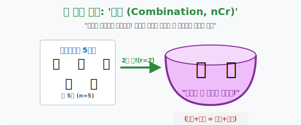

# 1. 서열 파괴, 평등의 우주: '조합 (Combination)'

## [도입부] 학습 목표 (Learning Objectives)
- 1등, 2등을 가르는 차디찬 순열(Permutation) 의 세계를 벗어나, "그냥 한 팀(Group) 으로 뽑기만 하자" 는 가장 민주적이고 평등한 확률 모델인 **'조합(Combination)'** 의 기본 개념을 이해합니다.
- 복잡하게 늘어놓은 줄 세우기($n!$) 가 아니라, 커다란 자루 속에 손을 집어넣어 한 움큼 동시에 쥐어 꺼내는 시각적 메타포를 통해 집합(`Set`) 의 성질을 깨닫습니다.
- 파이썬(Python)의 수학 도구인 `itertools.combinations` 를 활용하여, 복권 당첨 확률이나 피자 토핑을 고르는 절대 다이얼을 단 한 줄의 코드로 돌려봅니다.

---

## 1. 1등석, 2등석이 없는 둥근 밥그릇

아이스크림 가게에 5가지 맛(딸기, 초코, 바닐라, 포도, 녹차) 이 있습니다. 
친구 2명이 먹을 겁니다. 지난 단원(순열) 의 시선이라면 이렇게 생각했습니다.
> "누가 먼저 먹을래? 1번 타자가 5개 중 하나 고르고, 2번 타자가 남은 4개 중 하나를 고르자!" $\rightarrow$ ${}_5\mathrm{P}_2 = 5 \times 4 = 20$ 가지.

과연 그럴까요? 아이스크림을 동그란 파인트 그릇 하나에 동시에 푹푹 퍼 담는다고 생각해 봅시다.
내가 **(딸기, 초코)** 를 담았을 때와, 알바생이 실수로 순서를 거꾸로 퍼서 **(초코, 딸기)** 를 담았을 때, 집에 와서 퍼먹는 결과물은 다릅니까? **"위장이 보기엔 100% 똑같은 우주"** 입니다.
이처럼 '뽑히는 순서' 따위는 멍멍이나 줘버리고 **직급 체계를 완전히 붕괴시켜 하나의 덩어리로 취급**하는 행위, 이것이 바로 **조합 (Combination, ${}_n\mathrm{C}_r$)** 입니다.

> **"서로 다른 $n$개 중에서, 직급(순서) 없이 그저 $r$개를 뽑기만 하는 경우의 수: ${}_n\mathrm{C}_r$"**



<br>

## 2. 일상 속 조합의 냄새를 맡아라

세상의 확률 문제는 대부분 '순열' 보다는 '조합' 의 세계관을 더 많이 닮아 있습니다. 우리는 서열보다는 뭉뚱그려진 팀을 원할 때가 많기 때문입니다.

* **"로또 번호 6개를 맞춰라"**: 45개의 공 중에서 6개를 뽑습니다. 1번 공이 먼저 나오든 마지막에 나오든 당첨금은 똑같습니다. 서열이 붕괴된 완벽한 조합입니다. $\rightarrow$ **${}_{45}\mathrm{C}_6$**
* **"도미노 피자 토핑 3개 추가"**: 새우, 불고기, 포테이토 등 10개의 토핑 중 3개를 얹습니다. 피자 오븐에 들어가면 다 녹아서 똑같습니다. 순서 무의미! $\rightarrow$ **${}_{10}\mathrm{C}_3$**
* **"반장, 부반장을 뽑자"**: (순열 O) $\rightarrow$ 직급 수직 체계.
* **"청소 당번 2명을 뽑자"**: (조합 O) $\rightarrow$ 직급 수평 체계. 같이 쓸고 닦는 비참한 운명 공통체!

---

## 3. 💻 파이썬(Python) 의 무자비한 로또 크래커

서로 다른 45개의 공 중에서 순서를 무시하고 6개를 뽑는 경우의 수(${}_{45}\mathrm{C}_6$), 과연 인간의 연필로 계산하면 며칠 밤을 새워야 할까요? 파이썬의 `math.comb` 모듈을 발사하면 내가 왜 로또에 당첨되지 않는지 단 0.01초 만에 깨닫게 됩니다.

### 🐍 파이썬 예제: 로또(Lotto) 1등 당첨 확률 산출기

```python
import math
import itertools

print("--- 💰 인생 한방: 로또 당첨 확률 분석기 (조합기) 가동 ---")

# 전체 로또 번호 (1부터 45까지)
total_numbers = 45
# 내가 찍어야 할 번호 개수 (6개)
pick_count = 6

# 파이썬 수학 모듈의 조합(Combination) 직접 연산! (45_C_6)
total_combinations = math.comb(total_numbers, pick_count)

print(f" [데이터 세팅] {total_numbers}개의 공 중에서 {pick_count}개를 뽑습니다.")
print("-" * 50)
print(f" 💣 [충격과 공포의 결과]")
print(f"    당신이 로또 1등에 당첨될 수 있는 총 경우의 수는:")
print(f"    무려 [ {total_combinations:,} ] 가지입니다!!")
print(f"    (확률: 1 / {total_combinations:,}) -> 지나가던 벼락 맞을 확률보다 낮습니다.")

# --- 보너스 렌더링 ---
# 그럼 진짜로 번호 6개를 뽑아주는 생성기를 만들어 볼까?
# 1~45 숫자 중 6개를 순서 무시하고(조합) 무작위로 추출!
import random
lotto_balls = list(range(1, 46))
# random.sample 파이썬 함수 자체가 내부적으로 조합(Combination) 구조를 사용합니다!
my_lucky_numbers = random.sample(lotto_balls, 6)
# 사용자가 보기 편하게 정렬(sort) 시켜줌. (조합은 어차피 순서가 노상관이므로 내 마음대로 정렬해도 됨!)
my_lucky_numbers.sort()

print("-" * 50)
print(f" 🍀 [파이썬 AI의 AI 랜덤 추천 픽]: {my_lucky_numbers}")

# 결과창:
# --- 💰 인생 한방: 로또 당첨 확률 분석기 (조합기) 가동 ---
#  [데이터 세팅] 45개의 공 중에서 6개를 뽑습니다.
# --------------------------------------------------
#  💣 [충격과 공포의 결과]
#     당신이 로또 1등에 당첨될 수 있는 총 경우의 수는:
#     무려 [ 8,145,060 ] 가지입니다!!
#     (확률: 1 / 8,145,060) -> 지나가던 벼락 맞을 확률보다 낮습니다.
# --------------------------------------------------
#  🍀 [파이썬 AI의 AI 랜덤 추천 픽]: [3, 11, 25, 30, 41, 44]
```

이 알고리즘은 단지 복권뿐만 아니라 인공지능이 "수천 개의 특징(Feature) 데이터 중 예측력이 가장 높은 핵심 조합 3개를 뽑아라!" 라고 명령받았을 때 사용하는 거대한 차원 축소 연산의 뼈대가 됩니다.

---

## [결론] 학습 정리 (Summary)

1. **조합 (${}_n\mathrm{C}_r$)**: 객체들의 가치나 서열이 완전히 평등할 때, 주어진 모집단 속에서 덩어리(부분 집합) 로 한 번에 뽑아 올리는 구조입니다.
2. **순서 붕괴**: A-B를 뽑으나 B-A를 뽑으나 똑같은 한 그릇(Set) 으로 폭파(평준화) 시켜버리는 과정이 조합의 핵심입니다.
3. 파이썬의 `math.comb` 는 "순열처럼 일렬로 나열할 필요가 없으므로 연산 로드가 훨씬 적어" 수백만 건의 데이터를 고를 때 눈 깜짝할 새 연산해 내는 효율성을 자랑합니다.
