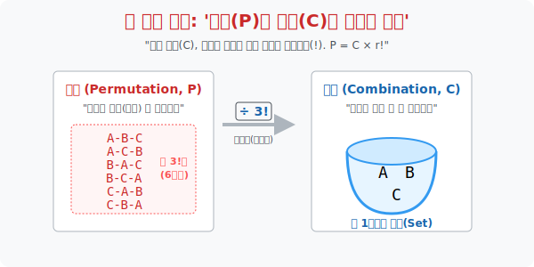




# 2. 뭉개버려라: '순열(P)과 조합(C)의 차이'

## [도입부] 학습 목표 (Learning Objectives)
- '순열(Permutation)' 은 사실 **조합(Combination) 으로 덩어리를 먼저 뽑아낸 뒤, 그들에게 서열표를 나누어주며 줄을 세우는 팩토리얼($!$) 의 후처리 작업**이었음을 기하학적으로 증명합니다.
- 왜 조합 공식 ${}_n\mathrm{C}_r$ 의 분모 밑바닥에 '순서를 무효화' 시키는 포식자 $r!$ 이 똬리를 틀고 앉아 나누기 연산을 수행하고 있는지 그 수학적 폭동 진압의 쾌감을 맛봅니다.
- 파이썬(Python)의 `itertools` 패키지 안에 있는 `permutations` 와 `combinations` 의 동작 속도와 생성 파일 용량을 비교해 보며, 순서를 날려버린 '조합' 이 시스템의 과부하를 얼마나 혁신적으로 줄여주는지 코딩해 봅니다.

---

## 1. 순열과 조합의 팩토리얼(해체) 쇼

$10$명의 학생 중 매일 아침 화장실 청소를 할 $3$명을 뽑는 비참한 룰렛을 돌립니다. 
* **상황 1 (순열의 시선)**: "너 1구역 변기, 너 2구역 세면대, 너 3구역 바닥!" (역할과 서열이 존재) $\rightarrow$ **${}_{10}\mathrm{P}_3$** 
  * $10 \times 9 \times 8 = 720$ 가지
* **상황 2 (조합의 시선)**: "아 몰라, 그냥 니들 셋이 화장실 다 맡아!" (역할 없이 한 덩어리 취급) $\rightarrow$ **${}_{10}\mathrm{C}_3$**

**[가짜 경우의 수를 파괴하는 팩토리얼 무기 ($r!$)]**
순열의 세계(720가지) 안을 현미경으로 들여다보면, (A-B-C) 가 1-2-3 구역을 맡는 수, (A-C-B) 로 맡는 수, (B-A-C)... 이렇게 3명이 지들끼리 역할을 바꾸는 **$3!$ (6가지)** 의 중복 환영이 무조건 1세트씩 얽혀있습니다.

그런데 조합의 세계관에서는 A, B, C 가 누굴 하든 "그냥 너네 한 팀이잖아?" 라며 그 6가지($3!$) 를 무자비하게 뭉개서 '단 1개의 팀(경우의 수)' 으로 박살 내버립니다.
즉, 순열이 뻥튀기해 놓은 가짜 인플레이션 값에다가 **"뽑힌 녀석들의 머릿수 팩토리얼($r!$)" 만큼을 나누기(분모) 로 때려 박으면** 군더더기가 쏙 빠진 순수한 조합의 알맹이만 남습니다.

> **${}_n\mathrm{C}_r = \frac{{}_n\mathrm{P}_r}{r!}$**

결국, 순열은 조합에 꼬리표를 달아준 것에 불과합니다. 세상의 모든 선택은 "일단 덩어리로 뽑아 놓고(조합 C), 그 뽑힌 애들에게 순서표 배지를 나눠주며 배열하는(순열 P)" 시스템이었습니다.



<br>

## 2. 💻 파이썬(Python) 엔진 속도 비교 (P vs C)

서로 다른 20명의 이름 중 5명을 무작위로 추려내는 작업을 파이썬에 지시합니다. 하나는 순열, 하나는 조합 모터입니다. 과연 컴퓨터 CPU가 받아들이는 과부하(경우의 수 폭발) 차이는 어느 정도일까요?

### 🐍 파이썬 예제: 알고리즘 연산 폭발량(Big-O) 측정기

```python
import itertools
import math

print("--- ⚔️ 컴퓨터 메모리 부하 테스트: 순열(P) vs 조합(C) ---")

# (가상 데이터) 시스템에 접속한 총 20명의 유저. 우리는 5명을 추출할 예정!
n_users = 20
r_select = 5

# 1. 조합 (Combination): 순서를 뭉갠 가장 최적화된 우주
comb_result = math.comb(n_users, r_select)
print(f" 🔵 [조합 20_C_5 엔진] '순서 노상관 한 팀 묶기' 결과: {comb_result:,} 가지")

# 2. 순열 (Permutation): 뽑힌 5명에게 서열(1~5위) 을 강제로 매기는 우주
# 순열은 nPr = n! / (n-r)! 공식으로 파이썬 math.factorial 이용
perm_result = math.factorial(n_users) // math.factorial(n_users - r_select)
print(f" 🔴 [순열 20_P_5 엔진] '서열까지 매겨 일렬 배치' 결과: {perm_result:,} 가지")

print("-" * 50)
# 메모리 팽창 충격량 계산
bloating_factor = perm_result // comb_result
math_factor = math.factorial(r_select) # 뽑힌 5명을 줄 세우는 5! (=120)

print(f" 💣 [결과 해부] 대참사 분석 리포트")
print(f"    - 순열 알고리즘이 조합에 비해 [{bloating_factor}] 배나 시스템 메모리를 더 처먹었습니다!")
print(f"    - 놀랍게도 그 숫자는 5명끼리 지들 안에서 자리를 바꾸는 [5!] = {math_factor} 와 완벽히 똑같습니다.")
print(f"    - 결론: 굳이 '직급' 이 필요 없는데 P를 쓰면 서버가 다운될 수 있다.")

# 결과창:
# --- ⚔️ 컴퓨터 메모리 부하 테스트: 순열(P) vs 조합(C) ---
#  🔵 [조합 20_C_5 엔진] '순서 노상관 한 팀 묶기' 결과: 15,504 가지
#  🔴 [순열 20_P_5 엔진] '서열까지 매겨 일렬 배치' 결과: 1,860,480 가지
# --------------------------------------------------
#  💣 [결과 해부] 대참사 분석 리포트
#     - 순열 알고리즘이 조합에 비해 [120] 배나 시스템 메모리를 더 처먹었습니다!
#     - 놀랍게도 그 숫자는 5명끼리 지들 안에서 자리를 바꾸는 [5!] = 120 와 완벽히 똑같습니다.
#     - 결론: 굳이 '직급' 이 필요 없는데 P를 쓰면 서버가 다운될 수 있다.
```

데이터 엔지니어들은 데이터 리스트에서 임의의 샘플 그룹을 추출(`Sampling`) 할 때 절대 순열 함수를 쓰지 않습니다. 필요 없는 서열화 알고리즘 탓에 연산량이 수백, 수천 배 폭발하기 때문입니다.

---

## [결론] 학습 정리 (Summary)

1. **포식자 조합(C)**: 무한히 팽창하려는 순열의 가짓수 안에 숨어있는 '자리 바꾸기 중복($r!$)' 을 식별해 내어, 과감히 분모로 쪼개버림으로써(나눗셈) 우주를 무자비하게 압축시키는 녀석이 바로 조합입니다.
2. **$10\mathrm{P}_3 = 10\mathrm{C}_3 \times 3!$**: 직급이 있는 3명을 뽑고 싶다면, "일단 평등하게 3명을 담은 바구니를 고르고(C), 그 바구니 안에서 자기들끼리 1,2,3등 서열을 찢어(3!) 곱해준다" 가 수학자들의 훌륭한 알고리즘 분해법입니다.
3. 이 두 가지를 혼동하면 인공지능 추천 알고리즘이나 네트워크 전송 로직에서 $100배$ 이상의 서버 렌더링 지연(Lag) 이 발생하게 됩니다.

