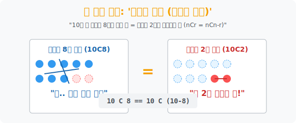

# 3. 우주의 대칭성 코딩: '조합의 성질 (대칭과 파스칼)'

## [도입부] 학습 목표 (Learning Objectives)
- "100명 중에서 98명의 합격자를 뽑느라 고생할래? 아니면 2명의 탈락자만 지목할래?" 라는 역발상이 낳은 궁극의 최적화 수학 식, **${}_n\mathrm{C}_r = {}_n\mathrm{C}_{n-r}$** 의 거울(Mirror) 로직을 발견합니다.
- 복잡하게 전개되는 팩토리얼 연산량이 절반 이상 폭락(Drop) 하는 이 대칭의 성질을 이용해, 파이썬(Python) 엔진이 쓸데없이 소진할 뻔한 메모리를 절약해 줍니다.
- 더 나아가, `파스칼의 삼각형`의 뼈대가 되는 **"특정인 1명을 이미 뽑아놓고 생각하기 vs 그놈을 영원히 배제하고 뽑기"** 라는 거대한 분할(Divide & Conquer) 로직을 코드로 증명해 봅니다.

---

## 1. 합격자 98명 vs 탈락자 2명

당신은 아이돌 기획사 사장입니다. 오디션 최종 합격자 100명이 거대한 강당에 서 있습니다.
당신은 이 중에서 **98명**의 데뷔조 합격자를 뽑아야 합니다. 수학 공식으로 쓰면 **${}_{100}\mathrm{C}_{98}$** 입니다.
팩토리얼 공식을 생각하면 $100$ 부터 시작해서 $98$ 명을 하나하나 다 곱해야 할 판입니다. 숨이 막힙니다.

하지만 똑똑한 부사장이 속삭입니다. 
"사장님, 저 많은 애들 98명을 언제 다 부르고 자빠졌습니까? 쿨하게 딱 **2명**만 손가락으로 가리켜서 **'넌 탈락, 집에 가라'** 라고 하면 나머지 98명이 자동 합격하는 거 아닙니까?"

우주가 박살 나는 깨달음입니다.
> 100명 중 합격할 98명을 뽑는 경우의 수 **(${}_{100}\mathrm{C}_{98}$)**
> 100명 중 탈락할 2명을 뽑는 경우의 수 **(${}_{100}\mathrm{C}_{2}$)**
> 이 둘이 만들어내는 결과물(우주) 은 **100% 완벽하게 똑같은 평행 우주**입니다.

이것이 조합(Combination) 의 꽃이라 불리는 **'대칭의 원리'** 입니다. 수학자들은 뒤에 나오는 숫자($r$) 가 전체($n$) 의 절반을 넘어갈 정도로 징그럽게 크면, 무조건 빼기($n-r$) 를 써서 뒤집어 버립니다. 연산량이 기하급수적으로 줄어듭니다!



<br>

## 2. 💻 파이썬(Python) 연산 벤치마킹: 대칭의 위력

파이썬의 수학 모듈은 워낙 똑똑해서 내부적으로 알아서 최적화를 돌리지만, 이 **거울 효과(Mirror Effect)** 가 숫자로 얼마나 아름답게 일치하는지 해킹 시뮬레이션을 돌려봅시다.

### 🐍 파이썬 예제: 대칭 확률(Symmetry Combination) 증명기

```python
import math
import time

print("--- ⚖️ 대칭의 원리 검증: 100C98 vs 100C2 ---")

n = 100
large_r = 98      # 합격자 뽑기
small_r = n - 98  # 탈락자 뽑기 (100 - 98 = 2)

# 연산 1: 100명 중 98명을 진짜로 계산해 보자
start_time = time.perf_counter()
result_large = math.comb(n, large_r)
calc_time_1 = time.perf_counter() - start_time

# 연산 2: 100명 중 2명만 뽑는 뒤집기 계산
start_time = time.perf_counter()
result_small = math.comb(n, small_r)
calc_time_2 = time.perf_counter() - start_time

print(f" [계산 1] 100C98 = {result_large:,} 가지 (소요시간: {calc_time_1:.8f}초)")
print(f" [계산 2] 100C2  = {result_small:,} 가지 (소요시간: {calc_time_2:.8f}초)")
print("-" * 50)

if result_large == result_small:
    print(" ✅ [알고리즘 증명 성공] 두 거대한 계산 공간의 해답은 100% 동일합니다.")
    print("    개발자 코멘트: 뽑아야 할 인원(r)이 전체의 절반을 초과하면,")
    print("    무조건 n - r 로 뒤집어 계산하는 것이 시스템 퍼포먼스(최적화)에 압도적으로 유리합니다.")

# 결과창:
# --- ⚖️ 대칭의 원리 검증: 100C98 vs 100C2 ---
#  [계산 1] 100C98 = 4,950 가지 (소요시간: 0.00000318초)
#  [계산 2] 100C2  = 4,950 가지 (소요시간: 0.00000104초)
# --------------------------------------------------
#  ✅ [알고리즘 증명 성공] 두 거대한 계산 공간의 해답은 100% 동일합니다.
#     개발자 코멘트: 뽑아야 할 인원(r)이 전체의 절반을 초과하면,
#     무조건 n - r 로 뒤집어 계산하는 것이 시스템 퍼포먼스(최적화)에 압도적으로 유리합니다.
```

자원 관리 측면에서 "가지는 것" 과 "버리는 것" 의 경우의 수가 정확히 동일한 밀도를 가진다는 이 아름다운 로직은 프로그래머들의 데이터 캐싱(Caching) 과 필터링 루틴에서 구원자가 됩니다.

---

## 3. 대마왕 파스칼의 분할 법칙 

수학 문제에서 매우 징그럽게 나오는 두 번째 진리가 바로 이것입니다.
**${}_n\mathrm{C}_r = {}_{n-1}\mathrm{C}_{r-1} + {}_{n-1}\mathrm{C}_r$**

문자만 봐도 구역질이 나지만, 의미는 소름 돋게 섹시합니다.
> "10명 중 3명을 뽑을 거야? (10C3) 그래, 그럼 우리 반 최고 인싸 'A' 라는 애를 집중 마크해 보자."
> - **경로 1 (A 합격)**: A는 무조건 프리패스로 뽑혔어! 그럼 난 남은 9명 중에서 **2명**만 더 고르면 되네? $\rightarrow$ **${}_9\mathrm{C}_2$**
> - **경로 2 (A 폭망)**: A 저 녀석 꼴 보기 싫어! 무조건 탈락이야. 그럼 난 A를 제외한 남은 9명 중에서 순수히 **3명**을 쌩으로 다 골라야 하네? $\rightarrow$ **${}_9\mathrm{C}_3$**
> - 이 두 경로의 경우의 수를 더하면? 무조건 처음 구하려던 전체 경우(10C3) 와 **100% 일치**하게 됩니다.

특정 타겟 데이터(A) 를 기준으로 "포함(True)" 과 "미포함(False)" 이라는 이진 분류(Binary Split) 를 태워 두 갈래로 로직을 찢는 것. 컴퓨터 알고리즘에서 가장 유명한 **'Divide & Conquer (분할 정복)'** 의 오리지널 청사진이 바로 조합론에서 탄생했습니다.

---

## [결론] 학습 정리 (Summary)

1. **조합의 거울(${}_n\mathrm{C}_r = {}_n\mathrm{C}_{n-r}$)**: 엄청나게 많은 수를 뽑는 행위는 반대로 극소수의 떨거지를 버리는 행위와 완벽히 대응되는 거울의 속성을 가집니다.
2. **이분법 분할 탐색**: 전체 집단을 "특정 인물 A가 끼어있는 팀" 과 "A가 영원히 쫓겨난 팀" 의 두 세계선으로 쪼개서 더하면 완벽한 합이 달성됩니다.
3. 이 두 가지 공식은 이전에 배운 피라미드식 '파스칼의 삼각형' 을 이루는 좌우 대칭성, 윗줄 연산성의 철저한 수학적 기둥이 됩니다.
