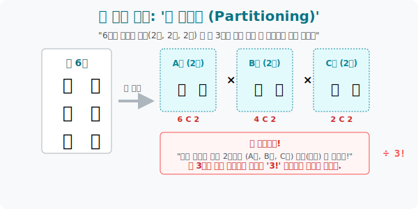

# 4. 이름 없는 방들의 반란: '조 나누기 (분할)'

## [도입부] 학습 목표 (Learning Objectives)
- 조합(Combination) 을 연속적으로 쏘아서 사람들을 여러 방(그룹) 에 묶어 넣는 **'조 나누기(Partitioning)'** 의 알고리즘 체인을 이해합니다.
- 조를 짤 때 "어라? 1번 방과 2번 방의 크기(인원수) 가 똑같네?" 라는 사실이 왜 팩토리얼 나누기 스킬($\div r!$) 이 다시 등판해야 하는 치명적인 버그를 탄생시키는지 기하학적으로 해체합니다.
- 인원수가 다른 그룹 배분과, 인원수가 똑같은 익명의 그룹 배분을 수학적으로 구별해 내는 능력(순열과 조합의 짬짜면) 을 탑재합니다.

---

## 1. 호텔 방 예약 알고리즘: 6명을 쪼개라

우리 일행 6명이 여행을 가서 호텔 방 3개를 빌렸습니다. 그런데 방 구조가 각각 다릅니다.
* **상황 1**: 스위트룸(3인), 더블룸(2인), 싱글룸(1인)
자, 6명을 이 방 3개에 밀어 넣어 봅시다. 연쇄 조합 콤보가 터집니다.
1. 6명 중 제일 좋은 스위트룸에 갈 3명을 고릅니다. $\rightarrow$ **${}_6\mathrm{C}_3$**
2. 남은 3명 중 더블룸에 갈 2명을 고릅니다. $\rightarrow$ **${}_3\mathrm{C}_2$**
3. 남방 1명이 독방(싱글룸) 에 던져집니다. $\rightarrow$ **${}_1\mathrm{C}_1$**

방 구조(이름표) 가 다르기 때문에, A그룹/B그룹 간에 헷갈릴 일이 없습니다. 그냥 무난하게 곱하면($6C3 \times 3C2 \times 1C1$) 임무 완수입니다. 문제는 다음 상황입니다.

* **상황 2**: 똑같은 크기의 트윈룸 3개 (2인, 2인, 2인)
1. 6명 중 2명 픽! $\rightarrow$ **${}_6\mathrm{C}_2$**
2. 남은 4명 중 2명 픽! $\rightarrow$ **${}_4\mathrm{C}_2$**
3. 남은 2명 픽! $\rightarrow$ **${}_2\mathrm{C}_2$**

수학 풀듯 막 곱하고($6C2 \times 4C2 \times 2C2 = 90$가지) 잠을 잤습니다. 
그런데 문제가 터졌습니다. **호텔방 3개가 이름 앞단어조차 없는 완벽히 똑같은 방**이라는 점입니다.

> 1번으로 (A-B) 가 묶이고, 2번으로 (C-D), 3번으로 (E-F) 가 묶였습니다.
> 다음 릴레이에선 1번으로 (C-D), 2번으로 (E-F), 3번으로 (A-B) 가 묶였습니다.

이 2가지는 다른 우주일까요? 그냥 (A-B), (C-D), (E-F) 라는 똑같은 세 무리가 거실에 서 있는 거지 않습니까! 
이 똑같은 크기의 2명짜리 3개 그룹은(방 3개는) 지들끼리 서열이랍시고 뒤섞이는 **$3!$** (6배) 만큼의 환영(버그) 을 내포하고 있습니다. 우리는 이 6배의 거품을 '나누기' 로 걷어내야 합니다.
**최종 정답: $90 \div 3! = 15$가지.**



<br>

## 2. 팩토리얼 파편화 (분할의 진실)

수학자들은 거품을 발견하면 망설이지 않고 $\div$ 표창을 날립니다.
* 멤버수가 $n$명인 조가 **2개** 똑같이 생겼다? $\rightarrow$ 방 2개가 뒤섞이는 거품을 깬다 **$\div 2!$**
* 멤버수가 $n$명인 조가 **3개** 똑같이 생겼다? $\rightarrow$ 방 3개가 뒤섞이는 거품을 깬다 **$\div 3!$**
* 멤버수가 $n$명인 조가 **4개** 똑같이 생겼다? $\rightarrow$ 방 4개가 뒤섞이는 거품을 깬다 **$\div 4!$**

이처럼 "이름 없는 컵에 구역을 나누어 담을 때, 컵의 규격(크기) 이 똑같으면 그 집체만 한 컵들이 지들끼리 우왕좌왕 섞이는 것을 제압하라" 는 것이 분할 알고리즘의 맹점입니다.

---

## 3. 💻 조 짜기 시스템의 함정 코딩

이 알고리즘은 대학교 체육대회 토너먼트 조 짜기, 혹은 월드컵 브라켓 추첨을 짤 때 가장 많이 터지는 로직 오류 중 하나입니다. 중복을 쳐내지 못해 대진표를 수천 배로 뻥튀기하는 개발자들의 흔한 실수를 방어해 봅니다.

### 🐍 파이썬 예제: 알고리즘 결함 분석 - 분할기

```python
import math

print("--- ⚔️ 분배 알고리즘(Partition) 버그 디버깅 테스트 ---")

# 전체 12명의 멤버를 [4명], [4명], [4명] 똑같은 크기의 3개 조로 쪼개라!
total = 12

# 1. 아! 나는 배운 대로만 한다. 조합(Combination) 의 연속 터치!
step1 = math.comb(12, 4)
step2 = math.comb(8, 4)
step3 = math.comb(4, 4)

dumb_code_result = step1 * step2 * step3
print(f" ❌ [버그 발생 연산] 연속 C 곱하기 콤보: {dumb_code_result:,} 가지")

# 2. 똑같은 4명짜리 빈 상자가 3개다. 
# 이 3개의 상자가 지들끼리 이름표를 바꾸는 3! (6가지)의 중복 버그(거품)를 무자비하게 박살낸다!
same_group_count = 3
bubble_breaker = math.factorial(same_group_count)

smart_code_result = dumb_code_result // bubble_breaker

print("-" * 50)
print(f" 🛡️ [버그 수정 완료] 이름 없는 똑같은 조 {same_group_count}개의 자리바꿈( {bubble_breaker}배 ) 폭파!")
print(f"    최종 도출된 완벽한 대진표 조 짜기 가짓수: {smart_code_result:,} 가지")

# 만약 12명을 [5명], [4명], [3명] 으로 쪼갰다면? -> 그룹 인원수가 모두 다르므로 이름이 달린 것이나 진배없음.
# 이때는 나누기(버블 브레이커) 가 전혀 필요 없습니다! 무조건 1가지 우주로 확정!

# 결과창:
# --- ⚔️ 분배 알고리즘(Partition) 버그 디버깅 테스트 ---
#  ❌ [버그 발생 연산] 연속 C 곱하기 콤보: 34,650 가지
# --------------------------------------------------
#  🛡️ [버그 수정 완료] 이름 없는 똑같은 조 3개의 자리바꿈( 6배 ) 폭파!
#     최종 도출된 완벽한 대진표 조 짜기 가짓수: 5,775 가지
```

수학은 언제나 "상태(State)" 에 집중합니다. 그 그룹에 이름표(속성, 인원수의 다름 등 식별성) 가 있느냐 없느냐에 따라 팩토리얼 검열관이 파견될지 결정됩니다.

---

## [결론] 학습 정리 (Summary)

1. **연속 조합 콤보**: 인원수가 많은 큰 덩어리를 쪼갤 때는 조합(${}_n\mathrm{C}_r$) 식을 인원이 소진될 때까지 계속 곱해 나가는 릴레이 방식을 사용합니다.
2. **동수 그룹 분할 버그**: 쪼개고 난 뒤 조의 크기(인원수) 가 동일한 그룹이 2개 이상 발생한다면, 그 그룹들은 서열 식별이 불가능한 빈 박스들과 같으므로 그 그룹 개수 팩토리얼 수만큼 강제로 나누어 줍니다(중복 제거).
3. 이 개념은 프로그래밍에서 `데이터 파티셔닝(Partitioning)` 을 수행하거나 서버를 쪼갤 때 나오는 로직(동일 크기의 익명 버킷 할당) 의 순수 베이스 이론입니다.
