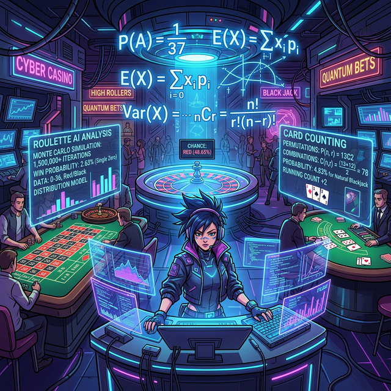

# 00. 인트로: 폭발하는 우주의 가지치기 (Intro)

$1{\sim}3$권 확률 1부에서는 주사위 하나와 동전 두 개를 허공에 던졌습니다. 기껏해야 분기점이 $6$개, $12$개 정도에서 끝났기 때문에, 우리가 손가락으로 트리를 그려가며 "경우의 수" 를 직접 바구니에 주워 담을 수 있었습니다.

하지만 이제 당신은 라스베이거스 **카지노 딜러 AI 서버**를 설계해야 합니다.
트럼프 카드는 $52$장이나 있습니다. 여기서 무작위로 $5$장을 뽑아내서 '로열 스트레이트 플러시' 조합을 세팅하는 트리 가지치기를 모니터에 그리라고요?
아마 당신의 모니터는 가지치기가 $\mathbf{3억 1187만 5200갈래}$로 뻗어나가며 $CPU 100\%$ 과부하 사태로 터져버릴 것입니다.

  

## 1. 노가다의 종말, 공식 머신 조합기

확률 파트 2(모듈 46) 의 시작점은 이 절망에서 출발합니다. 
"수천, 수억 갈래로 폭발하는 미래의 가지치기 트리를, 어떻게 [눈으로 손수 그리지 않고도] 단 1줄의 수학 코드로 순식간에 **압축 추출(ZIP)** 해낼 것인가?"

위대한 해커들은 트리를 쳐다보다가 패턴 하나를 찾아냅니다.
"어차피 첫 갈래에서 $10$가지로 갈라지면, 그다음 잔가지는 무조건 $9$개, 그다음은 $8$개씩... 일정한 렌더링 패턴 비율로 숫자가 줄어들잖아? 이걸 그냥 **반복문 루프 곱하기 엔진(Factorial 팩토리얼)** 으로 통째로 터트리고 돌려버리면 되지!" 

이것이 경우의 수를 구하는 미친 단축기 치트인 **"순열(Permutation 줄 세우기)"** 과 **"조합(Combination 대표 뽑기)"** 의 탄생 배경입니다.

## 2. 몬테카를로(Monte Carlo): 수학이 포기한 최후의 보루

그러나 아무리 순열과 조합이라는 압축 코드가 강력해도, 현실의 날씨 예측이나 핵분열 에너지 시뮬레이션 같은 더러운 확률 변수는 수학 기호만으로 커버가 안 될 만큼 카오스(혼돈) 그 자체입니다.

이때 프로그래머들이 꺼내 드는 궁극의 "무식함의 끝판왕" 핵무기가 있습니다.
바로 머리 아프게 종이 위에서 확률 수식을 짜지 않고, 파이썬 우주 엔진을 $CPU \ 100\%$ 로 갈아 넣어, 실제로 컴퓨터 안에서 가상의 대결을 **$100$만 번, $1000$만 번** 광속 무한 루프 반복 시뮬레이션으로 미친 듯이 돌려버보는 것입니다. 그리고 그 결과를 통계 내버려서 승률을 뽑아내는 미친 사기 스킬!
이것을 도박의 성지 이름을 따 **몬테카를로 시뮬레이션 (Monte Carlo Simulation)** 이라고 부릅니다. 

이 단원의 마지막 장(6장) 에서는 이 몬테카를로 무한 총기 난사법으로, 파이 참(PyCharm) 콘솔 창에 진짜 "우주 상수 파이($\pi = 3.1415$)" 를 오직 '무작위 난수 총알 폭격' 만으로 소름 돋게 깎아 만들어내는 충격적인 AI 파이썬 스크립트를 경험하게 될 것입니다! 자, 첫 번째 단축키인 **[순서가 지배하는 권력, 순열]** 로 진입하십시오!
