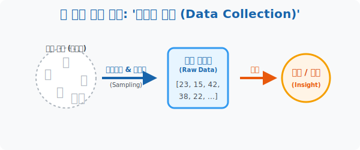

# 1. 흩어진 조각 모으기: 광산에서 원석 깨기, '자료의 수집 (Data Collection)'

## [도입부] 학습 목표 (Learning Objectives)
- 21세기 가장 비싼 자원인 '데이터(Data)' 가 현실 세계에서 어떻게 탄생하고 추출되는지, 통계학의 첫 단추인 **'자료 수집'** 의 개념을 이해합니다.
- 인터넷이나 설문조사에서 무작위로 긁어모은 가공되지 않은 숫자 덩어리들을 통계학에서는 **변량(Variate) / 원시 데이터(Raw Data)** 라 부르는 이유를 깨닫습니다.
- 파이썬(Python)의 기초 데이터 수집기인 `input()` 함수와 데이터 저장고인 `List(리스트)` 를 활용해, 지저분한 원석(데이터) 을 우리의 메모리로 집어넣는 코딩 기초를 체험합니다.

---

## 1. 통계학의 부팅, 원시 데이터(Raw Data) 

여러분은 지금 IT 회사의 신입 데이터 분석가로 입사했습니다. 사장님이 첫 번째 미션을 던집니다. 
"우리 동네 중학생들이 하루에 스마트폰을 몇 시간이나 보는지 알아와!"

가장 먼저 해야 할 일이 무엇일까요? 공식을 외우는 걸까요? 아닙니다. 학교 앞으로 뛰어나가 학생들을 붙잡고 설문지에 체크하게 하거나, 인스타그램에 투표창을 올리는 것입니다.
"너는 3시간, 쟤는 5시간, 그 옆 친구는 1시간..." 
이렇게 오직 **수집(Collection)** 이라는 노동을 통해서 모인 숫자 조각들 즉 `[3, 5, 1, 4, 3, 2, ...]` 을 통계학에서는 **자료(Data) 혹은 변량(Variate)** 이라고 부릅니다.

* **변량 (Variate)**: 성적, 키, 몸무게처럼 "변할 수 있는(Variable) 수량(Quantity)" 이라는 뜻의 수학적 용어입니다.
* 데이터 과학자들은 이 방금 막 캐낸 흙 묻은 숫자들을 **원시 데이터(Raw Data)** 라고 부릅니다. 이 상태로는 아무 쓸모가 없고 그저 머리만 아픕니다. 통계학은 바로 이 쓰레기 같은 숫자 덩어리를 예쁘게 씻고 닦아 보석(통찰, Insight) 으로 만드는 연금술입니다.



<br>

## 2. 조사 방법: 다 물어볼까, 몇 명만 찌를까?

데이터를 모을 때는 두 가지 거시적 테크닉이 존재합니다. (앞선 [53. 추정] 파트에서도 살짝 엿본 내용입니다.)

1. **전수 조사 (Census)**: 
   - 우리나라 인구 주택 총조사처럼 지구상(모집단) 에 있는 모든 타겟을 한 명도 안 빼놓고 다 털어버리는 방법입니다. 가장 정확하지만 시간과 돈이 미친 듯이 박살 납니다.
2. **표본 조사 (Sampling)**: 
   - 스마트폰 사용 시간을 알기 위해 전 국민 중학생 150만 명을 다 잡을 순 없습니다. 랜덤하게 딱 "마포구 중학생 500명" 만 요령껏 찌르는 방법입니다. 현대 기업과 통계청이 가장 사랑하는 스킬이죠.

어떤 전략을 택하든, 여러분의 손에 숫자가 적힌 종이 1,000장이 쥐어지게 될 것입니다. 통계 1단계 퀘스트 통과입니다!

---

## 3. 💻 파이썬(Python) 데이터 수집 엔진: `input()` 과 `List`

통계학자가 종이에 숫자를 펜으로 적는 행위를, 컴퓨터 프로그래머는 키보드로 타이핑된 값(`UserInput`) 을 파이썬의 가장 강력한 바구니 객체인 **리스트(List `[]`)** 에 구겨 넣는 작업으로 번역합니다.

### 🐍 파이썬 예제: 스마트폰 사용 시간 데이터 수집기

```python
print("--- 📱 실시간 원시 데이터(Raw Data) 크롤링 엔진 시작 ---")

# 아직 텅 비어 있는 원시 데이터 바구니 창조 (List 선언)
screen_time_data = []

number_of_users = 5  # 시간 제약상 5명만 물어보는 표본 조사(Sampling) 실시

for i in range(1, number_of_users + 1):
    # input() 함수는 현실 세계의 사용자가 타이핑한 데이터를 컴퓨터 메모리로 빨아들이는 진공청소기!
    # (실제 환경에선 키보드로 입력하지만, 여기선 가상 시뮬레이션 데이터를 담았다고 가정)
    raw_input = float(i * 1.5)  # 예시를 위해 1.5, 3.0, 4.5... 자동생성
    
    # 빨아들인 데이터를 append() 라는 명령어로 내 바구니 맨 뒤에 꾹꾹 밀어 넣는다!
    screen_time_data.append(raw_input)
    print(f" [데이터 수집] {i}번 학생의 스마트폰 사용 시간: {raw_input}시간 -> 바구니 적재 완료!")

print("\n" + "-" * 50)
print(" 📦 [수집 종료] 최종 원시 데이터(Raw Data) 확보 성공!")
# 그냥 무식하게 묶여있는 숫자 덩어리 자체를 보여줌
print(f"    ▶ 변량(Data) 리스트: {screen_time_data}")

# 결과창:
# --- 📱 실시간 원시 데이터(Raw Data) 크롤링 엔진 시작 ---
#  [데이터 수집] 1번 학생의 스마트폰 사용 시간: 1.5시간 -> 바구니 적재 완료!
#  [데이터 수집] 2번 학생의 스마트폰 사용 시간: 3.0시간 -> 바구니 적재 완료!
#  [데이터 수집] 3번 학생의 스마트폰 사용 시간: 4.5시간 -> 바구니 적재 완료!
#  [데이터 수집] 4번 학생의 스마트폰 사용 시간: 6.0시간 -> 바구니 적재 완료!
#  [데이터 수집] 5번 학생의 스마트폰 사용 시간: 7.5시간 -> 바구니 적재 완료!
# 
# --------------------------------------------------
#  📦 [수집 종료] 최종 원시 데이터(Raw Data) 확보 성공!
#     ▶ 변량(Data) 리스트: [1.5, 3.0, 4.5, 6.0, 7.5]
```

이제 여러분 컴퓨터 안에는 `screen_time_data` 라는 이름표가 달린 거대한 광물 덩어리 변량(Variate) 이 들어왔습니다. 다음 챕터부터 이 흙 묻은 데이터 조각들을 예쁘게 깎아보는 통찰 알고리즘을 시작합니다.

---

## [결론] 학습 정리 (Summary)

1. **원시 데이터 (Raw Data)**: 세상에서 막 긁어모아 아무런 가공도 거치지 않은 순수한 숫자들의 나열입니다. IT 업계에선 이 원석을 많이 가질수록 권력을 쥡니다.
2. **변량 (Variate)**: 키, 나이, 점수처럼 대상에 따라 다르게 나타나는 특성값을 숫자로 매핑해둔 통계학의 기초 재료입니다.
3. **컴퓨터의 데이터 창고, List `[]`**: 흩어져 있는 변량 파편들을 파이썬에서는 `[` 과 `]` 기호 사이에 차곡차곡 담아 하나의 변수 이름(예: `score_list`) 으로 묶어서 관리하는 것이 통계의 시작입니다.
