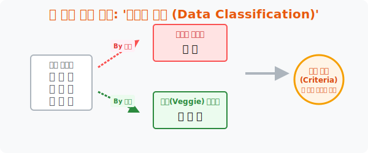

# 2. 내 입맛대로 체에 거르기: 기준이라는 칼, '자료의 분류 (Data Classification)'

## [도입부] 학습 목표 (Learning Objectives)
- 1수업에서 냅다 담아온 무질서한 데이터 조각들을 통계학의 도마 위에 올리고, **'기준(Criteria)'** 이라는 칼로 예쁘게 토막내고 선별하는 **자료의 분류** 기술을 배웁니다.
- 같은 데이터 묶음이더라도 내가 '어떤 기준(색상별? 크기별? 성별?)' 뷰(View) 필터를 들이대느냐에 따라 도출되는 통찰(Insight) 이 완전히 달라짐을 파악합니다.
- 파이썬(Python)의 핵심 제어문인 `If (조건문)` 필터링을 로직을 이용해, 거대한 리스트 안에서 내가 원하는 조건에 부합하는 데이터만 싹 도려내서 분류하는 데이터 전처리를 경험합니다.

---

## 1. 기준(Criteria): 통계 분석가의 절대 권력 

창고에 과일과 채소 수백 개가 어질러져 있습니다. 누가 여러분에게 "이것 좀 예쁘게 정리(분류)해 줘" 라고 한다면, 여러분은 반드시 되물어야 합니다.
**"사장님, 기준이 뭡니까?"**

* "색깔별로 분류해" (기준 A) $\rightarrow$ 빨간색(사과+딸기), 노란색(바나나+레몬), 초록색(오이+상추)
* "당도로 분류해" (기준 B) $\rightarrow$ 단것(사과+바나나+딸기), 안 단것(오이+상추+레몬)

통계학에서 수집된 자료(변량)는 그 자체로 절대적이지 않습니다. 권력을 잡은 데이터 분석가가 **어떤 타공망(기준)을 들이대어 체를 치는가** 에 따라 전혀 다른 부류의 지식체계로 나뉩니다. 
우리는 쓸데없이 기준을 잡지 않습니다. 어떤 기준을 쓸지는 **'자료를 모은 목적(Purpose)'** 이 100% 결정합니다. (예: 쥬스를 만들 거면 '당도' 기준, 매대를 꾸밀 거면 '색깔' 기준) 



<br>

## 2. 남녀노소, 그리고 구간(Range) 단위 자르기

가장 대표적인 통계의 기준(필터) 들은 이렇습니다.
1. **명목형 기준 (카테고리)**: "너 남자야 여자야?" "치킨 좋아해 피자 좋아해?" 처럼 글자로 확실히 그룹 지어지는 조건입니다.
2. **수치형/구간형 기준 (계급)**: "너 수학 점수 몇 점이야?" 라고 물으면 83점, 84점, 85점 너무 조각나서 분류가 안 됩니다. 이럴 땐 분석가가 강제로 **범위(Range)** 라는 칼을 휘두릅니다.
   - "80점 이상 ~ 90점 미만인 녀석들 전부 이리 와서 모여!!"
   - 여기서 수학 점수는 이도 저도 아닌 숫자가 아니라, 비로소 [80점대] 라는 예쁜 분류 그룹으로 환생하게 됩니다. (이것이 앞으로 배울 '계급' 의 뼈대입니다.)

---

## 3. 💻 파이썬(Python) If 조건문 필터링(Filtering) 매직

프로그래머들이 하는 하루 일과의 절반은, 남들이 던져준 거대한 X레기 데이터 창고에서 쓸모 있는 것들만 **조건(If)** 을 달아 체에 걸러내어 새로운 바구니에 옮겨 담는 일입니다. 이를 **데이터 전처리(Filtering)** 라고 부릅니다.

### 🐍 파이썬 예제: 기준(Criteria) 에 따른 성적 필터링 분류기

```python
print("--- 🔪 데이터 도마 위의 칼질: If 조건 필터링 시스템 ---")

# 1. 아까 수집해온 무질서한 수학 점수 원시 데이터 덩어리 (List)
raw_math_scores = [45, 88, 72, 95, 33, 80, 50, 91, 79]

# 2. 분석가의 강력한 권력! "기준(Criteria)" 을 발동할 빈 새 바구니 준비
elite_group = []   # 80점 이상 필터 통과자들
normal_group = []  # 80점 미만 쩌리들

print(f" [분해 전 원시 데이터]: {raw_math_scores}")
print("\n [시스템] 잣대(기준: 80점)를 들이대어 분류(Classification)를 렌더링합니다...")

# 리스트를 처음부터 끝까지 한번 훑으면서 (For 루프)
for score in raw_math_scores:
    
    # [조건 분류기 가동] 만약 이 점수가 80 이상이라면? (If 조건문)
    if score >= 80:
        elite_group.append(score) # 필터망을 통과하여 엘리트 바구니에 쏙!
    else:
        normal_group.append(score) # 탈락자들은 일반 바구니에 쏙!

print("-" * 50)
print(f" 📂 [분류 완료: 엘리트 폴더] -> {elite_group}")
print(f" 📂 [분류 완료: 일반인 폴더] -> {normal_group}")

# 결과창:
# --- 🔪 데이터 도마 위의 칼질: If 조건 필터링 시스템 ---
#  [분해 전 원시 데이터]: [45, 88, 72, 95, 33, 80, 50, 91, 79]
# 
#  [시스템] 잣대(기준: 80점)를 들이대어 분류(Classification)를 렌더링합니다...
# --------------------------------------------------
#  📂 [분류 완료: 엘리트 폴더] -> [88, 95, 80, 91]
#  📂 [분류 완료: 일반인 폴더] -> [45, 72, 33, 50, 79]
```

원시 데이터 시절에는 보이지 않던 정보가 분류를 기점으로 폭발합니다.
"아, 대충 보니 엘리트 폴더에 4개나が入ってる? 반 애들 절반(4/9) 이 80점을 넘는 똑똑이 반이구나!"
분류(Classification) 는 수학의 영역을 넘어, 데이터를 바라보는 여러분의 **철학과 가치관을 주입하는 과정**입니다.

---

## [결론] 학습 정리 (Summary)

1. **분류(Classification)**: 제각각 흩어진 다수의 객체(데이터)를 무리에 묶어 '그룹' 단위로 생각하기 위한 수학적 전처리 과정입니다.
2. **기준(Criteria)의 힘**: 같은 데이터라도 '수집한 목적' 이 다르면 칼을 대는 기준이 완전히 달라지며, 좋은 통계학자는 쓸모없는 기준을 과감히 버릴 줄 아는 사람입니다.
3. **If 제어문의 본질**: 컴퓨터 파이썬 코딩에서 가장 많이 쓰는 `if (참이냐 거짓이냐)` 블록은 결국, 통계학에서 들이대는 이 칼(기준) 망을 코드로 구현한 거대한 필터 스크린(Filter Screen) 에 불과합니다.
