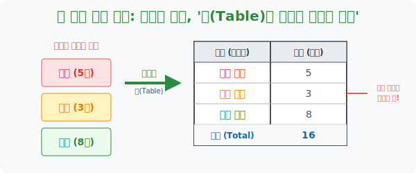

# 3. 흩어진 데이터를 묶는 포장지: '표(Table)를 활용한 자료의 정리'

## [도입부] 학습 목표 (Learning Objectives)
- 2수업에서 기준(Criteria) 에 따라 쪼개진 데이터 무리들을, 남들이 한눈에 볼 수 있도록 바둑판 모양의 격자에 예쁘게 포장하는 **'표(Table)'** 작성법을 체화합니다.
- 복잡한 텍스트로 풀어쓴 "사과 5개, 바나나 3개, 오렌지 2개" 라는 문장이 표에 들어가는 순간, "항목별 도수(수량)" 와 "전체 합산(Total)" 이 파노라마처럼 펼쳐지는 디스플레이 마법을 확인합니다.
- 파이썬(Python)의 데이터 분석 필수 라이브러리인 `Pandas` 를 살짝 맛보며, 엑셀(Excel) 의 표(DataFrame) 구조가 컴퓨터 메모리상에서 어떻게 생성되고 렌더링 되는지 경험합니다.

---

## 1. 정리 정돈의 끝판왕: 격자(Matrix) 구조

앞선 수업에서 우리는 반 친구들의 성향을 "축구 좋아하는 분단", "야구 좋아하는 분단" 으로 열심히 분류해 놓았습니다.
하지만 이걸 교장 선생님께 보고서로 제출할 때, "축구는 철수 영희 민수고요, 야구는 수진이 하나고요..." 라고 줄글로 적어내면 그 보고서는 곧바로 휴지통으로 직행합니다.

**"데이터는 묶이고 포장되어야 비로소 가치를 지닌다."**

이때 사용하는 가장 원초적이고 위대한 발명품이 바로 가로줄과 세로줄로 이루어진 **'표(Table)'** 입니다.
1. **항목(Category)**: 내가 어떤 잣대(분류 기준) 로 이 데이터를 쪼갰는지를 명시합니다. (예: 좋아하는 스포츠)
2. **도수(Frequency)**: 각 항목에 속하는 데이터가 "몇 개(명)" 나 되는지 머릿수를 세어 적습니다.
3. **합계(Total)**: 가장 밑바닥에 등장인물이 총 몇 명인지 합산을 적어, 누락된 녀석이 없는지 디버깅(검증) 합니다.

이렇게 만들어진 표는 아무리 복잡한 데이터라도 단 3초면 "아, 우리 반은 축구를 제일 좋아하고 배구는 아무도 안 좋아하는구나" 라는 직관적 깨달음(Insight) 을 모니터에 즉시 띄워줍니다.



<br>

## 2. 엑셀(Excel) 과 데이터베이스의 시조새

여러분이 중학교 1학년 때 배우는 이 허접해 보이는 '표 그리기' 가 사실 현대 IT 산업의 근간입니다.
네이버 회원 정보, 은행의 계좌 잔액, 게임 속 아이템 목록... 전 세계의 거대한 시스템은 모두 행(Row) 과 열(Column) 로 이루어진 표, 즉 **RDBMS(관계형 데이터베이스)** 라는 테이블 창고에 보관됩니다. 수학 시간에 표 그리는 연습을 게을리하면, 나중에 엑셀조차 다루지 못하는 컴맹이 될 수밖에 없는 이유입니다.

---

## 3. 💻 파이썬(Python) `Pandas` 데이터 프레임(DataFrame) 생성기

분류된 데이터를 표로 엮는 직업, '데이터 사이언티스트' 들이 가장 많이 쓰는 파이썬 마법 지팡이가 바로 `Pandas(판다스)` 입니다. 복잡한 텍스트 문자열을 엑셀과 완벽히 똑같은 표(DataFrame) 로 순식간에 콘솔창에 렌더링해버리는 경이로운 기능을 갖추고 있습니다.

### 🐍 파이썬 `Pandas` 예제: 분류된 데이터를 표(Table) 로 자동 렌더링하기

```python
import pandas as pd  # 데이터 과학의 심장, Pandas 소환!

print("--- 📊 Pandas 엔진: 분류된 데이터 격자(Table) 렌더링 ---")

# 1. 딕셔너리(Dict) 형태로 항목과 수량(도수) 데이터를 매핑해 둔다.
raw_dict = {
    "좋아하는 강아지": ["포메라니안", "푸들", "리트리버", "허스키"],
    "학생 수 (명)": [12, 8, 5, 2]
}

# 2. Pandas 의 마법 생성기 DataFrame() 에 데이터를 던져 넣는다!
table_df = pd.DataFrame(raw_dict)

# 3. 누락 검증을 위해 '합계' 행(Row) 을 하나 로직으로 추가한다.
total_students = table_df["학생 수 (명)"].sum()
# 꼼수 로직: 새 행을 하나 이어 붙인다!
table_df.loc["합계"] = ["- 총 합산 -", total_students]

# 4. 콘솔창에 엑셀처럼 렌더링하여 디스플레이 아웃풋 출력
print("\n[학교 앞 강아지 선호도 조사 표]")
print("================================")
print(table_df.to_string(index=False)) # 인덱스 번호는 지저분하니 숨기고 표만 출력!
print("================================")

# 결과창:
# --- 📊 Pandas 엔진: 분류된 데이터 격자(Table) 렌더링 ---
# 
# [학교 앞 강아지 선호도 조사 표]
# ================================
# 좋아하는 강아지  학생 수 (명)
#    포메라니안            12
#          푸들             8
#    리트리버             5
#        허스키             2
#  - 총 합산 -            27
# ================================
```

파이썬이 스스로 알아서 칸의 간격을 맞추고(Padding), 숫자들을 오른쪽으로 정렬(Align) 시켜 영롱한 표를 찍어내는 모습입니다. 우리가 공책에 자를 대고 선을 그어야 나오는 결과물이 `Pandas` 단 두 줄의 코드에 들어 있습니다.

---

## [결론] 학습 정리 (Summary)

1. **표(Table)**: 산발적으로 흩어져 있던 원형 데이터들을 기준(항목) 과 수량(도수) 의 2차원 격자로 가둬, 정보의 가시성을 극대화하는 브리핑용 최종 포장지입니다.
2. **누락 차단 장치 (합계)**: 표의 가장 아랫줄에 '합계' 를 적는 것은 폼이 아닙니다. 처음에 측정한 27명의 원시 데이터 총량과 매칭되는지 확인하는 가장 완벽한 수학적 디버깅(오류 검사) 시스템입니다.
3. **데이터베이스의 원형**: 이 1차원적인 단순한 표가 1만 개, 1억 개씩 연결되고 얽힌 것이 현대 소프트웨어 공학의 '관계형 데이터베이스(DB)' 설계 이론의 완전한 모태입니다.
