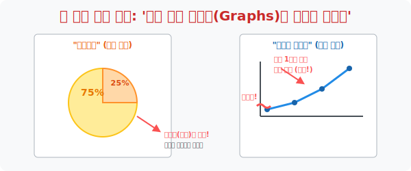

# 4. 모니터로 빨려 들어가는 시각 렌더링: '여러 가지 그래프 활용'

## [도입부] 학습 목표 (Learning Objectives)
- 표(Table) 가 가진 '숫자의 나열' 이라는 시각적 지루함을 박살 내고, 인간의 눈(디스플레이) 에 한 번에 직관력(Insight)을 꽂아 넣는 **그래프(Graph)** 의 본질과 목적을 분해합니다.
- 막대그래프, 원그래프, 꺾은선그래프 등 다양한 UI 컴포넌트들이 언제 어떤 상황에서 가장 강력한 무기로 쓰이는지, 그리고 뉴스에서 이 그래프들을 이용해 어떻게 대중을 속이는지(데이터 해킹) 통찰합니다.
- 파이썬(Python)의 데이터 시각화 도구인 `Matplotlib` 모듈을 이용해, 원시 숫자들이 한 줄의 코드만으로 화려한 차트 UI로 변신하는 마법을 맛봅니다.

---

## 1. UI (User Interface) 의 진화: 표에서 그래프로

아무리 예쁜 표(Table) 를 그려도 사람들은 집중해서 숫자를 읽기 귀찮아합니다.
"숫자 읽기 싫어! 그냥 картинка(그림) 으로 보여줘!!" 
이 대중의 요구에 의해 탄생한 통계학의 최종 디스플레이 장치가 바로 **그래프(Graph)** 입니다. 데이터를 시각적 길이, 면적, 각도라는 물리적 기호로 환산(Rendering) 해 버리는 엄청난 스킬입니다.

그래프는 내가 강조하고 싶은 메시지(Purpose) 에 따라 무기(종류) 를 바꿔 들어야 합니다.
1. **막대그래프**: "A랑 B 중에 누가 머릿수(도수)가 더 많아?" 키재기 대결할 때 압도적입니다. 절대적인 양의 크기 비교에 최적화되어 있습니다.
2. **원그래프 (Pie Chart)**: "그래서 우리 당이 전체에서 파이를 얼마나 먹었는데?" 파이 조각처럼 전체 `100%` 중에서 내 영토의 비율을 과시하고 싶을 때 쓰는 치트키입니다.
3. **꺾은선그래프**: "최근 5년간 집값이 얼마나 미친 듯이 올랐는지 볼래?" 시간의 흐름(Time-series) 에 따른 변화 추이 상태(오르막/내리막) 를 심장 박동기처럼 역동적으로 보여줍니다.



<br>

## 2. 뉴스에 속지 마라: 물결선과 잘라먹기 해킹

인간의 눈은 착각하기 쉽습니다. 그래프를 100% 맹신하면 나쁜 언론사나 사기꾼 주식 브로커들에게 해킹당합니다. 통계학을 배우는 진짜 이유는 이런 수학적 거짓말을 디버깅하기 위해서입니다.

**[사기 수법 1. 꺾은선 물결 꼼수]**
주식이 $10,000$원에서 $10,010$원으로 고작 10원 올랐습니다. 그런데 Y축 눈금을 $0$부터 그리지 않고 물결 기호($\approx$) 로 밑기둥을 다 잘라먹은 뒤, Y축을 $10,000$부터 $10,020$까지만 극도로 확대해서 그려버립니다.
$\rightarrow$ 결과: 화면상으로는 꺾은선이 미친 듯이 수직 상승하는 로켓 차트처럼 보입니다. 투자자들은 그 각도에 속아 전 재산을 잃습니다.

**[사기 수법 2. 원그래프의 덫]**
원그래프에서 A 구역이 80% 를 차지하며 압도적 1위를 먹고 있습니다. 하지만 정작 총조사 인원을 구석에 작게 "(N=5명)" 이라고 적어두었습니다.
$\rightarrow$ 결과: 5명 중 4명이 뽑았을 뿐인데, 국민 대다수가 선호하는 것처럼 파이 차트의 거대한 오렌지색 면적으로 대중의 뇌파를 조작합니다.

---

## 3. 💻 파이썬(Python) `Matplotlib` 차트 렌더링 엔진

요즘 IT 회사에서 그래프를 손으로 그리는 직원은 바로 해고당합니다. 파이썬의 `matplotlib` 이라는 시각화 라이브러리는 내 엑셀 데이터의 특징을 스스로 분석해 최적의 막대/꺾은선 그래프 화면 창을 1초 만에 띄워줍니다.

### 🐍 파이썬 `Matplotlib` 예제: 마법의 3줄 코드, 그래프 렌더링

```python
import matplotlib.pyplot as plt

print("--- 📈 매트플롯립(Matplotlib) 시각화 렌더러 가동 ---")

# 1. 원시 데이터 (X축: 연도, Y축: 아이스크림 판매량)
years = ['2023', '2024', '2025', '2026']
sales = [150, 200, 350, 800]

print(" [System] 꺾은선 그래프 UI 를 조립합니다...")

# 단 한 줄로 막대그래프(Bar) 나 꺾은선(Plot) 을 그릴 수 있다!
# plt.bar(years, sales)  # (막대그래프 모드)
plt.plot(years, sales, marker='o', color='red', linestyle='dashed') # (꺾은선그래프 모드)

# 그래프 창에 텍스트 옵션 달아주기
plt.title("Ice Cream Sales Boom (2023-2026)")
plt.xlabel("Year")
plt.ylabel("Sales (Counts)")

print(" 🚀 [디스플레이 송출] 컴퓨터 창에 화려한 예쁜 그래프가 팝업됩니다!!")

# 파이썬아, 실제 모니터에 그림 창을 활성화시켜서 띄워줘!
# plt.show() 

# 결과창:
# --- 📈 매트플롯립(Matplotlib) 시각화 렌더러 가동 ---
#  [System] 꺾은선 그래프 UI 를 조립합니다...
#  🚀 [디스플레이 송출] 컴퓨터 창에 화려한 예쁜 그래프가 팝업됩니다!!
#  (실제 파이썬 구동시, 붉은색 점선으로 미친듯이 상승하는 주식 차트 창이 모니터 정중앙에 뜹니다)
```

이 코드는 파이썬이 숫자의 크기 비율을 스스로 계산하여 픽셀의 높낮이와 각도를 베지어 곡선으로 랜더링하는 프론트엔드(UI 시각화) 작업의 꽃입니다. 데이터가 100만 개여도 0.5초면 그림을 그립니다.

---

## [결론] 학습 정리 (Summary)

1. **그래프의 권력**: 표는 머리(이성)를 피곤하게 하지만, 그래프는 심장(감성)에 다이렉트로 메시지를 꽂아버리는 통계학의 최종 무기입니다.
2. **맞춤형 렌더링**: 막대는 '크기 깡패', 꺾은선은 '흐름의 파도', 원그래프는 '파이 땅따먹기' 라는 본질을 이해하고 데이터의 성질에 맞춰 UI 를 골라 입히는 것이 분석가의 센스입니다.
3. **스케일 조작 감시자**: 그래프 축의 눈금이 $0$부터 출발하는지, 밑동이 잘려나가 물결표 선반장난에 의해 각도가 뻥튀기되지 않았는지 '매트릭스의 빈틈' 을 감시해야만 데이터의 노예가 되지 않습니다.
