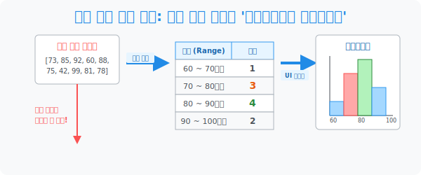

# 5. 파편화된 숫자의 병합: 구간 압축 시스템, '도수분포표와 히스토그램'

## [도입부] 학습 목표 (Learning Objectives)
- 수백 명의 수학 성적처럼, 똑같은 값이 거의 없어 일반 표(Table) 로는 절대 묶을 수 없는 파편화된 숫자들을 **'계급(Range/Interval)'** 이라는 올가미로 묶어 강제로 압축시키는 **'도수분포표'** 제작 기술을 익힙니다.
- 강제로 구간을 나눔으로써 데이터 본연의 정확한 스펙(1의 자리) 은 잃어버리지만, 전체 집단이 어떻게 뚱뚱하게 뭉쳐 있는지 **분포(Distribution)의 뼈대**를 파악하는 빅데이터 마인드를 흡수합니다.
- 이 압축된 계급 덩어리들을 틈새(Gap) 없는 직사각형 빌딩 숲으로 세워 올리는 **'히스토그램(Histogram)'** 의 시각적 위력을 체감하고, 파이썬(Python)의 다차원 조건 필터링 알고리즘이 이를 어떻게 코드로 대체하는지 엿봅니다.

---

## 1. 개별성 포기! 구간 압축기 (도수분포표) 발동

우반 학생 30명의 수학 점수를 칠판에 적었습니다. 73, 42, 99, 81, 78, 65...
사장님이 "표(Table) 로 그려와!" 라고 합니다. 일반 표를 쓰면 가로 항목(점수) 이 무려 30칸이나 되는 극악의 쓰레기 표가 탄생합니다. 서로 점수가 똑같은 녀석이 거의 없기 때문입니다.

이 파편화의 저주를 풀기 위해 통계학자들은 **[잔인한 도끼질 (구간 압축)]** 을 시전합니다. 구체적인 1의 자리 점수 따위는 전부 칼로 쳐내 버리고 넓은 포대 자루(계급) 안으로 집어 던집니다.

* **도수분포표 (Frequency Distribution Table)**: "야! 너희들 몇 점인지 디테일은 안 궁금해! 80점 이상 90점 미만인 녀석들 전부 이리 와서 모여! 머릿수(도수) 만 센다!"

**[용어 압축 코딩]**
1. **변량**: 73, 85, 92 같은 오리지널 원시 데이터.
2. **계급 (Class/Bin)**: "80이상 ~ 90미만" 처럼 데이터를 묶기 위해 임의로 설정한 포대 자루(구간).
3. **도수 (Frequency)**: 그 포대 자루 안에 떨어진 데이터들의 단순 머릿수(카운트).

도수분포표를 그리는 순간, 99점이건 91점이건 똑같이 '90점대 학생 1명' 으로 세탁됩니다. 세밀한 1의자리 팩트는 소실(Loss) 되었지만, 대신 "우리 반은 80점대에 압도적인 뚱땡이 군단(분포)이 형성되어 있구나" 라는 거시적 숲통찰력을 1방에 얻어냅니다.



<br>

## 2. 틈이 없는 빌딩 숲, 히스토그램 (Histogram)

도수분포표를 모니터에 그림으로 렌더링한 형태가 바로 **[히스토그램]** 입니다.
언뜻 보면 "그냥 막대그래프네?" 라고 착각하지만 치명적인 기능적 차이가 있습니다.

* **막대그래프**: 사과 5명, 배 3명. 막대기 사이에 **'빈틈(Gap)'** 이 있습니다. 사과와 배는 서로 이어질 수 없는 독립된 객체니까요.
* **히스토그램**: 70점~80점, 80점~90점... 몸무게, 키, 점수 같은 연속적인(Continuous) 숫자들을 쪼갠 것이므로 막대기 사이를 **시멘트로 발라 붙여버립니다 (틈새 제로)**. X축 자체가 하나의 길다란 숫자 자(Ruler) 가 됩니다. 

히스토그램 빌딩 꼭대기의 한가운데 점들을 찍어 선으로 부드럽게 연결하면, 대학교에 가서 지겹게 볼 거대한 종구 모양의 **'정규 분포(Normal Distribution)'** 파동 곡선이 탄생하게 됩니다.

---

## 3. 💻 파이썬(Python) 반복문으로 '계급(Bin)' 필터링 짜보기

엑셀이나 통계 프로그램이 없다면, 우리는 저 빌딩 하나하나 (예: 80 이상 90 미만) 마다 조건(If) 을 걸어 데이터를 하나씩 주워 담는 노가다를 뛰어야 합니다. 파이썬에게 이 일을 시키면 $N$중 조건문(Multiple Conditions) 을 통해 광속으로 분류해 냅니다.

### 🐍 파이썬 예제: `If-Elif` 구조를 활용한 도수분포망(Bin) 카운터

```python
print("--- 🚦 구간(Bin) 압축 센서: 도수분포 연산기 가동 ---")

raw_scores = [73, 85, 92, 60, 88, 75, 42, 99, 81, 78, 85, 87, 88]

# 각 계급(구간) 에 떨어질 머릿수를 체크할 변수통을 0개로 세팅
bin_60_70 = 0
bin_70_80 = 0
bin_80_90 = 0
bin_90_100 = 0

print(f" [데이터 로드] 흝어진 원시 성적 {len(raw_scores)}개를 컨베이어 벨트에 태웁니다.")

# 점수를 하나씩 꺼내서, 어느 구간(Bin) 에 떨어질지 If 문으로 낭떠러지 분류!
for s in raw_scores:
    if 60 <= s < 70:      # 60이상 70미만 이라면?
        bin_60_70 += 1
    elif 70 <= s < 80:    # 70이상 80미만 이라면? (Elif: 아니면 혹시 이건가?)
        bin_70_80 += 1
    elif 80 <= s < 90:    # 80이상 90미만 이라면?
        bin_80_90 += 1
    elif 90 <= s <= 100:  # 극강의 실력자
        bin_90_100 += 1

print("\n" + "=" * 50)
print(" 📊 [분류 완료] 도수분포표 (Frequency Distribution)")
print(f"   [ 60 ~ 70미만 ] : {bin_60_70} 명   🟩")
print(f"   [ 70 ~ 80미만 ] : {bin_70_80} 명   🟩🟩🟩")
print(f"   [ 80 ~ 90미만 ] : {bin_80_90} 명   🟩🟩🟩🟩🟩🟩 (최대 밀집 구역!)")
print(f"   [ 90 ~ 100이하] : {bin_90_100} 명   🟩🟩")

# 결과창:
# --- 🚦 구간(Bin) 압축 센서: 도수분포 연산기 가동 ---
#  [데이터 로드] 흝어진 원시 성적 13개를 컨베이어 벨트에 태웁니다.
# 
# ==================================================
#  📊 [분류 완료] 도수분포표 (Frequency Distribution)
#    [ 60 ~ 70미만 ] : 1 명   🟩
#    [ 70 ~ 80미만 ] : 3 명   🟩🟩🟩
#    [ 80 ~ 90미만 ] : 6 명   🟩🟩🟩🟩🟩🟩 (최대 밀집 구역!)
#    [ 90 ~ 100이하] : 2 명   🟩🟩
```

(실제 데이터 사이언티스트들은 `numpy.histogram` 이나 `pandas.cut` 같은 치트키 한 줄로 위 코드를 박살 냅니다. 하지만 뼛속 원리인 `If x >= 80 and x < 90:` 를 모르면 해커가 될 수 없습니다.)

---

## [결론] 학습 정리 (Summary)

1. **디테일을 버리고 거시를 취함**: 도수분포표는 개별 데이터의 유니크한 성질($83$점 조차)을 무참히 지워버리는 댓가로, "우리 집단의 주력 부대가 80점대 포진해 있다" 는 거대한 거점 정보를 쟁취하는 거래입니다.
2. **계급 (Bin/Range)**: 숫자를 담는 바구니의 너비입니다. 계급 간격(10점 단위로 끊을지, 5점 단위로 촘촘히 끊을지)을 분석가가 어떻게 설정하느냐에 따라 히스토그램 빌딩의 실루엣이 완전히 박살 나거나 섬세해집니다.
3. **히스토그램의 틈새 제로**: 단순 이산적인 막대그래프와 달리, 끊어지지 않는 연속형 변수(점수, 시간, 무게) 를 다루기 때문에 밑바닥부터 옥상까지 시멘트를 발라 이어놓은 데이터 산맥의 결정체입니다.
