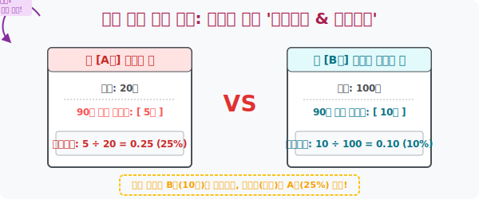

# 6. 체급이 다른 자들의 불공정 결투 해킹: '상대도수와 누적도수'

## [도입부] 학습 목표 (Learning Objectives)
- 인원수가 20명인 A반과 인원수가 100명인 B반의 "90점 넘은 사람 수" 를 단순 비교하는 것이 얼마나 수학적으로 무식한 사기극인지 파헤칩니다.
- 집단의 총량(Total Capacity) 에 구애받지 않고 오직 퀄리티와 밀도(비율) 만을 $0 \sim 1$ 사이의 소수로 렌더링 하여 공정하게 패싸움을 시키는 **'상대도수(Relative Frequency)'** 알고리즘을 체화합니다.
- 점수가 얼마나 누적(Stack) 되었는지 탑을 쌓아 내 백분위 등수를 단번에 알아채는 **'누적도수'** 의 위력을 파이썬(Python) 누적 합계 시스템 코드(`+=` 연산)로 구현해 봅니다.

---

## 1. 체급 조작의 마술, 상대도수 (Relative Frequency)

A 학원의 원장이 광고를 엄청나게 때립니다. 
> "우왓! 우리 학원 이번 중간고사에서 수학 90점 넘은 엘리트 학생이 무려 **100명**이나 배출되었습니다!! 옆동네 B 학원은 겨우 **10명**밖에 안 되네요. 나대지 마라 ㅋㅋㅋ" 

이런 언론 플레이에 절대 속으면 안 됩니다. 
진실의 통계학자가 등판하여 팩트를 체크합니다.
- A 학원은 전체 수강생이 **1만 명** 공장형 학원이었습니다. ($100명 \div 10,000 \rightarrow$ 겨우 **0.01 (1%)** 만이 성공)
- B 학원은 전체 수강생이 **20명**뿐인 과외식 스파르타 학원입니다. ($10명 \div 20 \rightarrow$ **0.5 (50%)** 가 대성공!!)

단순한 머릿수(도수) 만으로 집단끼리 칼싸움을 붙이면 체급이 미친 듯이 차이 나는 몬스터 앞에서 무조건 왜곡이 발생합니다.
이 불공정한 사기극을 막기 위해 들이대는 절대 평등의 잣대가 바로 **상대도수** 입니다.

* **상대도수 구하는 공식**: $\text{어떤 계급의 도수} \div \text{전체 도수 총합}$
* **특징**: 내가 속한 구역의 머릿수를 전체 덩치로 나눠버리므로, 항상 **$0 \sim 1$ 이하의 소수(비율)** 로 컴파일됩니다. 상대도수의 모든 계급을 끝까지 싹 다 더하면 죽었다 깨어나도 **무조건 1 (100%)** 이 됩니다. (이것이 상대도수표의 치명적인 검증 로직입니다.)



<br>

## 2. 눈사람처럼 굴려붙이기: 누적도수 (Cumulative Frequency)

데이터를 위에서부터 싹 쓸어내리며 모터가 돌아가듯 더해버리는 무식하고도 유용한 스킬입니다.
"야, 수학 60점 이상부터 너(80점대)까지 싸잡아서 도대체 우리 반에 몇 명이나 있는 거냐?"

* 60점~70점: 2명
* 70점~80점: 3명 
* 80점~90점: (나)

누적도수는 위에서부터 계속 이전 데이터를 눈덩이처럼 합체(Stack) 시킵니다. ($2+3=5$명). 그럼 "내 밑으로 5명이나 깔려있구나!" 를 즉시 알게 해줍니다. 데이터가 얼마나 켜켜이 쌓여오고 있는지 성장 곡선을 렌더링 할 때 미친 효율을 냅니다.

---

## 3. 💻 파이썬(Python) 누적 합계(`+=`) 및 상대비율 할당기

파이썬 반복문(`for`) 안에서 이전 값을 잃어버리지 않고 계속 쟁여놓는 누적 합산 스킬(`cumulative_sum += current_val`) 은 실무 프로그래밍 테스트에서 단골로 출제되는 핵심 로직입니다. 

### 🐍 파이썬 예제: 리스트의 상대도수 및 누적도수 자동 변환 엔진

```python
print("--- 🧮 불공정 체급 붕괴 시스템: 상대/누적도수 산출기 ---")

# 특정 반의 점수 구간별 머릿수 (도수)
frequency_data = [2, 5, 8, 4, 1]  # 각 50점대, 60대, 70대, 80대, 90대 명수라 가정

# 1. 덩치 파악 (전체 머릿수 합계 연산)
total_count = sum(frequency_data)
print(f" [시스템] 전체 데이터 덩치(총도수) 파악 완료: 총 {total_count}명\n")

cumulative_sum = 0  # 눈사람처럼 굴려서 값을 보관할 빈 변수 초기화!

print(" 구간   | 도수 | 상대도수 (비율)  | 누적도수 (스택)")
print("-" * 50)

# 2. 리스트를 처음부터 끝까지 스캔하며 변환 계산
for idx, freq in enumerate(frequency_data):
    
    # [상대도수 변환로직]: 내 몸집을 전체 덩치로 나눠버린다! (극강의 비율화)
    relative_freq = freq / total_count
    
    # [누적도수 변환로직]: 과거에 쌓인 눈사람에 현재 빈도수를 += 로 덮어씌워 덧붙인다!
    cumulative_sum += freq
    
    # 터미널에 소수점 2자리까지만 예쁘게 끊어서 출력 (반올림 UI)
    print(f" 구간 {idx+1} |  {freq}명 |   {relative_freq:.2f} (약 {int(relative_freq*100)}%)  | 누적 {cumulative_sum}명")

print("-" * 50)
print(" 💡 [해커의 시각] 가장 마지막 줄 누적도수가 '총인원' 과 똑같다면 무결점 통과!")

# 결과창:
# --- 🧮 불공정 체급 붕괴 시스템: 상대/누적도수 산출기 ---
#  [시스템] 전체 데이터 덩치(총도수) 파악 완료: 총 20명
# 
#  구간   | 도수 | 상대도수 (비율)  | 누적도수 (스택)
# --------------------------------------------------
#  구간 1 |  2명 |   0.10 (약 10%)  | 누적 2명
#  구간 2 |  5명 |   0.25 (약 25%)  | 누적 7명
#  구간 3 |  8명 |   0.40 (약 40%)  | 누적 15명
#  구간 4 |  4명 |   0.20 (약 20%)  | 누적 19명
#  구간 5 |  1명 |   0.05 (약 5%)   | 누적 20명
# --------------------------------------------------
#  💡 [해커의 시각] 가장 마지막 줄 누적도수(20)가 '총인원(20)' 과 똑같다면 무결점 통과!
```

코드에서 보듯, 도수(단순 명수)로는 구간 3에 "8명" 이라는 무의미한 숫자가 찍히지만, 시스템에 의해 "아하, 우리 반 전체 병력의 무려 $40\% (0.40)$ 가 구간 3에 뚱뚱하게 몰려있구나!" 라는 백분율 비율 데이터로 진화합니다.

---

## [결론] 학습 정리 (Summary)

1. **체급 보정기 (상대도수)**: 총인원이 다른 극과 극의 두 집단을 나란히 세워놓고 실적을 비교할 때 들이대는 궁극의 메스(칼) 입니다. 내 머릿수를 반드시 전체 총합으로 나눠서 비율(0~1) 로 세탁합니다.
2. **소수점의 마술**: 상대도수는 $0.23, 0.45$ 처럼 무조건 소수로 튀어나오며, 이 모든 소수 파편들을 끌어모아 다 더하면 하늘이 두 쪽 나도 **합계 $1$** 이 되어야 하는 절대 법칙을 지닙니다.
3. **스택 뷰어 (누적도수)**: 위에서부터 데이터를 차곡차곡 쓸어 담으며 덧셈(`+=`) 을 치는 기술입니다. 내가 과연 하위(또는 상위) 몇 퍼센트에 걸쳐있는지 '커트라인' 파악의 도구로 무섭게 쓰입니다.
