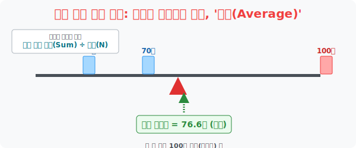

# 7. 무너진 시소의 중심을 잡아라: 대푯값계의 제왕, '평균(Average)'

## [도입부] 학습 목표 (Learning Objectives)
- 10만 명이나 되는 집단의 성적 데이터를 단 '1개의 숫자' 로 압축시켜 그 집단을 대표하는 얼굴마담으로 내세우는 **'대푯값(Representative Value)'** 의 개념을 이해합니다.
- 대푯값계의 압도적 1인자인 **'평균(Mean/Average)'** 이 물리적으로는 어떤 의미를 가지며, 모든 변량(수치) 들에 공평하게 몸집을 깎고 양보하게 만들어 평형을 이루는 '무게 중심점' 임을 깨닫습니다.
- 파이썬(Python)의 `sum()` 과 `len()` 함수를 융합하여, 수천 개의 데이터라도 0.01초 안에 평균을 산출해 내는 수학적 연산 엔진을 구축합니다.

---

## 1. 10만 명을 대표하는 단 한 명의 전사, '대푯값'

서울의 모든 중학생(약 10만 명) 의 수학 실력을 부산 학생들과 비교하려고 합니다.
10만 명의 성적표(10만 줄의 데이터) 를 통째로 뽑아서 부산 시장님께 던져줄 건가요? 뺨을 맞을 것입니다.
통계학의 궁극적 목표는 결국 방대한 빅데이터를 "딱 1개의 숫자" 로 초압축하여 깔끔하게 보고하는 것입니다. 이 집단의 멱살을 잡고 대표로 나선 1개의 숫자를 **대푯값(Representative Value)** 이라 부릅니다.

대푯값에는 중앙값, 최빈값 등 여러 캐릭터가 있지만, 초중고 12년 내내 우리를 괴롭힐 가장 무서운 대장 몬스터가 바로 **[평균(Average)]** 입니다.

* **초등학생의 평균 계산법**: "전부 다 더한 다음, 사람 머릿수로 나눈다."
* **물리학자의 평균 해석법**: "시소 위에 10만 명을 앉혀놓고, 시소가 수평을 이루며 절대 넘어지지 않는 완벽한 밸런스(무게 중심) 지점을 찾는다!"



<br>

## 2. 공산주의적 평등: 평균의 진짜 속내

왜 "전부 더해서 개수로 나누는 행위" 가 공평한 무게 중심점이 될까요?
여러분이 용돈을 1,000원 받고, 동생이 5,000원을 받는다고 칩시다. 몹시 불공평합니다. 엄마가 "야, 둘이 똑같이 공평하게 나눠 가져!" 라고 소리칩니다.

1. **전부 더한다(Sum)**: 일단 돈을 다 뺏어서 테이블 중앙에 한 덩어리로 모읍니다. ($1,000 + 5,000 = 6,000$원)
2. **개수로 나눈다(Div)**: 이 거대한 6,000원을 너(1명)와 동생(1명), 총 2명에게 '똑같이(공평하게)' $1/N$ 칼질을 해서 배분합니다. ($6,000 \div 2 = 3,000$원)

평균은 집단 내에 있는 모든 값을 강제로 압수하여 하나의 큰 찰흙 공으로 뭉친 다음, 다시 등장인물 개수만큼 $1/N$ 스무디로 갈아버리는 궁극의 '절대 평등점' 입니다. 

**[평균의 치명적 약점: 극단치(Outlier)의 테러]**
동네 꼬마 9명(용돈 1천 원) 과 이건희 회장(재산 1조 원) 이 모여있습니다. 이 10명의 재산 평균을 구하면, 꼬마들도 전부 1,000억 원 부자로 세탁됩니다. 이처럼 미친 듯이 크거나 작은 '극단치(Outlier)' 가 단 1개라도 껴있으면, 전체 평균이 그쪽으로 확 쏠려버리는 치명적인 버그가 존재합니다.

---

## 3. 💻 파이썬(Python) 빅데이터 평균 산출 엔진

수능 점수 평균, 국가 GDP 평균 등 데이터가 100만 개를 넘어가는 순간 인간의 암산은 마비됩니다. 
파이썬은 "전부 더하기(`sum()`)" 와 "개수 세기(`len()`)" 라는 가장 강력한 내장 함수 단 두 개로 이 연산을 0.01초 대기시간 없이 렌더링 해버립니다.

### 🐍 파이썬 예제: N명의 용돈 평등 분배(평균) 시뮬레이션

```python
import math

print("--- ⚖️ 절대 평등 분배기: 평균(Average) 연산 엔진 가동 ---")

# 동네 아이들 5명의 용돈 원시 데이터 (빈부격차가 심함)
allowance_data = [1500, 8000, 2000, 500, 13000]

# 1. 일단 테이블 중앙에 돈을 싹 다 압수해서 더한다! (Sum)
total_money = sum(allowance_data)

# 2. 등장인물이 총 몇 명인지 카운트한다! (Len: Length)
people_count = len(allowance_data)

print(f" [상태 보고] 총 자금: {total_money}원 / 총 인원: {people_count}명")

# 3. 평균의 법칙 가동: 총합을 인원수로 1/N 칼질 (공평 분배)
average_money = total_money / people_count

print("-" * 50)
print(f" 💵 [수평 밸런스 완료] 5명이 공평하게 가질 평균 용돈: {int(average_money)}원")

# 4. 해커의 시상: 평균 구하기의 진짜 의미
print("\n 💡 [해석] 만약 5명 모두가 처음부터 서로 '5,000원' 씩 평등하게 들고 있었다면?")
print(f"    -> 5000원 x 5명 = {5000 * 5}원! 실제 원본 총합({total_money})과 완벽히 일치합니다.")

# 결과창:
# --- ⚖️ 절대 평등 분배기: 평균(Average) 연산 엔진 가동 ---
#  [상태 보고] 총 자금: 25000원 / 총 인원: 5명
# --------------------------------------------------
#  💵 [수평 밸런스 완료] 5명이 공평하게 가질 평균 용돈: 5000원
# 
#  💡 [해석] 만약 5명 모두가 처음부터 서로 '5,000원' 씩 평등하게 들고 있었다면?
#     -> 5000원 x 5명 = 25000원! 실제 원본 총합(25000)과 완벽히 일치합니다.
```

데이터 과학자들은 이런 평균을 구한 뒤, 내가 실제로 가진 데이터(예: 500원) 가 저 거대한 기준점(5,000원) 에서 좌우로 얼마나 멀리 떨어져 있는지(편차) 를 통해 세상의 분포도를 그리는 고급 해킹 기술(분산/표준편차) 로 나아가게 됩니다.

---

## [마무리 요약] 통계 기초 (Chapter 74) 총정리

1. 통계는 "데이터 채굴(수집) $\rightarrow$ 기준 필터링(분류) $\rightarrow$ 표/그래프 포장(렌더링) $\rightarrow$ 대푯값 추출(평균)" 로 이어지는 **현대 데이터 사이언스와 AI 머신러닝의 완벽한 축소판**입니다.
2. 엑셀의 기초구조인 표와 히스토그램은 데이터를 다루는 컴퓨터 프로그래머의 필수 소양이며, 이를 모르면 IT 시대에 살아남을 수 없습니다.
3. 이제 여러분의 하드디스크에 저장된 '데이터' 들이 단순한 잡동사니가 아니라 세상을 분석하는 칼과 통찰력(평균) 으로 컴파일되었기를 바랍니다. 다음 장부터는 이 무기를 바탕으로 더 신나는 수학 해킹을 이어가 봅시다!
