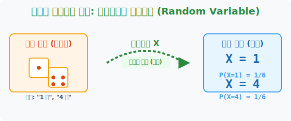

# 1. 운명을 계산하는 숫자: 확률변수와 확률분포 (Random Variable)

## [도입부] 학습 목표 (Learning Objectives)
- '주사위를 던져 짝수가 나오는 사건' 같은 현실 세계의 모호한 말들을 컴퓨터가 계산할 수 있는 깔끔한 숫자($X$)로 변환시키는 **'확률변수(Random Variable)'**의 개념을 마스터합니다.
- 동전 뒤집기나 주사위 던지기에서 발생할 수 있는 모든 $X$ 값과 그에 딸린 확률($P$)이 세트로 돌아다니는 체계인 **'확률분포(Probability Distribution)'**의 생태계를 이해합니다.
- 파이썬(Python) 딕셔너리(Dictionary)를 통해 사건과 확률을 $1:1$ 코드로 맵핑하는 데이터 구조를 구현해 봅니다.

---

## 1. 현실의 사건을 수학의 도마 위에 올리다

그동안 우리는 "주사위를 던져 4가 나올 확률은 $1/6$이다" 처럼 한국어로 길게 말해왔습니다.
하지만 인공지능과 통계학자들은 이런 감성적인 문장을 극도로 혐오합니다. 그들은 "조건문을 간결한 방정식으로 만들고 싶다!"라는 욕망에 휩싸였고, 결국 기발한 아이디어를 냅니다.

**"주사위 눈의 숫자를 그냥 대문자 $X$ 라고 부르자!"**
이제 "주사위를 던져 4가 나올 확률" 이라는 긴 문장은 수학 세계에서 **$P(X=4)$** 라는 단 6글자의 깔끔한 수식으로 압축됩니다. 
이처럼 현실 세계에서 우연히 일어나는 사건의 결과를, 수학과 컴퓨터가 이해할 수 있는 하나의 '숫자'로 번역해 주는 대리인(변수)을 **확률변수(Random Variable)** 라고 부릅니다. 보통 알파벳 대문자 $X, Y, Z$ 등을 구세주처럼 사용합니다.

<div align="center">
  
</div>

<div align="center">
  
</div>

<br>

## 2. 모든 운명을 하나의 지도로: 확률분포 (Probability Distribution)

주사위를 굴리면 대문자 $X$ 가 가질 수 있는 숫자는 $1, 2, 3, 4, 5, 6$ 총 6가지입니다.
그리고 각각의 $X$ 숫자가 현실에 도달할 확률 $P(X)$는 모두 $\frac{1}{6}$ 로 똑같습니다. 

이렇게 확률변수 $X$가 가질 수 있는 "모든 값($1\sim6$)"과 "그 값이 튀어나올 확률($1/6$)" 을 하나하나 짝지어서 보여주는 것을 **확률분포(Probability Distribution)** 라고 합니다. 
마치 게임에서 캐릭터 뽑기를 할 때 "SS등급(X)이 나올 확률 1%, A등급(X) 확률 10%, B등급(X) 확률 89%" 라고 써놓은 확률 공개표와 완벽하게 똑같은 원리입니다. 이 지도가 있어야 우리는 미래에 벌어질 일들을 수학적으로 제어할 수 있습니다.

---

## 3. 💻 파이썬(Python)으로 확률 뽑기 게임 렌더링하기

게임회사의 백엔드 서버는 아이템 강화를 시도할 때마다 거대한 확률분포표 데이터베이스를 뒤져 성공과 실패를 판가름합니다. 파이썬의 `Dictionary`는 $X$값(Key)과 $P$값(Value)을 한 묶음으로 처리하는 완벽한 확률분포 맵 구조입니다.

### 🐍 파이썬 예제: 던전 몬스터 드랍 확률 딕셔너리 구성

```python
print("--- 🎲 넥슨 강화 아이템 드랍 확률분포 서버 ---")

# (데이터 셋) 확률변수 X = '몬스터가 떨어뜨리는 골드의 양'
# X가 가질 수 있는 값(10원, 50, 100, 1000)과 그 확률 P(X) 을 매핑(Mapping)합니다.
drop_distribution = {
    10: 0.50,    # P(X=10) = 50% 확률로 똥템
    50: 0.30,    # P(X=50) = 30% 확률로 평범
    100: 0.15,   # P(X=100) = 15% 확률로 쓸만함
    1000: 0.05   # P(X=1000) = 5% 확률로 대박!
}

# 확률분포의 철칙: "모든 일어날 확률을 무조건 다 더하면 1.0 (100%) 이 되어야 한다!"
total_prob = sum(drop_distribution.values())

print(f"✅ 총 확률 검증 시스템: 합계 {total_prob * 100}% (무결성 통과)")
print("-" * 50)

# 유저가 몬스터를 잡았을 때 발동되는 확률변수 X의 상태 출력
for x_value, prob in drop_distribution.items():
    print(f"수학 표기 P(X={x_value}) -> 발생 확률: {prob * 100}%")

# 결과창:
# --- 🎲 넥슨 강화 아이템 드랍 확률분포 서버 ---
# ✅ 총 확률 검증 시스템: 합계 100.0% (무결성 통과)
# --------------------------------------------------
# 수학 표기 P(X=10) -> 발생 확률: 50.0%
# 수학 표기 P(X=50) -> 발생 확률: 30.0%
# 수학 표기 P(X=100) -> 발생 확률: 15.0%
# 수학 표기 P(X=1000) -> 발생 확률: 5.0%
```

여러분이 즐기는 모바일 가챠 게임(뽑기)의 핵심 엔진이 바로 이 10줄 남짓한 딕셔너리 코드로 구동됩니다. 현실의 '아이템 종류(사건)'를 깔끔하게 $1000$이라는 숫자($X$)로 치환시켜 놓았기 때문에 컴퓨터가 순식간에 계산을 때릴 수 있는 것입니다.

---

## [결론] 학습 정리 (Summary)

1. **확률변수 ($X$)**: "앞면이 2개 나온다" 같은 자연어 문자열을 $X=2$ 라는 간결한 수학 숫자로 번역해 내는 통계학의 대리인입니다.
2. **함수적 매핑**: 동전을 3번 던졌을 때 앞면이 나타나는 횟수처럼, 내가 룰을 정하면 현실 세계의 막연한 결과가 딱 떨어지는 정수로 치환되는 변환기 역할을 합니다.
3. **확률분포 (Distribution)**: 그 확률변수 $X$가 가질 수 있는 '모든 경우의 숫자'들의 리스트와, 거기에 딸린 '확률(퍼센트)' 의 매칭 짝꿍을 싹 다 모아놓은 거대한 설계 지도를 뜻합니다 (그 모든 확률을 더하면 무조건 $1$이 됩니다).
