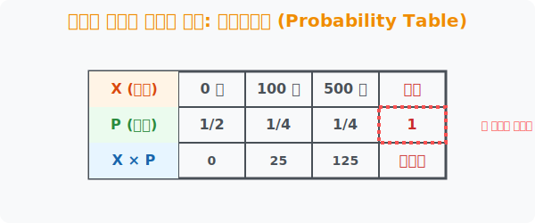

# 2. 표로 정리하는 확률: 확률분포표 (Probability Distribution Table)

## [도입부] 학습 목표 (Learning Objectives)
- 머릿속에서 어지럽게 둥둥 떠다니는 복잡한 확률 사건들을 한눈에 들어오는 투명한 엑셀(Excel) 격자무늬, **'확률분포표'** 로 강제 이주시켜 깔끔하게 고정하는 법을 배웁니다.
- 확률분포표의 맨 오른쪽 합계(Sum) 칸이 우주가 두 쪽 나도 무조건 **'1'** 이 되어야만 하는 무결성 철칙을 체화합니다.
- 파이썬(Python) 기반의 데이터 프레임(`Pandas`) 구조를 모방하여, 표 형식으로 데이터를 뽑아내고 검증하는 시각적 렌더링 작업을 수행합니다.

---

## 1. 지저분한 숫어들을 포획하는 감옥, '표(Table)'

우리는 1장에서 확률분포를 파이썬의 `Dictionary` 로 구성해보며, 일어날 수 있는 모든 숫자인 확률변수 $X$와 거기에 딸린 확률 $P(X)$의 짝꿍을 찾았습니다. 
하지만 데이터가 10개, 100개로 늘어나면 줄줄이 읽어내려가는 방식은 통계학자들의 눈을 핑핑 돌게 만듭니다. 인간의 눈은 세로와 가로가 반듯하게 쳐진 **'바둑판 모양의 격자(표)'** 를 볼 때 가장 편안함을 느낍니다.

그래서 발명된 것이 **확률분포표**입니다. 
- **1층(위 칸):** 발생 가능한 모든 경우의 수 ($X$ 값들) 나열
- **2층(아래 칸):** 그 $X$가 당첨될 실제 확률 ($P$ 값들) 나열
- **맨 오른쪽 칸:** 전체의 총합 (합계)

이 단순무식한 직사각형 박스 표를 긋는 순간, 아무리 복잡한 동전 10번 던지기 게임도 마치 슈퍼마켓 영수증처럼 단번에 가독성이 폭발하게 됩니다.

<div align="center">
  
</div>

<br>

## 2. 합계는 무조건 '1' : 통계청의 뚫리지 않는 철칙

여러분, 동전을 던지면 앞면($1/2$) 아니면 뒷면($1/2$)이 나옵니다. 주사위는 1부터 6까지 각각 $1/6$ 확률을 가집니다. 
어떤 게임이든, 현실 세계에서 벌어질 수 있는 **'모든 경우의 확률'을 싹 다 긁어모아서 더하면 무조건 $100$% 즉 수학 숫자로는 `1`** 이 나와야 합니다. 

확률분포표의 맨 우측 **[합계]** 칸 자리에 $1$이 적혀 있지 않거나, 다 더했는데 우연히 $0.99$ 나 $1.02$ 가 튀어나왔다면? 
그것은 도박사가 사기를 쳤거나 프로그래머가 코드에 버그(오류)를 심어놓은 것입니다. 표의 아랫줄(확률P)의 총합이 $1$ 이 되는지 검문하는 것은 자율주행 자동차 알고리즘에서 오류 멈춤을 방지하는 가장 1차적인 '안전 퓨즈' 입니다.

---

## 3. 💻 파이썬(Python) `Pandas` 스타일 확률표 스캐너

데이터 사이언스는 무수히 많은 확률들을 `CSV`나 엑셀 표로 만들어서 다룹니다. 파이썬에서는 `Pandas Dataframe` 이라는 라이브러리가 이 확률분포표의 역할을 100% 모방합니다.

### 🐍 파이썬 예제: 로또 뽑기 확률표 생성 및 무결성 검증

```python
import pandas as pd # 엑셀 표의 신, 판다스 임포트

print("--- 📊 도박장 확률분포표 무결성 검사기 ---")

# (데이터 셋) 야바위 게임 
# X: 당첨금(0원, 100원, 500원) / P: 당첨확률
game_X_values = [0, 100, 500]
game_P_probs  = [0.5, 0.25, 0.25]  # 절반은 꽝!

# 파이썬 Pandas를 이용해 2줄짜리 깔끔한 '확률분포표' 즉시 생성
# 엑셀의 열(Column) 구조처럼 뭉쳐서 데이터 표(DataFrame)로 렌더링
prob_table = pd.DataFrame({
    '확률변수 X (당첨금)': game_X_values,
    '확률 P(X=x)     ': game_P_probs
}).T  # .T 는 가로로 넓게 눕혀버리는(Transpose) 마법의 태그

print("[렌더링 된 확률분포표]")
print("=" * 40)
print(prob_table)
print("=" * 40)

# 🚨 블랙박스 검증: 무조건 '1'이 나와야 하는 안전 퓨즈 통과할까?
total_p = sum(game_P_probs)

if total_p == 1.0:
    print(f"\n✅ [검증 통과] 밑판 확률의 총합이 {total_p*100}% 로 완벽한 표입니다.")
else:
    print(f"\n❌ [버그 발생] 헐! 확률의 합이 {total_p} 입니다! 사기 게임입니다!")

# 결과창:
# --- 📊 도박장 확률분포표 무결성 검사기 ---
# [렌더링 된 확률분포표]
# ========================================
#                    0      1      2
# 확률변수 X (당첨금)  0.0  100.0  500.0
# 확률 P(X=x)          0.5    0.25   0.25
# ========================================
# 
# ✅ [검증 통과] 밑판 확률의 총합이 100.0% 로 완벽한 표입니다.
```

이렇게 $X$ 열과 $P$ 열이 반듯하게 정렬된 파이썬 표(데이터프레임)를 가지게 되면, 추후 3장에서 마법의 통계학 코어인 평균(기댓값)과 분산을 구할 때 위아래로 폭격(곱셈)하기가 엄청나게 수월해집니다.

---

## [결론] 학습 정리 (Summary)

1. **시각적 압축(Table)**: 산만하게 퍼져있는 확률변수 $X$와 각자의 당첨 확률 $P$ 뭉치들을 가로 직사각형 바둑판에 위아래($1층: 2층$)로 정렬시켜 인간의 두뇌를 편안하게 해주는 렌더링 툴입니다.
2. **합계 $1$의 법칙**: 아랫줄(2층)에 세팅된 확률 값($P$)들을 전부 합산했을 때는 무조건 $1$ 이 나와야 하며, 이는 곧 파이썬이 데이터 버그나 무결성 에러를 체크하는 체크섬(Checksum) 방화벽 역할을 합니다.
3. **데이터 과학의 출발점**: 현대 빅데이터 AI가 사용하는 Pandas 데이터프레임의 생김새와 완전히 일치하며, 다가올 기댓값(평균)이나 분산 수식을 짤 때 칸끼리 더하고 곱하는 식을 세우기 위한 수학적 밥상입니다.
