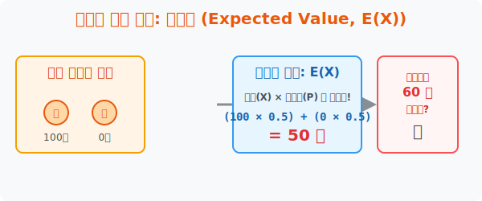

# 3. 도박의 절대 진리: 기댓값 (Expected Value)

## [도입부] 학습 목표 (Learning Objectives)
- 카지노와 도박장, 복권 회사가 왜 영원히 돈을 잃지 않는지 통계학의 궁극 오의인 **'기댓값(Expected Value, E(X))'** 수학 공식을 통해 비밀을 폭로합니다.
- 확률분포표에서 "위 칸($X$)과 아래 칸($P$)을 미친 듯이 곱하고 전부 더하는" 아주 단순한 계산법 하나가 미래의 통장 잔고를 어떻게 점치는지 원리를 터득합니다.
- 파이썬(Python)의 원클릭 배열 곱셈 코드를 렌더링 하여 내가 참여할 확률 게임이 '혜자' 게임인지 '사기' 게임인지 판독하는 수익 검증기를 완성합니다.

---

## 1. 이 게임에 참가비 60원을 내시겠습니까?

친구와 동전 던지기 도박을 합니다. 앞면이 나오면 $100$원을 받고, 뒷면이 나오면 한 푼도 못 받습니다($0$원). 그런데 친구가 "대신 이 게임에 참여하려면 한 판당 참가비 60원을 내라"라고 제안합니다. 이 게임, 하는 게 이득일까요 손해일까요?

우리는 "운 좋으면 100원 따고, 재수 없으면 0원이니까 대충 중간쯤 50원 벌겠네" 라고 감(Sense)으로 때려 맞춥니다.
이 감각을 통계학의 언어로 번역한 것이 바로 **'기댓값(Mean, $E(X)$)'**입니다. 
당신이 이 짓거리를 $10$번, $100$번, $1$만 번 계속(무한대 반복)했을 때, **판당 평균적으로 당신 주머니에 떨어질 것이라고 100% 보장되는 '수학적 참값'** 이 바로 기댓값입니다. 

<div align="center">
  
</div>

<br>

## 2. 계산법: 위 칸과 아래 칸의 죽음의 왈츠

기댓값을 구하는 공식은 초등학생도 5분이면 배우는 구구단 덧셈의 반복입니다. 
확률분포표의 각 열(Column)에 위치한 **'당첨금 값($X$)' 과 '그 확률 퍼센트($P$)'를 위아래로 쾅쾅 박치기(곱셈)시킨 뒤, 모조리 더해주면 끝**입니다.

- **[앞면]** 당첨금 100원 $\times$ 확률 1/2 = $50$
- **[뒷면]** 당첨금 0원 $\times$ 확률 1/2 = $0$
- **총합 (기댓값):** $50 + 0 = 50$원!

이 게임을 반복하면 결국 참가자는 판당 평균 **$50$원**을 벌어가게끔 수학의 신이 세팅해 두었습니다. 
그런데 참가비가 **$60$원**이라면? 한 판 할 때마다 무조건 판당 **$-10$원**씩 십일조를 내며 피가 깎이는 구조, 즉 파산이 확정된 "절대 불리한 도박" 이라는 팩트가 산출됩니다. 전 세계 카지노의 모든 불빛 찬란한 슬롯머신은 이 $E(X)$ 값이 무조건 참가비보다 살짝 낮게(예: $48$원) 세팅되어 있습니다.

---

## 3. 💻 파이썬(Python)으로 로또 사기 판독기 구축

파이썬의 `Zip` 함수나 배열을 이용하면, 로또나 강화 확률 게임의 수십 줄짜리 확률분포표의 위 칸(X)과 아래 칸(P)을 0.01초 만에 박치기시켜 진짜 기댓값을 실시간으로 반환합니다.

### 🐍 파이썬 예제: 넥슨 확률형 박스 기댓값(E(X)) 도출기

```python
print("--- 🎰 RPG 럭키박스 지능적 호구 판별기 ---")

# 박스 1회 뽑기 가격: 15,000 원

# (데이터 셋) X: 당첨 아이템의 현금 가치 / P: 확률
prizes_X = [0, 5000, 10000, 100000]     # 대박템 10만원, 꽝 0원
probs_P  = [0.60, 0.25, 0.10, 0.05]     # 꽝이 60%

# 기댓값(Expected Value, E(X)) 계산
# 파이썬 리스트 컴프리헨션(Comprehension)으로 위, 아래 칸을 짝지어 곱하고 sum!
expected_value = sum([x * p for x, p in zip(prizes_X, probs_P)])

print(f"✅ 아이템 뽑기의 1회 순수 기댓값 E(X) = {expected_value:,.0f} 원")

# 참가비(15000원) 대비 호구력 검증
ticket_price = 15000

print("-" * 50)
if expected_value < ticket_price:
    loss = ticket_price - expected_value
    print(f"🚨 [결론] 당신은 한 번 뽑을 때마다 평균적으로 {loss:,.0f} 원씩 공중분해 당하고 있습니다!")
    print(" ☞ 확률형 아이템 법규 위반 의심! (사기 게임)")
else:
    print(" ☞ 혜자 게임입니다. 계속 돌리세요!")

# 결과창:
# --- 🎰 RPG 럭키박스 지능적 호구 판별기 ---
# ✅ 아이템 뽑기의 1회 순수 기댓값 E(X) = 7,250 원
# --------------------------------------------------
# 🚨 [결론] 당신은 한 번 뽑을 때마다 평균적으로 7,750 원씩 공중분해 당하고 있습니다!
#  ☞ 확률형 아이템 법규 위반 의심! (사기 게임)
```

이 $7,250$원이라는 냉정한 수학적 선고(기댓값)는 우리가 살면서 보험을 들거나, 주식 투자를 할 때 반드시 돌려봐야 하는 최소한의 자기방어 인공지능 알고리즘입니다.

---

## [결론] 학습 정리 (Summary)

1. **기댓값의 정체, E(X)**: 10판, 100판짜리 단판 승부의 우연에 기대는 것이 아니라, 수만 판의 도박(행위)을 반복했을 때 거스를 수 없는 대수의 법칙(Law of Large Numbers)에 의해 1판당 떨어지는 **"진짜 수학적 평균 이득액"**입니다.
2. **세로 곱셈의 법칙**: 확률분포표에서 얻을 수 있는 각 당첨금($X$) 이랑 그것이 당첨될 확률 퍼센트($P$) 파트너를 각각 세로로 곱한 뒤, 그 덩어리들을 가로로 싹 다 합산(Sum)해버리면 허무할 정도로 쉽게 기댓값이 나옵니다.
3. **카지노 필승법**: 기댓값이 판돈(참가비)보다 조금이라도 낮다면(예: 60원 내고 기댓값 50원짜리 게임 참여), 여러분은 게임을 하면 할수록 100% 확률로 파산하게 됩니다. 보험사와 카지노의 거대한 빌딩은 바로 이 "마이너스 기댓값 십일조"에 의해 세워졌습니다.
