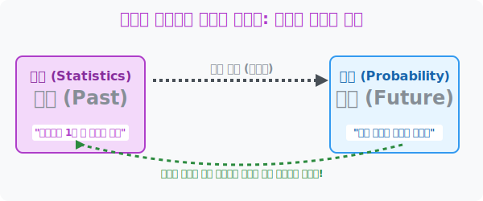

# 4. 과거를 스캔해 미래를 렌더링하다: 확률과 통계의 본질

## [도입부] 학습 목표 (Learning Objectives)
- 수학교과서의 표지 인쇄물 단골 레퍼토리인 '확률' 과 '통계' 의 철학적 융합 메커니즘을 완전히 깨닫습니다.
- 통계(과거의 파편)가 어떻게 모여서 법칙이 되고, 그 법칙이 확률(미래의 예언) 이라는 신의 암호로 작동하는지 대수의 법칙(Law of Large Numbers)을 통해 증명합니다.
- 파이썬(Python)의 `Random` (난수 폭격기)을 이용해 1만 번 주사위를 던지는 시뮬레이션을 구현하고, 신의 설계도를 탈취하는 머신러닝의 뼈대를 이해합니다.

---

## 1. 통계는 '과거'의 부검실, 확률은 '미래'의 점술집

학생들에게 "확률과 통계가 뭐가 달라?" 라고 물어보면 대부분 대답을 하지 못합니다. 사실 두 개념은 완벽히 동전의 양면이자 시제가 다를 뿐입니다.

- **통계 (Statistics) = '과거'의 해부학:** 어제, 그제, 1년 동안 길거리에 쏟아진 수동적인 결과물(잔해물)을 쓸어담아 표와 그래프로 요약하는 "경찰의 목격자 진술서 판독" 입니다.
- **확률 (Probability) = '미래'의 렌더링:** 통계가 모아놓은 패턴을 관찰해 보니 "내일 타자가 홈런 칠 가능성은 3할($3/10$)이겠구나!" 라고 내일의 결과값을 예언하는 신의 굴림판입니다. 

"내일 비 올 확률 60%"라는 예언은 신내림을 받은 것이 아니라, **과거 수만 일 동안 기압장비로 모아놓은 날씨 데이터(통계)**들을 뒤져보았더니 비슷한 날씨에서 10번 중 6번 꼴로 비가 왔었다는 **[경험적 미래 예측값]**을 뿌리는 것일 뿐입니다.

<div align="center">
  
</div>

<br>

## 2. 1만 번의 노가다: 대수의 법칙 (Law of Large Numbers)

우주의 법칙 중 가장 인간에게 든든한 법칙이자, 카지노/보험사를 먹여 살리는 성스러운 교리가 하나 있습니다. 바로 무식한 노가다 앞에서는 우연도 규칙으로 변한다는 **'대수의 법칙'** 입니다.

동전을 2번 던지면 앞면/앞면이 연속으로 나올 수도 있습니다. 수학적 참값인 확률(50%)과 통계적 현실(100%) 사이에 엄청난 갭(왜곡)이 발생합니다.
하지만 동전을 미친 듯이 **1만 번, 10만 번 연달아 던지면 어떻게 될까요?** 뒷면과 앞면의 비율이 소름 돋게 $0.50001...$ 등 정확히 수학적 확률인 $50$%(반반)를 향해 미친 듯이 수렴해서 다가갑니다. 즉, **시행 횟수(과거의 통계)가 방대해질수록 우연은 죽어버리고 수학적 진리(확률)에 강제로 안착한다**는 무시무시한 자연계의 강제 물리 법칙입니다.

---

## 3. 💻 파이썬(Python)으로 신의 주사위 해킹하기

사람의 손으로 주사위를 1만 번 구르려면 이틀 밤낮이 걸리지만, 파이썬 CPU 코어는 몬테카를로 시뮬레이션(반복 노가다)을 0.1초 만에 박살 내어 대수의 법칙을 시각적으로 증명해 냅니다.

### 🐍 파이썬 예제: 대수의 법칙 (주사위 1만 번 폭격 루프)

```python
import random # 주사위 굴리기 모듈 (난수 생성)

print("--- 🎲 대수의 법칙: 파이썬 시뮬레이션 엔진 가동 ---")

def roll_dice(trials):
    count_1 = 0 # 1이 나온 횟수 기록장
    
    # 인간은 불가능한 노가다 타격을 파이썬 루프(for)로 강제 지정
    for _ in range(trials):
        dice_result = random.randint(1, 6) # 무작위 1~6 슛!
        if dice_result == 1:
            count_1 += 1
            
    # 통찰된 1번칸의 출현 확률 통계
    result_prob = count_1 / trials
    print(f"[{trials}번 노가다] 1이 뜰 실제 확률: {result_prob:.4f} (이론값: 0.1667)")

# 횟수를 기하급수적으로 늘리면서 시뮬레이팅!
roll_dice(10)       # 10번 던지기
roll_dice(100)      # 100번 던지기
roll_dice(1000)     # 1,000번 던지기
roll_dice(100000)   # 10만 번 던지기

# 결과창:
# --- 🎲 대수의 법칙: 파이썬 시뮬레이션 엔진 가동 ---
# [10번 노가다] 1이 뜰 실제 확률: 0.1000 (이론값: 0.1667)  <-- 오차 극심
# [100번 노가다] 1이 뜰 실제 확률: 0.2000 (이론값: 0.1667)
# [1000번 노가다] 1이 뜰 실제 확률: 0.1580 (이론값: 0.1667)
# [100000번 노가다] 1이 뜰 실제 확률: 0.1668 (이론값: 0.1667) <-- 미친 수렴!!
```

파이썬의 실행 결과를 보면 단 몇 번 던졌을 때는 오차가 엄청나지만, **10만 번을 강제로 렌더링 하자** 인간이 종이로 풀어낸 수학 공식 상의 참값 $1/6 (0.1667)$ 과 미친 듯이 똑같아지는 기적(수렴 현상)을 목격할 수 있습니다. 딥러닝(Deep Learning)이라는 구조 역시, 수백만 장의 강아지/고양이 사진(통계)을 때려 박아 미래에 들어올 사진이 강아지일 확률(미래)을 정합하도록 훈련시키는 '대수의 법칙 해킹'일 뿐입니다.

---

## [결론] 학습 정리 (Summary)

1. **시간 여행의 두 톱니바퀴**: 통계는 발자국(과거의 흔적)을 줍는 아카이브(저장소)이며, 이 빅데이터 패턴들을 잘게 갈아 넣어서 눈에 보이지 않는 내일의 결과(미래)를 도표로 예언해 내는 렌더링 툴이 확률입니다.
2. **대수의 법칙 (Law of Large Numbers)**: 통계 데이터의 파편이 10개, 100개일 때는 오류 투성이의 잡음(Noise)이지만 그 덩어리가 수십만 건(Big Data)으로 누적될수록 무조건 수학 공식이 도출해 낸 신의 시나리오(참값 확률)로 강제 정렬된다는 현상입니다.
3. **머신러닝의 태그**: 파이썬은 지치지 않는 영구 엔진(For Loop)을 장착하고 있어, 현실에서 인간이 수십 년 걸려 얻을 경험(통계)적 표본을 방구석 모니터 안에서 단 1분 만에 수렴시키는 '가상 우주'를 제공합니다.
