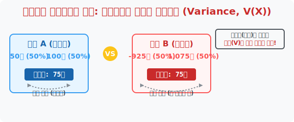

# 5. 도박판의 롤러코스터 지수: 확률분포의 분산과 표준편차 (V(X), σ(X))

## [도입부] 학습 목표 (Learning Objectives)
- '기댓값(평균 수익)' 이 완벽히 똑같은 두 개의 게임 코인 중, 어떤 놈이 진짜 위험한 지옥행 롤러코스터인지 판별해 내는 **'확률변수의 분산(Variance, $V(X)$)'**을 목격합니다.
- 거슬리는 확률 공식을 "제곱의 다 더한 값 - 기댓값의 제곱"이라는 전설의 단축키 **'제평평제'** 로 박살 내는 트릭을 배웁니다.
- 파이썬(Python)으로 이 무지막지한 수식을 구현하여, 주식 차트에서 폭등과 폭락을 반복하는 잡주의 리스크(표준편차)를 검거해 냅니다.

---

## 1. 기댓값은 똑같은데, 심장 박동수가 다른 이유

당신 앞에는 버튼 2개가 있습니다. 누를 때마다 돈을 받거나 뺏깁니다. 
- **[A버튼 게임]** 50% 확률로 50원 획득, 50% 확률로 100원 획득 $\rightarrow$ (기댓값: 평균 **75원** 이득)
- **[B버튼 게임]** 50% 확률로 925원 강탈당함(-925), 50% 확률로 1,075원 벼락부자 $\rightarrow$ (기댓값: 평균 **75원** 이득)

놀랍게도 두 버튼의 수학적 기댓값(E(X))은 판당 $75$원으로 완벽하게 똑같습니다! 
하지만 A버튼은 할머니도 할 수 있는 귀여운 동네 오락기이고, B버튼은 전 재산이 털릴 수도 있는 미친 하이리스크 도박판입니다. 
기댓값 $75$원 이라는 대장 숫자만 믿고 B버튼을 눌렀다가는 심장마비로 사망할 수 있습니다. 
이렇게 수백 개의 $X$ 값들이 기댓값(평균)이라는 코어에서 **"얼마나 극단적으로 무섭게(넓게) 날뛰는가"** 를 재는 척도가 바로 **확률변수의 분산(Variance, $V(X)$)** 과 **표준편차($\sigma(X)$)** 입니다.

<div align="center">
  
</div>

<br>

## 2. 악명 높은 단축 공식: '제평 - 평제'

확률분포표에서 이 흩어진 거리(분산)를 구하는 원래 공식은 눈이 돌아갈 정도로 끔찍합니다. ($x$에서 기댓값을 빼고 제곱해서 어쩌고...)
하지만 통계학의 천재 선배들은 이 공식을 인수분해로 미친 듯이 깎아내 전설적인 치트키 단축 공식을 하나 남겨두었습니다. 

> **$V(X)$ 분산 = $E(X^2) - \{E(X)\}^2$**
> (외우기 주문: **제**곱의 **평**균 빼기, **평**균의 **제**곱!)

1. **제곱의 평균 ($E(X^2)$):** 확률분포표 윗 칸 숫자들($X$)을 일단 다 제곱($\times 2$번 곱함)시켜 뻥튀기 한 뒤, 아래 칸 확률($P$)들과 미친 듯이 박치기 곱셈해서 싹 다 더해버린 값.
2. **평균의 제곱 ($\{E(X)\}^2$):** 아까 구해놓은 얌전한 오리지널 기댓값 평균을 그냥 쿨하게 제곱한 값. 

이 둘을 통 크게 마이너스($-$)로 빼버리면 순식간에 난해했던 '분산($V$)'이 모니터 밖으로 튀어나오고, 그 값에 루트($\sqrt{}$) 모자만 씌우면 게임의 공포 지수인 '표준편차($\sigma$)'가 완성됩니다.

---

## 3. 💻 파이썬(Python)으로 위험 자산 스캐너 구동

주식 트레이딩 로봇(퀀트)은 어떤 종목을 매수할지 고를 때 수익률(기댓값)만 보지 않고 무조건 위험도(표준편차) 렌더링 필터를 겹쳐서 돌립니다.

### 🐍 파이썬 예제: 주식 A와 B의 투자 위험도(분산) 측정 알고리즘

```python
import math

print("--- 📉 월스트리트 주식 리스크(위험도) 스캐닝 봇 ---")

# (데이터 셋) 주식 A: 은행 이자처럼 변동이 없음 / 주식 B: 비트코인 뺨치는 변동성
# X는 수익률(%), P는 해당 수익률이 터질 확률
stock_A_X = [2, 3, 4]       # 수익률 코딱지만 하지만 안정적
stock_A_P = [0.3, 0.4, 0.3] 

stock_B_X = [-50, 3, 56]    # 상장폐지냐, 테슬라냐!
stock_B_P = [0.3, 0.4, 0.3] 

def calculate_risk(name, X, P):
    # 1. 기댓값 E(X) 구하기 (위칸 ✕ 아래칸)
    Ex = sum([x * p for x, p in zip(X, P)])
    
    # 2. [제평-평제] 치트키 가동!
    # 제곱의 평균 E(X^2) : 위칸(X)을 제곱해서 아래칸(P)과 곱함
    Ex2 = sum([(x**2) * p for x, p in zip(X, P)])
    
    # 분산 V(X) = E(X^2) - (E(X))^2
    Vx = Ex2 - (Ex ** 2)
    
    # 표준편차 (분산의 지붕에 루트 씌우기)
    std_dev = math.sqrt(Vx)
    
    print(f"[{name} 종목] 기대 수익 평균: {Ex:.1f}% | 💥 위험도(표준편차): ±{std_dev:.1f}%")

calculate_risk("은행주 A", stock_A_X, stock_A_P)
calculate_risk("작전주 B", stock_B_X, stock_B_P)

# 결과창:
# --- 📉 월스트리트 주식 리스크(위험도) 스캐닝 봇 ---
# [은행주 A 종목] 기대 수익 평균: 3.0% | 💥 위험도(표준편차): ±0.8%
# [작전주 B 종목] 기대 수익 평균: 3.0% | 💥 위험도(표준편차): ±41.0%
```

결과를 보면 "어? 평균 수익률은 둘 다 3.0%로 똑같네?" 라고 투자했다가, B종목의 표준편차 **$\pm 41.0$%** 라는 무시무시한 롤러코스터 칼바람 숫자를 보고 즉각 매수를 철회하게 해 주는 파이썬 알고리즘의 위대한 승리라 할 수 있습니다.

---

## [결론] 학습 정리 (Summary)

1. **분산과 표준편차($V(X), \sigma(X)$)**: 평균적으로 얻는 수익 금액은 같아도 그 결과를 얻기 위해 감당해야 하는 요동치는 진동의 크기, 즉 '도박의 리스크 파워' 를 나타내는 숫자입니다.
2. **단축 치트키**: 외워서 풀기 난감한 거리 수식들을 싹 다 증발시키고, 단지 확률분포표에서 칸마다 계산하는 **(제곱의 평균) - (평균의 제곱)** 이라는 강력한 콤보를 통해 순식간에 분산을 뽑아냅니다.
3. **금융공학과 게임엔진의 코어**: 파이썬은 평균값(E)의 달콤함 뒤에 도사리고 있는 폭락과 폭등 시나리오를 이렇게 단 3줄짜리 `zip` 수식으로 경고해 주며 해악성 짙은 확률형 게임의 민낯을 폭로해 줍니다.
