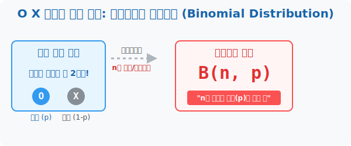

# 6. O X 게임의 절대 법칙: 이항분포와 독립시행 (Binomial Distribution)

## [도입부] 학습 목표 (Learning Objectives)
- 선택지가 무조건 "나오냐 안 나오냐(성공 or 실패)" 단 2가지뿐인 극단적 흑백 논리의 세계, **'이항분포(Binomial Distribution)'**라는 템플릿의 속성을 깨닫습니다.
- 앞선 결과를 뒤의 녀석이 철저히 무시하는 기억상실증 사건, **'독립시행'** 이 어떻게 수백 번의 확률 코드를 단순한 공식 체인으로 압축시켜 주는가를 이해합니다.
- 파이썬(Python)의 `math.comb` 조합 알고리즘을 이용해 "주사위를 10번 던졌을 때 3번만 성공할 바늘구멍 확률"을 밀리초 단위로 렌더링 해냅니다.

---

## 1. 흑백 세계의 이름, 이항(Binomial)

이 세상에는 주사위 숫자 1,2,3,4,5,6 처럼 결과가 여러 개 갈라지는 사건도 있지만, 아주 심플하게 **"성공(O) 아니면 실패(X)"** 딱 두 가지 칼뿌리표 결과만 가지고 있는 사건들이 있습니다.
- 동전을 던지면 "앞면(O)이냐 앞면 아니냐(X)"
- 농구 슛을 쏘면 "들어가냐(O) 튕겨나가냐(X)"
- 복권을 샀을 때 "당첨이냐(O) 꽝이냐(X)"

이렇게 옵션이 딱 2개(이항)로 고정된 상태에서 똑같은 짓거리를 $n$번 미친 듯이 반복(예: 자유투 100번 연속 슈팅)했을 때, 전체적으로 $O$가 몇 번 나올지를 그려내는 거대한 확률 맵의 프로토타입을 통계학에서는 **이항분포(Binomial Distribution)** 라고 부릅니다. 이 구조는 대수학 세계에서 가장 아름다운 기호인 **$B(n, p)$** 로 압축 표기됩니다 ($n$=반복 횟수, $p$=1판당 성공 확률).

<div align="center">
  
</div>

<br>

## 2. 과거를 기억 못 하는 붕어: 독립시행 (Independent Trials)

이항분포가 돌아가기 위한 가장 핵심적인 조건은 바로 '앞판의 결과가 뒤판에 영향을 주지 않는가?' 입니다. 

동전을 5번 던져서 앞면이 5번 연속 나왔습니다. 그럼 6번째 던질 때는 자연의 균형을 맞추기 위해 뒷면이 나올 확률이 확 올라갈까요? 
**아닙니다.** 동전은 뇌가 없어서 자기가 방금 전에 앞면이 5번 나왔다는 사실을 기억하지 못합니다. 6번째 던질 때도 앞면이 나올 확률은 아주 냉정하게 똑같은 반반($1/2$)입니다.
이처럼 매 판마다 확률이 리셋(Reset) 되며 독단적으로 돌아가는 시행을 **독립시행**이라고 부릅니다. 어제의 뽑기 실패가 오늘의 뽑기 확률업(UP)을 보장해주지 않는 가챠 게임의 악독한 원리이기도 합니다.

---

## 3. 💻 파이썬(Python)으로 이항분포 확률 뚫기

이항분포 상황에서 "동전을 10번 던졌을 때 정확히 앞면이 3번 나올 확률" 은 손으로 계산하면 엄청난 조합($_{10}C_3$) 노가다를 요구합니다. 하지만 파이썬 수학 모듈은 이 독립시행 수학식을 뼈대째로 장착하고 있습니다.

### 🐍 파이썬 예제: 독립시행 O/X 게임의 기적 확률 계산기

```python
import math

print("--- 🏀 농구 천재의 자유투 성공 확률 추적기 ---")

# (데이터 셋) B(n, p) 이항분포 세팅
# 1. 커리가 자유투를 연속으로 10번(n) 던집니다.
n_trials = 10
# 2. 커리의 평소 1구 슛 성공 확률(p)은 80% (0.8) 로 기계 일정합니다 (독립시행)
p_success = 0.8  

# 미션: "10번을 던졌는데, 그중에 정확히 딱 8번(k)만 골인시킬 확률은?"
k_target = 8

# 독립시행의 확률 계산 마법 공식: (n번중_k번_고르는경우의수) * (성공확률^k) * (실패확률^나머지)
# 1. 10개 중에 8개 골라잡기 (Combination: 10C8)
ways_to_choose = math.comb(n_trials, k_target)

# 2. O가 8번 터지고, 잔챙이 X가 2번(10-8) 터질 확률 세팅
prob_OOO = (p_success ** k_target) * ((1 - p_success) ** (n_trials - k_target))

# 최종 확률 퓨전!
final_probability = ways_to_choose * prob_OOO

print(f"▶ 타겟 세팅: 총 {n_trials}번 던져서 정확히 {k_target}번 림에 꽂을 확률은?")
print(f"▶ 파이썬 연산 도출 확률: {final_probability * 100:.2f} %")

# 결과창:
# --- 🏀 농구 천재의 자유투 성공 확률 추적기 ---
# ▶ 타겟 세팅: 총 10번 던져서 정확히 8번 림에 꽂을 확률은?
# ▶ 파이썬 연산 도출 확률: 30.20 %
```

이렇게 파이썬은 "10번 중 8번 당첨"이라는 엄청나게 많은 가지치기 경우의 수 시나리오를 반복문(For loop) 없이 단 3줄짜리 콤비네이션 조합 체인으로 순식간에 격파해 버립니다. 

---

## [결론] 학습 정리 (Summary)

1. **이항분포 (Binomial Distribution)**: 세상의 복잡한 색깔을 버리고 무조건 "내가 얻으려는 것(성공, $p$)", 그리고 "그 외 나머지 잡것(실패, $1-p$)" 의 흑백 템플릿으로 치환하여 분석하는 컴퓨터 0,1 바이너리(Binary)적인 통계 사고방식입니다.
2. **독립과 기억상실**: "내가 저번 판에 실패를 10번 했으니까 이번 판은 성공 보상이 뜰 거야" 라는 인간의 욕망을 깔아뭉개는, '매번 초기화($1/2$)' 되는 무책임하고 잔혹한 독립시행이 B($n$, $p$)를 떠받치는 핵심 나사못입니다.
3. **독립시행 확률 공식**: 파이썬 `math.comb` 를 동반한 **($n$개 중 $k$개 뽑기 $) \times p^k \times (1-p)^{n-k}$** 조합 공식은 무한한 확률 트리에 갇히지 않고 1방향 연산으로 정답 확률을 도출하는 치트키 알고리즘입니다.
