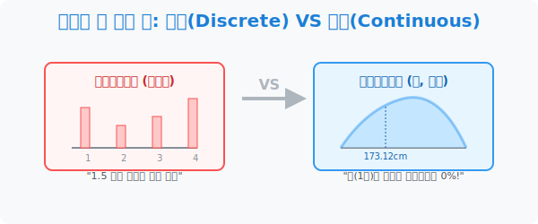
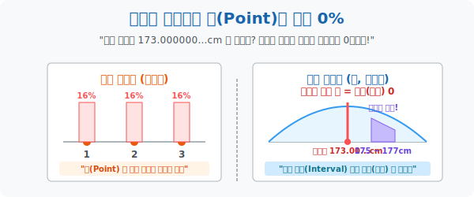

# 1. 끊어질 수 없는 선: 연속확률분포의 탄생

## [도입부] 학습 목표 (Learning Objectives)
- 동전 던지기나 주사위 굴리기처럼 "1개, 2개" 딱딱 끊어지는 막대그래프(이산확률분포)의 시대를 끝내고, 시간이나 몸무게처럼 무한정 소수점으로 쪼개지는 부드러운 곡선 세계 **'연속확률분포(Continuous Distribution)'** 로 차원 이동을 합니다.
- 연속 확률의 기묘한 철학, 즉 **"정확히 딱 173.000000...cm 일 확률은 0%다"** 라는 무한대 해상도의 충격적인 역설을 이해합니다.
- 파이썬(Python)의 난수(Random Float)를 생성해보며 소수점 10자리까지 내려가는 데이터가 '특정 점'에 당첨되는 것이 사실상 로또보다 불가능함을 코딩으로 체감합니다.

---

## 1. 계단에서 미끄럼틀로! 막대기와 곡선

중학교와 고1 수학 시간까지 우리가 지겹게 배우던 확률은 모두 **'이산(Discrete)'** 이었습니다. 
- "주사위를 굴려 3이 나올 확률은 1/6 이지!" 
동전이나 주사위, 제비뽑기의 결과값은 1, 2, 3 처럼 딱딱 끊어져 있습니다. 주사위를 던졌는데 '3.1415의 눈' 이 나오는 일은 우주가 붕괴해도 일어나지 않습니다. 이걸 그래프로 그리면 **'막대 그래프'** 가 됩니다.

하지만 현실의 진짜 데이터들은 불연속적이지 않습니다.
여러분의 **키, 몸무게, 100m 달리기 기록시간, 내일 비가 올 강수량, 커피의 온도** 를 생각해 보세요.
어떤 학생의 키를 재어 "173cm" 라 하더라도, 아주 정밀한 레이저 자로 재면 "173.125934...cm" 일 것입니다.
이렇게 값과 값 사이에 또 다른 소수점 값이 무한히 들어가며 끊어지지 않는 데이터를 **연속 확률 변수** 라고 부르며, 이들의 분포를 그리면 딱딱한 막대기가 아니라 부드럽고 매끄러운 **'등성이 곡선(Curve)'** 이 탄생합니다.



<br>

## 2. 점(Point)의 확률은 0% 이다.



가장 소름 돋는 연속 세계의 법칙입니다.
이산 확률 세계에서 주사위를 던져 '3'이 나올 확률은 명확히 $\frac{1}{6}$ 입니다. 점(Point)이 명확한 질량을 가집니다.
그러나 대한민국의 성인 남성 중 임의로 1명을 뽑았을 때, **키가 정확히 173.000000...cm 에 완벽하게 떨어질 확률은? 정답은 0 (0%) 입니다!**.
하지만 대한민국의 5천만 명 중에 누군가를 뽑았을 때, 그 사람의 키가 **"정확히 티끌 하나 오차도 없이 173.0000000000...cm"** 에 맞을 확률은 얼마일까요?
우주 끝까지 내려가는 무한한 소수점 단위 아래에서 딱 하나의 숫자에 걸릴 확률은 분모가 무한대($\infty$) 가 되므로 **$1 \div \infty = 0$** 이 되어버립니다.
따라서 연속확률분포에서는 "키가 173cm 일 확률" 을 구하라고 하면 바보 취급을 받습니다. 점의 확률은 0이니까요!

그래서 수학자들은 룰을 바꿉니다. 
*"점은 버려라! 연속된 세계에서는 무조건 **[구간]** 으로만 확률을 물어봐라! 즉, 키가 '172cm 이상 174cm 미만' 일 구간의 확률을 묻는 것으로 법을 개정한다!"*

---

## 3. 💻 파이썬(Python) 끝없는 소수점 해상도의 한계 테스트

`random.random()` 을 실행할 때마다 파이썬은 소수점 15자리 수준의 정밀한 연속 데이터를 토해냅니다. 이 중에서 정확히 우리가 예측한 숫자가 맞을 수 없음을 브루트 포스 코드로 감상합니다.

### 🐍 파이썬 예제: 연속 데이터에서 '점' 맞추기의 극악 확률

```python
import random

print("--- 🎯 연속 확률 변수의 저주: 정확한 소수점 타격하기 ---")

# (목표) 컴퓨터가 0.0 ~ 1.0 사이의 랜덤 실수를 뽑을 때,
# 과연 내가 미리 적어둔 숫자가 정확히! 일치하여 당첨될 수 있을까?
my_target = 0.50000000001

print(f"▶ 나의 목표 타겟(단일 점): 딱 {my_target} 이 나와야 함!")
print("-" * 50)

attempts = 1000000  # 100만 번 주사위(실수) 굴리기!
match_count = 0

for i in range(attempts):
    # random.random() 은 0.123456789123... 식의 연속값을 생성 (미끄럼틀)
    generated_value = random.random()
    
    # 만약 컴퓨터가 뽑은 수가 내 타겟과 정확히 일치한다면?
    if generated_value == my_target:
        match_count += 1

print(f" ⏳ [연산 종료] 총 {attempts:,} 번의 난수(실수) 뽑기 렌더링 완료.")
print(f" ✅ 타겟 적중 횟수: {match_count} 번")
if match_count == 0:
    print(" 💡 [결과 분석] 100만 번을 굴려도 단 한 번도 맞지 않았습니다.")
    print("    -> 무한히 쪼개지는 연속(Continuous) 세상에서 특정한 '점' 확률은 사실상 0% 임을 증명!")

# 결과창:
# --- 🎯 연속 확률 변수의 저주: 정확한 소수점 타격하기 ---
# ▶ 나의 목표 타겟(단일 점): 딱 0.50000000001 이 나와야 함!
# --------------------------------------------------
#  ⏳ [연산 종료] 총 1,000,000 번의 난수(실수) 뽑기 렌더링 완료.
#  ✅ 타겟 적중 횟수: 0 번
#  💡 [결과 분석] 100만 번을 굴려도 단 한 번도 맞지 않았습니다.
#     -> 무한히 쪼개지는 연속(Continuous) 세상에서 특정한 '점' 확률은 사실상 0% 임을 증명!
```

막대기 장난감에서 벗어나 현실 세계 빅데이터(Big Data)의 수치를 분석하기 위해서는, 이렇게 매끄럽게 연결된 '실수(Float)' 값들을 다루는 확률 밀도의 세계관으로 갈아입어야 합니다.

---

## [결론] 학습 정리 (Summary)

1. **그래프의 진화**: 딱딱 끊어진 막대기($1$,$2$,$3$개) 만 다루던 이산 수학에서, 키나 몸무게처럼 무한정 소수점으로 팽창하는 찰흙 같은 부드러운 곡선 세계 지도로 편입했습니다.
2. **점($x=a$)의 확률은 $0$**: 우주의 무한한 쪼개짐 속에서 정확히 특정 무게 단위나 시간을 딱 맞출 확률은 0이라는 기막힌 논리를 탑재했습니다. 
3. **구간($Range$) 의 법칙**: 그렇기에 이제부터는 무조건 $P(170 < X \le 175)$ 처럼 "어디서부터 어디까지" 라는 등성이의 빵 조각 '구간'을 물어보면서 확률을 말해야 하는 룰이 제정되었습니다.
