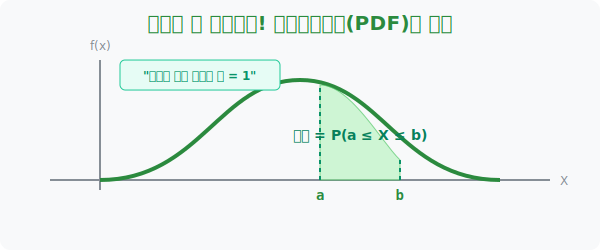
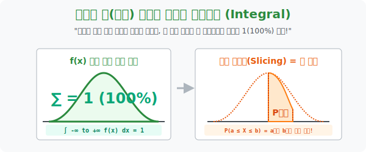

# 2. 면적이 곧 확률이다: 확률밀도함수(PDF)와 적분

## [도입부] 학습 목표 (Learning Objectives)
- 1수업에서 "연속확률에선 특정 숫자 딱 1개(점) 가 당첨될 확률은 0퍼센트" 라는 걸 배웠으니, 그렇다면 도대체 **"어떻게 확률값(%) 을 구해서 사람들에게 보고해야 하는가?"** 규칙을 배웁니다.
- 확률을 구하기 위해서 부드러운 산등성이 곡선인 **'확률밀도함수(Probability Density Function, PDF)'** 밑에 깔려있는 일정 구간의 **'도형 면적(Area)'** 을 색칠하여 퍼센트(%) 로 치환하는 적분의 기본 원리를 탑재합니다.
- 파이썬(Python)의 `scipy.integrate` 시스템을 켜서 아무렇게나 굽이치는 롤러코스터 함수의 a에서 b 구간 사이의 잉크 면적 넓이를 미적분 코딩으로 즉시 토해내는 파워를 구경합니다.

---

## 1. 확률밀도함수(PDF): 곡선과 면적의 마술

이제 우리에겐 막대그래프 대신 매끄러운 곡선 지도 하나가 책상에 펼쳐집니다. 이 곡선 산등성이를 멋들어진 말로 **확률밀도함수(Probability Density Function)** 라고 부릅니다. 줄여서 **PDF** 라고 합니다 (문서 파일이 아닙니다!). 

앞서 연속된 세계관에서 '키가 딱 173cm 일 확률'은 구할 수 없다(0점)고 선언했습니다. 
그 대신 룰이 이렇게 바뀌었습니다.
**[면적 룰] "키가 170cm 부터 175cm 사이($170 \le X \le 175$) 에 들어갈 확률이 궁금한가? 그렇다면 이 PDF 곡선 아래 땅바닥 중 가로축 170과 175 사이에 수직선을 긋고 남은 '넓이(면적)' 를 계산해라! 그 면적 크기 자체가 저 구간의 확률(%)이다!"**

이제 모든 확률 연산은 덧셈에서 **색칠 공부(넓이 구하기)** 로 타임 워프를 합니다.
막대기 높이를 더하는 시대는 끝났고, 물결치는 등성이 곡선 밑바닥의 형광펜 공간이 전체의 몇 퍼센트($0.1$ 이냐 $0.5$ 냐) 를 지배하고 있는지를 측정해야 하는 것입니다.



<br>

## 2. 확률의 궁극 법칙: 산이 아무리 높아도 면적은 1 이다!



주사위 6개의 확률의 합이 $\frac{1}{6} \times 6 = 1$ (100%) 이듯이, 연속 우주에서도 100% 법칙은 절대적으로 성립해야 합니다.
**"확률 밀도 함수 $f(x)$ 의 그래프 곡선이 만들어내는 전체 면적은 무조건, 죽었다 깨어나도 1($100\%$) 이어야 한다!"**

이를 강력한 적분 기호(Integral) 로 뼛속까지 박아 넣습니다.
**$$ \int_{-\infty}^{\infty} f(x) \, dx = 1 $$**
확률밀도함수 PDF 에는 하늘이 두 쪽 나도 절대 깰 수 없는 대원칙이 있습니다. 확률의 총합 무조건 1($100\%$) 이어야 한다는 논리입니다.

1. **지하실 금지**: 산등성이는 절대 음수(마이너스 땅바닥) 밑으로 파먹어 들어갈 수 없습니다. 확률이 $-30\%$ 인 미친 세계는 없기 때문입니다. ($f(x) \ge 0$)
2. **총면적은 무조건 1**: 산등성이가 미친놈처럼 뾰족하게 솟아있든, 호떡처럼 펑퍼짐하게 옆으로 퍼져있든, **그 산 밑바닥 땅 전체를 끝부터 끝까지 다 쓸어 담은 총면적(Area 넓이)은 우주 불변으로 "1" ($100\%$) 입니다.**

이 거대한 총면적 1 짜리 지형에서, 우리가 조각 케이크 자르듯 $a$ 부터 $b$ 까지 칼로 잘라낸 그 단면의 넓이가 $0.25$ 라면? 네, 그 구간에 당첨될 확률이 $25\%$ 라는 아주 섹시한 기하학적 치환이 성립되는 것입니다. 결국 연속확률 계산은 곧 **"곡선의 면적을 구하는 적분(Integration) 기술"** 에 다름 아닙니다.

---

## 3. 💻 파이썬(Python)의 곡선 면적(적분) 터미네이터

손으로 구불구불한 언덕의 면적 크기를 구하는 미적분 방정식 풀이는 우리를 밤새우게 하지만, 파이썬에 내장된 면적 스캐너(`quad` 적분기)는 아무리 복잡한 굴곡의 함수라도 시작점과 끝점만 던져주면 단 1초도 안 걸려 땅 면적(확률)을 내뿜습니다.

### 🐍 파이썬 예제: PDF 면적(=확률) 계산기 (적분 시뮬레이션)

```python
import scipy.integrate as integrate

print("--- 🖌️ 확률밀도함수(PDF) 칼질: 형광펜 면적(적분) 계산 레이더 ---")

# (방정식 세팅) 가상으로 굽이치는 롤러코스터 확률 함수 f(x)를 정의합니다.
# 예를 들어: f(x) = 0.5 * x (단, 0 ~ 2 구간에서만 유효한 삼각형 토지라고 가정!)
def pdf_function(x):
    return 0.5 * x

# Q. 전체 구간(0부터 2까지)의 땅 면적을 전부 더해볼까? -> 우주법칙에 따라 무조건 '1' 이 나와야함.
total_area, error = integrate.quad(pdf_function, 0, 2)

print("▶ 스캔 1: 산 전체를 스캔하라! (0 <= x <= 2)")
print(f" [시스템 판독] 산 전체 그물 면적 넓이: {total_area:.4f} (즉 100%)")
print("-" * 50)

# Q. 만약 사장님이 "1에서 2 사이 구간(1 <= x <= 2) 에 떨어질 확률만 내놔!" 라고 했다면?
target_start = 1
target_end = 2
partial_area, error = integrate.quad(pdf_function, target_start, target_end)

print(f"▶ 스캔 2: 특정 구간만 잘라서 색칠하라! ({target_start} <= x <= {target_end})")
print(f" [시스템 판독] 지정 구간 땅 면적 넓이: {partial_area:.4f}")
print(f" 🎯 최종 해독: 데이터가 {target_start} 와 {target_end} 구간에 안착할 확률은 {partial_area * 100:.1f} % 입니다!")

# 결과창:
# --- 🖌️ 확률밀도함수(PDF) 칼질: 형광펜 면적(적분) 계산 레이더 ---
# ▶ 스캔 1: 산 전체를 스캔하라! (0 <= x <= 2)
#  [시스템 판독] 산 전체 그물 면적 넓이: 1.0000 (즉 100%)
# --------------------------------------------------
# ▶ 스캔 2: 특정 구간만 잘라서 색칠하라! (1 <= x <= 2)
#  [시스템 판독] 지정 구간 땅 면적 넓이: 0.7500
#  🎯 최종 해독: 데이터가 1 와 2 구간에 안착할 확률은 75.0 % 입니다!
```

코더들이 `integrate.quad` 에 좌표 조각(1, 2)만 던져주면 알아서 나노미터 단위의 직사각형들을 다 쪼개서 합산하는 튜링 머신 덕분에, 우리는 데이터가 던져질 확률값을 "면적의 퍼센티지" 로 아주 쉽게 해독해 낼 수 있습니다.

---

## [결론] 학습 정리 (Summary)

1. **확률밀도함수(PDF)의 개념**: "산등성이 곡선" 이 바로 이 함수의 실체이며, 이 곡선을 타고 다니며 확률 값을 직접 뽑는 게 아니라 그 곡선 아래에 갇혀있는 "땅바닥 잉크 면적" 크기로 확률을 대체해서 읽어냅니다.
2. **면적 총합 $= 1 (100\%)$ 의 뼈대**: 우주가 두 쪽 나도 지형 곡선 내부를 박박 긁어모은 총넓이는 단 "1" 입니다. 이것이 수학자들이 온갖 미친 공식을 만들어내면서도 절대 지키는 베이스 캠프 룰입니다.
3. **구간은 곧 적분**: "A부터 B까지 범위에 속할 확률" 이란 말을 국어사전에서 "PDF 그래프에서 A부터 B까지 단면도로 칼을 썰어내어 생긴 종이조각 넓이(적분결과)" 라고 읽어내는 시각화 능력이 확률 통계 마스터의 지름길입니다.
