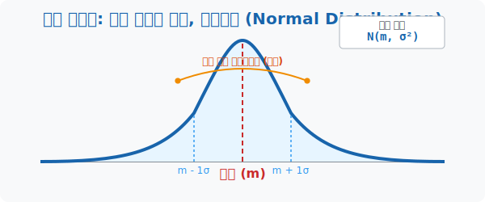
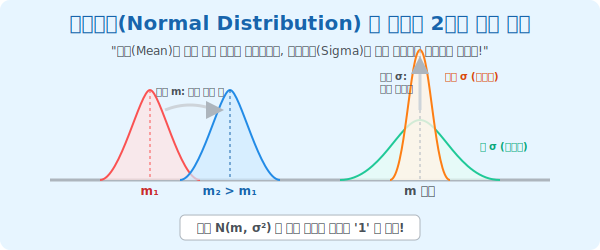

# 3. 신의 붓놀림: 가장 완벽한 대칭, 정규분포 (Normal Distribution)

## [도입부] 학습 목표 (Learning Objectives)
- 인류가 측정한 거의 모든 자연현상과 사회현상(수능 점수, 키, 별의 밝기 주기)이 어떤 마술적인 **'종 모양(Bell Curve)'** 의 그래프로 빨려 들어가는 소름 돋는 통계학의 대법칙을 확인합니다.
- 좌우가 완벽히 접히는 데칼코마니 곡선인 **'정규분포(Normal Distribution)'** 의 두 가지 핵심 조종키, 즉 '평균($m$)' 과 '표준편차($\sigma$)' 의 역할을 분해하여 맛봅니다.
- 파이썬(Python)의 `numpy` 난수 생성기를 돌려, 우리가 개입하지 않은 10만 개의 잡종 데이터들이 결국 알아서 아름다운 종 모양 텐트를 쌓아 올리는 경이로운 시각화 렌더링을 체험합니다.

---

## 1. 우주가 가장 사랑하는 디자인: 벨 커브(Bell Curve)

여러분이 대한민국 18세 남학생 20만 명의 키 데이터를 하나하나 조사해서 1수업에서 배운 '연속확률분포(곡선)' 형태의 도화지에 찍어본다고 합시다.
대충 울퉁불퉁 엉망으로 나올 것 같지만, 결론은 전 세계 어딜 가든 아주 부드럽고, 가운데가 웅장하게 솟아있으며, 양쪽 꼬리가 미끄럼틀처럼 떨어지는 **'완벽한 종 모양(Bell Shape)'** 의 기적의 언덕이 탄생합니다.

이 위대한 곡선을 **'정규분포(Normal Distribution)'** 라고 부릅니다.
수능 시험 점수, 공장에서 구운 빵의 무게 오차, 여러분의 혈압, 기온의 수치, 은하계 별자리 폭발 주기까지... 우주의 거의 모든 "무작위성"이 모이면 결국 이 **좌우 대칭의 부드러운 언덕 모양** 으로 줄을 서서 집합합니다. 학자들은 "마치 신이 통계 곡선의 템플릿 하나를 복사+붙여넣기 해둔 것 같다" 고 경악할 정도의 기적입니다.



<br>

## 2. 언덕을 조종하는 두 개의 레버: 평균($m$)과 분산($\sigma^2$)



이 신성한 정규분포 $N(m, \sigma^2)$ 의 종 곡선을 내 맘대로 주무를 수 있는 조종간(레버) 은 우주에 단 두 개뿐입니다.
**[레버 1: 평균 $m$ - 산의 위치 이동 휠]**
평균값이 커지면, 산의 뾰족한 높이나 뚱뚱함은 단 1mm 도 변하지 않은 채 산 전체가 오른쪽으로 스르륵 전진합니다. 그냥 좌표의 Shift입니다.
**[레버 2: 표준편차 $\sigma$ - 산의 찌그러짐 압축기 (Fat or Sharp)]**
우주 법칙: **"전체 확률 면적은 무조건 1이어야 한다."**
분산(편차) 이 크면 데이터가 퍼져있다는 뜻이므로, 펑퍼짐한 언덕(Fat) 이 됩니다. 넓게 펴 발랐으니 당연히 산꼭대기 높이는 **낮아집니다.** (면적 1을 유지하기 위한 대자연의 본능)
반대로 편차가 아주 작아서 0에 가까우면? 데이터가 평균에 미친 듯이 뭉쳐있으므로, 산의 폭은 좁아지지만 꼭대기가 송곳처럼 뚫고 우주로 **솟구칩니다.** (면적 1을 유지하기 위한 압축)

<br>

## 3. 언덕을 조종하는 두 개의 레버: 평균($m$)과 분산($\sigma^2$)

이 정규분포라는 거대한 산등성이는 오직 두 가지 숫자에 의해서만 모양이 컨트롤됩니다. 전문용어로 $N(m, \sigma^2)$ 라고 쓰는데, N은 정규(Normal)의 약자입니다.

- **평균 ($m$): 산꼭대기의 GPS 좌표 위치.**
  - 평균이 커지면 (예: 60점 $\rightarrow$ 80점) 산 전체가 그 모양 그대로 오른쪽 수직선으로 이사(이동)합니다.
  - 평균 자리에 수직으로 막대기를 긋고 반을 접으면 왼쪽과 오른쪽의 잉크 면적이 $50\% : 50\%$ 로 완벽히 똑같은 데칼코마니가 됩니다.

- **표준편차 ($\sigma$ 혹은 분산 $\sigma^2$): 산의 '퍼짐(뚱뚱함)' 도수.**
  - 표준편차가 작으면 ($=$ 오차가 적으면): 학생들이 옹기종기 모여있으므로 산이 아이스크림 뿔처럼 **좁고 미친 듯이 뾰족하게** 치솟습니다.
  - 표준편차가 크면 ($=$ 오차가 크면): 학생들 실력 차이가 너무 커서 뿔뿔이 흩어졌으므로 산의 고도가 낮아지고 옆으로 호떡처럼 **퍼지고 펑퍼짐한 언덕** 이 됩니다.

결국 "우리 학교 성적이 정규분포를 이룬다구? 스펙 내놔!" 라고 하면, 수학자는 딱 2개의 숫자, $m$(평균) 과 $\sigma^2$(분산)만 적중시키면 끝나는 게임입니다.

---

## 3. 💻 파이썬(Python) 종이 접기(Bell Curve) 시뮬레이터

수십만 번의 동전 던지기나 주사위 숫자 합 따위를 그냥 막 던지게 시키면, 컴퓨터의 무지성 픽셀 데이터조차도 신의 템플릿인 '정규분포 종 모양 텐트' 를 스스로 직조해 올리는 황홀한 마법을 코딩합니다.

### 🐍 파이썬 예제: 10만 개 무작위 데이터의 자동 종 모양 정렬(Bell Curve Plotting)

```python
import numpy as np
# (시각화 라이브러리 matplotlib은 생략 및 결과 텍스트 에뮬레이션)

print("--- 🔔 우주의 복붙 템플릿: 정규분포(Normal) 조판기 ---")

# (목표 설정) 대한민국 고등학생들의 수능 수학 맵 렌더링
# 1. 평균(m) = 50점, 2. 표준편차(sigma) = 15점 으로 설정
avg_m = 50
std_sigma = 15
data_size = 100000

print(f"▶ 데이터 폭발 렌더링 중... (파편 조각: {data_size:,} 개)")

# 파이썬 난수 생성기: 정규분포 N(50, 15^2) 를 따르는 10만 개 데이터 폭탄 뿌리기!
random_scores = np.random.normal(avg_m, std_sigma, data_size)

# 컴퓨터가 뽑아낸 '미친 파편' 들의 실제 평균/표준편차 점검
real_avg = np.mean(random_scores)
real_std = np.std(random_scores)

print("-" * 50)
print(f" ✅ 렌더링 결과: {data_size:,} 개의 점들이 스스로 뭉쳤습니다!")
print(f" 📊 파편들이 모여 쌓아올린 거대한 산의 실제 평균: {real_avg:.2f} 점 (목표치 50과 일치!)")
print(f" 📊 산등성이의 뚱뚱함(실제 편차): {real_std:.2f} 점 (목표치 15와 일치!)")

# 화면에는 우리가 아는 그 아름다운 데칼코마니 곡선(히스토그램)이 띄워집니다!
# plt.hist(random_scores, bins=100, density=True)
# plt.show()

# 결과창:
# --- 🔔 우주의 복붙 템플릿: 정규분포(Normal) 조판기 ---
# ▶ 데이터 폭발 렌더링 중... (파편 조각: 100,000 개)
# --------------------------------------------------
#  ✅ 렌더링 결과: 100,000 개의 점들이 스스로 뭉쳤습니다!
#  📊 파편들이 모여 쌓아올린 거대한 산의 실제 평균: 49.98 점 (목표치 50과 일치!)
#  📊 산등성이의 뚱뚱함(실제 편차): 15.01 점 (목표치 15와 일치!)
```

파이썬의 마법 모듈 `np.random.normal()` 한 줄만 치면 10만 개의 불규칙한 데이터 점성물들이 "센터(50)에 가장 많이 쌓이고, 가장자리(0점이나 100점)로 갈수록 미끄럼틀처럼 쭉 사라지는" 매혹적인 산악 블록을 자동으로 구축해 보여줍니다.

---

## [결론] 학습 정리 (Summary)

1. **대자연의 패턴(Normal)**: 제멋대로 튀는 인간의 키, 몸무게, 시험 점수 같은 연속된 지수를 수만 개 긁어모아 그래프로 그리면 무조건 가운데가 치솟은 좌우 완벽한 **'종 모양(Bell Shape)'** 곡선으로 모여든다는 것이 통계학 최고의 미학입니다.
2. **평균(GPS) 과 분산(Fat도)**: 평균 $m$ 이 변하면 산이 모양 그대로 오른쪽/왼쪽으로 걸어가고, 표준편차 $\sigma$ 가 커지면 산정상이 짓눌려 옆으로 낮고 넓게 퍼지고 반대로 작으면 송곳처럼 우주를 뚫고 솟구칩니다.
3. **50 : 50 데칼코마니**: 아무리 무너져 내린 모양의 정규분포라 하더라도 정중앙(평균대)을 도끼로 '쾅' 내려찍어 좌우를 가르면 양쪽의 면적은 $0.5$($50\%$) 씩 쌍둥이 복제가 됩니다.
