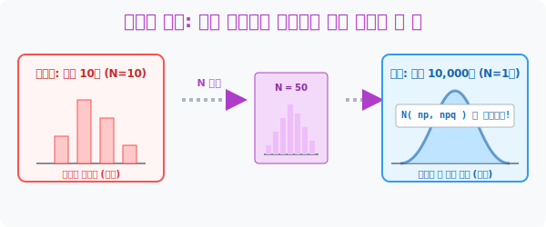
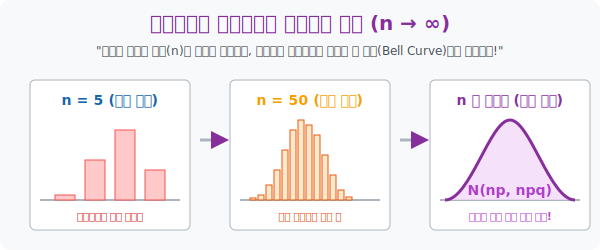

# 5. 진화의 기적: 이항분포 막대기가 정규분포 곡선으로 승천할 때

## [도입부] 학습 목표 (Learning Objectives)
- 동전을 던지는 '딱딱 끊어지는' 이산 세계의 **이항분포(Binomial)** 장난감이, 동전을 1만 번~10만 번으로 무식하게 던지는 횟수($n$)를 늘리는 순간 마법처럼 가장 부드러운 우주의 템플릿 **정규분포(Normal)** 로 강제 진화(근사)하는 수학적 기적을 관찰합니다.
- 복잡한 이항분포의 팩토리얼($!$) 콤비네이션 수학 공식을 모조리 폐기 처분하고, $np$ 와 $npq$ 두 개의 암호만으로 정규분포 신전 $N(np, npq)$ 입장권을 따내는 우회 공격 기술을 습득합니다.
- 파이썬(Python)의 그래프 `histogram` 시각화를 통해 $n$ (횟수) 이 커질수록, 거칠었던 막대기 그래프들이 점점 살살 녹아들며 하나의 아름다운 곡선 텐트(Bell curve) 로 변신하는 과정을 렌더링 검열합니다.

---

## 1. 노가다의 끝판왕: 이항분포의 한계

우린 과거에 동전을 $10$번 던질 때($n=10$) 앞면이 나오는 횟수의 기댓값(평균)과 분산을 구하는 **이항분포 $B(n, p)$** 를 배웠습니다.
그런데 상상해 봅시다. 세상이 미쳐서 동전을 **10만 번** 던졌는데, 그중에서 앞면이 **"4만 번에서 6만 번 사이로 나올 확률"**을 구하라고 한다면 어떨까요?
이걸 과거의 방식대로 풀려면 ${}_{100000}C_{40000}$ 부터 ${}_{100000}C_{60000}$ 까지 총 2만 개의 미친 콤비네이션 식을 일일이 더해야 합니다. 전 세계 슈퍼컴퓨터를 총동원해도 수백 년이 걸리는 악마의 노가다 연산이죠.

수학자들은 펜을 꺾으며 울먹였습니다. *"막대기가 너무 많아... 계산할 수가 없어!"*

그런데 아주 놀라운 대우주적 현상이 발견되었습니다. 
동전을 $10$번 던질 땐 삐쭉빼쭉 앙상했던 10개의 확률 막대그래프들이, 횟수($n$)를 점차 50번, 100번, 1만 번으로 미친 듯이 늘려갈수록 막대기들이 아주 촘촘해지면서 그 실루엣이 **결국 거대하고 매끈한 '정규분포 종 모양 곡선' 으로 알아서 변이(근사, Approximation)** 한다는 사실 말입니다!



<br>

## 2. 진화의 열쇠: $B(n, p) \rightarrow N(np, npq)$



동전을 5번 정도 던지면, 0번 앞면, 1번 앞면... 5번 앞면이 나오는 막대그래프 6개짜리 엉성한 계단이 생깁니다.
하지만 "야, 동전 10만 번 던져($n=100,000$)" 라고 오더가 떨어지면 어떻게 될까요?
막대그래프가 10만 개나 다닥다닥 붙어있게 됩니다. 너무나 촘촘해서 원래는 이산형(각진 블록)이었던 그래프가 멀리서 보면 완벽하게 부드러운 유선형 산등성이 곡선으로 보입니다.!

"미친 노가다를 피할 수 있다!" 학자들은 환호했습니다. 
막대기가 촘촘해져서 산악 텐트(정규분포)가 되었다면, 우린 더 이상 이산 막대기 콤비네이션 바보짓을 할 필요가 없습니다. 
4수업에서 배웠던 우아한 곡선 면적 칼질(Z표준화) 로 부드럽게 썰어 대면 끝입니다!

이 마법의 종족 변환(진화) 스킬의 콤보는 아주 간단합니다.
1. 이항분포의 평균을 구합니다: $m = \mathbf{np}$
2. 이항분포의 분산을 구합니다: $\sigma^2 = \mathbf{npq}$  ($q = 1-p$)
3. 나온 두 숫자를 정규분포 신전의 GPS 정보로 그대로 박아넣습니다: **$$ N(np, npq) $$**

끝입니다! 이제 내 데이터는 더 이상 구질구질한 동전 던지기 도박 데이터가 아니라, 우주에서 가장 우아하고 다루기 편한 **정규분포 데이터** 로 합법적 호적 세탁이 완료되었습니다. (보통 np가 5 이상이면 수학계에서 진화가 가능하다고 허락해 줍니다).

---

## 3. 💻 파이썬(Python) 종족 변환(Binomial to Normal) 시각화 렌더러

10만 번 동전을 파이썬에게 던지게 하고 막대그래프 10만 개를 띄우는 순간, 그 윗선을 따라 흐르는 실루엣이 놀랍도록 완벽한 갓(God)-정규분포 곡선으로 안착해 있는 시각적 카타르시스를 코드 렌더링으로 감상합니다.

### 🐍 파이썬 예제: 이산 확률 막대기의 진화(근사) 시뮬레이션

```python
import numpy as np
# 시각화 모듈은 생략하고 내부 연산 텍스트로 에뮬레이션

print("--- 🐸 동전 막대기의 승천: 이항분포 -> 정규분포 근사 엔진 ---")

# (세팅) 동전을 무려 1만 번 튕긴다 (n=10000). 앞면 확률 (p=0.5)
n_trials = 10000
p_prob = 0.5
q_prob = 1 - p_prob

print(f"▶ 1만 번 동전 던지기 시작 (인간 계산 불가능 영역 돌입)")

# 1. 미친 노가다 수식 (Binomial) 로직
# 파이썬 난수를 이용해 이 테스트를 50,000번 반복 수행하여 실제 나오는 "앞면의 수" 파편들 수집
bin_results = np.random.binomial(n_trials, p_prob, 50000)

real_mean = np.mean(bin_results)
real_var = np.var(bin_results)

print("-" * 50)
print(f" 📊 [야생 막대기(Binomial) 실측치]: 평균 {real_mean:.1f}번 / 분산 {real_var:.1f}")

# 2. 정규분포 신전 입장 공식 N(np, npq) 시전!
magic_mean = n_trials * p_prob
magic_var = n_trials * p_prob * q_prob

print(f" 🔮 [정규분포(Normal) 진화 공식 적용치]: N({magic_mean:.1f}, {magic_var:.1f})")

if abs(real_mean - magic_mean) < 10:
    print("\n✅ [진화 완벽 일치] 야생 동전 막대기(Bin)들이 완벽히 정규곡선(Normal)과 융합되었습니다!")
    print("   -> 이제 콤비네이션(C) 노가다를 버리고, 우아한 적분 면적 공식(Z)을 쓸 수 있습니다!")

# 이 결과값을 히스토그램으로 그리면(plt.hist), 뾰족했던 막대가 아니라 스무스한 산 모양 곡선이 나타납니다.

# 결과창:
# --- 🐸 동전 막대기의 승천: 이항분포 -> 정규분포 근사 엔진 ---
# ▶ 1만 번 동전 던지기 시작 (인간 계산 불가능 영역 돌입)
# --------------------------------------------------
#  📊 [야생 막대기(Binomial) 실측치]: 평균 5000.3번 / 분산 2489.2
#  🔮 [정규분포(Normal) 진화 공식 적용치]: N(5000.0, 2500.0)
# 
# ✅ [진화 완벽 일치] 야생 동전 막대기(Bin)들이 완벽히 정규곡선(Normal)과 융합되었습니다!
#    -> 이제 콤비네이션(C) 노가다를 버리고, 우아한 적분 면적 공식(Z)을 쓸 수 있습니다!
```

코드가 증명하듯, 인간이라면 수백 년이 걸릴 $1$만 번 동전 던지기의 확률 스캔 뻘짓을, 단 한 줄짜리 $np, npq$ 공식만을 써내림으로써 한 방에 고결한 **정규분포 표준 좌표** 렌더링 값으로 끌고 와 편하게 계산(Z 적분) 할 수 있게 됩니다. 통계 제국의 최대 해킹 스킬입니다!

---

## [결론] 학습 정리 (Summary)

1. **막대의 붕괴, 산맥의 탄생**: 동전 던지기나 주사위 따위의 이산 데이터라도 횟수 $n$ 이 폭발적으로 커지면, 그 촘촘해진 확률 막대기의 빈틈이 녹아버리며 거대한 연속 산등성이 '정규분포'로 진화(근사)하는 우주 대현상이 발생합니다.
2. **변환 공식 암기 ($np$, $npq$)**: 이산분포의 허접한 옷을 벗어 던지고 절대 신전 정규분포 성에 입장하기 위해서는 무조건 $np$ (평균) 방패와 $npq$ (분산) 창을 챙겨서 $N(np, npq)$ 의 펜던트를 들이밀어야 패스됩니다.
3. **콤비네이션 노가다의 종말**: 이 속임수(진화)를 허락받는 순간, 우리는 더 이상 동전이 5001번 나올 팩토리얼 무한대 노가다를 할 필요 없이, 넓이를 구하는 부드러운 Z 곡선 표준화 계산기를 그냥 대입해 버리면 되는 어마어마한 자유를 얻습니다.
