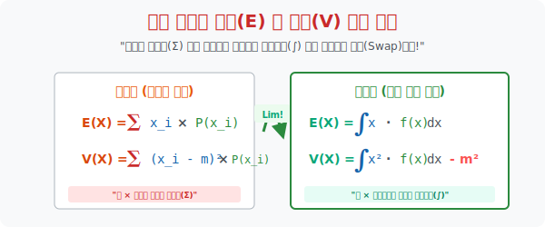

# 6. 기호의 진화: 연속확률 변수의 평균($m$)과 분산($\sigma^2$)

## [도입부] 학습 목표 (Learning Objectives)
- 동전과 막대기를 세던 이산 세계에서 우리가 지독하게 외웠던 확률의 덧셈 기호 **시그마($\Sigma$)** 가 드디어 목숨을 다하고, 그 빈자리를 아름답고 소름 돋는 부드러운 S자 곡선 **적분 기호 인테그랄($\int$)** 이 똑같이 대체하는 기호의 진화론을 감상합니다.
- 기댓값($E(X)$) 과 분산($V(X)$) 을 산출하는 공식 베이스 자체는 단 하나도 변한 게 없으며, 오직 그 도구만 덧셈 기계($\Sigma$) 에서 면적 스캐너($\int$)로 판갈이 된 팩트를 확인합니다.
- 파이썬(Python)의 `scipy.integrate.quad` 수치 적분 모듈을 이용해, 연속 함수의 $x \cdot f(x)$ 를 미적분 구문으로 계산하며 한 땀 한 땀 코드로 적분 수식을 풀어내는 인공지능 해비타트를 목격합니다.

---

## 1. 덧셈($\Sigma$)의 죽음, 적분($\int$)의 부활

우리가 앞선 챕터(이산확률분포)에서 기댓값(평균) 피를 토할 때 썼던 가장 중요한 공식은 바로 **"(변수 값 $\cdot$ 확률) 의 덧셈"** 이었습니다. 
이것을 수식으로 쓰면 위대한 $\sum x_i P(x_i)$ 가 됩니다. (예: 1점짜리가 나올 확률 $1/6$, 2점짜리가 나올 확률 $1/6 \dots$ 을 모조리 곱해서 더함).

그러나 1수업에서 우린 이제 불연속적인 1점 2점이 아니라 무한히 이어지는 "연속된 수직선"으로 넘어왔습니다. 무한한 소수점들을 다 더할 수는 없습니다.
수학자들은 덧셈 기호 시그마($\Sigma$)를 과감히 휴지통에 쳐박습니다. 그리고 그 쪼개짐의 한계를 벗어난 궁극의 면적 색칠 무기, **적분 기호($\int$)** 를 복사 붙여넣기로 세팅합니다.

- **[이산] 평균 $m$ = $\sum x \cdot P(x)$**
- **[연속] 평균 $m$ = $\int x \cdot f(x) dx$**

완전히 똑같지 않습니까? 확률값 $P(x)$ 자리에 함수 $f(x)$ 덩어리가 들어갔고, 더하라는 $\Sigma$ 대신 면적을 구하라는 $\int$ 가 앞을 막고 섰을 뿐, 수학의 뼈대 논리는 티끌 하나 바뀌지 않은 위대하고 통쾌한 순간입니다!



<br>

## 1. 평균($E(X)$) : 모든 것을 잘게 썰어 적분하라


이산 확률 세계에서 평균(기댓값) 이란 변수 $X$ 에다가 확률 $P$ 를 곱한 뒤 $\Sigma$ (시그마) 로 막노동 덧셈을 하는 것이었습니다.
하지만 연속 우주에서는 $X$ 값이 무한히 쪼개진 모래알이 되어버립니다. 그래서 $\Sigma$ 의 최종 진화 버전인 $\int$ (인테그랄, 적분) 을 사용합니다.

- **[이산] 분산 $V(X)$ = $\sum x^2 \cdot P(x) - m^2$**
- **[연속] 분산 $V(X)$ = $\int x^2 \cdot f(x) dx - m^2$**

이제 우린 수능 문제에서 징그러운 $f(x)$ 함수(예: $2x+1$ 같은 것)를 맞닥뜨리더라도 당황하지 않습니다. 사장님이 평균을 내놓으라고 하면 저 $f(x)$ 앞에 $x$ 하나만 곱한 채로 범위 면적 적분만 $\int$ 땡겨줍니다. 분산이 필요하면 $f(x)$ 에 $x^2$ 을 곱해 넣은 폭탄을 하나 툭 하고 적분기계에 흘려 보낸 뒤 내 몸무게(평균)의 제곱만 빼면 모든 상황이 스무스하게 끝납s.

---

## 2. 분산($V(X)$) : 재평평재 도 적분으로 간다

분산을 구하는 가장 달콤하고 짧은 치트키 공식을 기억하십니까? 바로 **"제곱의 평균 - 평균의 제곱" (재평평재)** 입니다.
이 놈 역시 연속의 나라로 입국 심사를 받을 땐 $\int$ 마크를 이마에 달아야 합니다.

- **[이산] 분산 $V(X)$ = $\sum x^2 \cdot P(x) - m^2$**
- **[연속] 분산 $V(X)$ = $\int x^2 \cdot f(x) dx - m^2$**

이제 우린 수능 문제에서 징그러운 $f(x)$ 함수(예: $2x+1$ 같은 것)를 맞닥뜨리더라도 당황하지 않습니다. 사장님이 평균을 내놓으라고 하면 저 $f(x)$ 앞에 $x$ 하나만 곱한 채로 범위 면적 적분만 $\int$ 땡겨줍니다. 분산이 필요하면 $f(x)$ 에 $x^2$ 을 곱해 넣은 폭탄을 하나 툭 하고 적분기계에 흘려 보낸 뒤 내 몸무게(평균)의 제곱만 빼면 모든 상황이 스무스하게 끝납니다.

---

## 3. 💻 파이썬(Python) 연속 적분기(Integral)를 이용한 평균/분산 연산 엔진

과거엔 칠판 하나를 꽉 채워 적분을 깎아 나갔지만, 파이썬에게는 수식만 툭 던져주면 알아서 무한대의 소수점 픽셀 직사각형으로 나눠 순식간에 평균과 분산 지표를 배포합니다. 

### 🐍 파이썬 예제: 연속확률함수(PDF)의 적분을 통한 평균과 분산 스캐닝

```python
import scipy.integrate as integrate

print("--- ⚔️ 기호의 부활: 연속 함수 f(x) 적분(Integral) 엔진 ---")

# (가정) 어떤 기계 부품 수명을 나타내는 연속확률밀도함수 최적화 (단 0 <= x <= 2 구간 제한)
# f(x) = 0.5 * x 
def f_x(x):
    return 0.5 * x

# 1. 기댓값 E(X) 연산: [  적분( x * f(x) )  ]
def expectation_func(x):
    return x * f_x(x)

# 0에서 2구간 면적 파열 스캔!
mean_result, error = integrate.quad(expectation_func, 0, 2)
print(f"▶ 1차 산출: E(X) 평균 산출값 (x * f(x) 면적) = {mean_result:.4f}")

# 2. 분산 V(X) 연산: [ 적분 ( x^2 * f(x) ) ] - (평균)^2 (이름하여 '재평평재')
def square_expectation_func(x):
    return (x**2) * f_x(x)

e_x_square, error = integrate.quad(square_expectation_func, 0, 2)
variance_result = e_x_square - (mean_result**2)

print(f"▶ 2차 산출: V(X) 분산 산출값 (x² * f(x) 면적 - m²) = {variance_result:.4f}")

print("-" * 50)
print(f" [최종 해독 완료] 이 롤러코스터 부품 데이터 집단의")
print(f"   - 평균 중심점은 {mean_result:.3f} 이며,")
print(f"   - 뚱뚱하게 퍼진 오차력(분산)은 {variance_result:.3f} 입니다.")

# 결과창:
# --- ⚔️ 기호의 부활: 연속 함수 f(x) 적분(Integral) 엔진 ---
# ▶ 1차 산출: E(X) 평균 산출값 (x * f(x) 면적) = 1.3333
# ▶ 2차 산출: V(X) 분산 산출값 (x² * f(x) 면적 - m²) = 0.2222
# --------------------------------------------------
#  [최종 해독 완료] 이 롤러코스터 부품 데이터 집단의
#    - 평균 중심점은 1.333 이며,
#    - 뚱뚱하게 퍼진 오차력(분산)은 0.222 입니다.
```

데이터 사이언스의 핵심은 거대한 덩어리(함수)를 적분기에 쑤셔 넣어 평균과 분산을 뽑아내는 것입니다. 우리는 덧셈 노가다를 하지 않고 오직 컴퓨터의 수치 적분(Numeric integration) 파워를 통해 통계의 진면목을 완성합니다.

---

## [결론] 학습 정리 (Summary)

1. **시그마의 사망, 인테그랄의 왕위 계승**: 불연속적인 점(이산)들을 더할 때 쓰던 더하기 $\Sigma$ 는 소수점으로 무한히 팽창하는 연속의 세계 앞에서 박살나고, 오직 등성이의 밑면적(넓이)을 스무스하게 긁어모으는 $\int$ 적분 기호가 지위봉을 물려받습니다.
2. **뼈대 공식은 절대 변하지 않는다**: $E(X) = X$ 와 확률을 곱한다! $V(X) = X^2$ 과 확률을 곱하고 $m^2$ 을 뺀다! 이 공식의 뼈대 자체는 단 하나도 변하지 않았으며 오직 기호 껍질만 갈아입었음을 간파해야 합니다.
3. **적분은 컴퓨터의 몫**: 현대 수학의 응용에서 우리가 손으로 다항함수 적분식을 풀 일은 없습니다. 공식을 꿰뚫는 눈만 있다면 파이썬 레이더망(`integrate.quad`)이 그 면적 확률을 1초 만에 렌더링해줄 것입니다.
