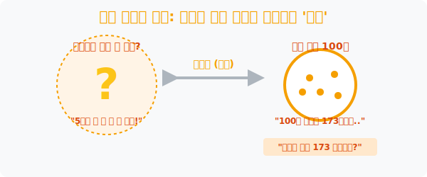

# 1. 셜록 홈즈의 수학: 일부만 보고 전체를 간파하는 '추정(Estimation)'

## [도입부] 학습 목표 (Learning Objectives)
- 통계학의 최종 보스이자 빅데이터 과학의 출발점인 **'추정(Estimation)'** 의 근본적인 존재 이유, 즉 "인간의 자원은 유한하므로 신의 영역(전체)을 다 알 수 없다"는 현실의 장벽을 이해합니다.
- 조각난 단서(데이터) 몇 개 만을 들고, 거대한 코끼리(전체)의 모양을 역으로 추적해 들어가는 통계학적 셜록 홈즈의 사고방식을 배웁니다.
- 파이썬(Python) 난수를 이용해 전체 정답을 미리 설정해 둔 뒤, 컴퓨터가 몰래 눈을 가리고 일부 파편만 주워서 '내가 만든 정답' 을 비슷하게 때려 맞히는지(추정률) 시뮬레이션 합니다.

---

## 1. 전지전능함표의 포기: 추정의 시작

과거 우리는 주머니에 들어있는 빨간 구슬 3개, 파란 구슬 2개를 놓고 확률 계산을 했습니다. 주머니 안을 우리가 내려다보고 있었기 때문입니다. 즉 정보의 **'신(God)'** 처럼 전체 정답을 다 알고 있었습니다.
하지만 여러분이 대통령 선거 여론조사를 하거나, 대한민국의 평균 당뇨병 수치를 조사한다고 칩시다. 5천만 명의 피를 다 실시간으로 뽑을 수 있나요? 절대 불가능합니다. 

현실 세계에서 우리는 주머니 속을 볼 수 없습니다. 거대한 주머니 안에서 딱 번호표 **1,000개 정도만 쓱 꺼내본 뒤**, 그 1,000개의 냄새와 색깔만 기막히게 분석해서 *"아하! 이 주머니 안의 5천만 개 전체 데이터는 대충 이런 모양이겠군!"* 이라고 **때려 맞히는 기술**이 바로 통계학의 꽃이자 딥러닝 인공지능의 코어 베이스, **추정(Estimation)** 입니다.



<br>

## 2. 때려 맞히는 과학의 당위성


"아니, 정확한 전수 조사를 해야지 대충 찍어 맞히는 게 수학이야?" 라고 반문할 수 있습니다.
하지만 현실 세계(Real World) 에서는 **전수 조사가 물리적으로 불가능하거나 절대 해서는 안 되는 상황**이 훨씬 많습니다.
아닙니다! 우리가 52챕터에서 배운 **'정규분포(Normal Distribution)'** 의 절대 템플릿과 **확률의 곡선 법칙**이 있기 때문에, 무작위로 뽑은 조각 데이터라 할지라도 수학 렌더링 공식에 넣으면 전체의 모습을 거의 $95\%, 99\%$ 의 정확도로 유추해 낼 수 있는 위대한 수학적 담보가 생성되어 있습니다.

추정은 찍기가 아닙니다! 
아주 정교한 오차율(거품 한계)을 명시한 상태에서, 우리가 다가갈 수 없는 거대한 '진짜 평균' 에 좌표 타격을 가하는 현대 자본주의 최고의 데이터 스캐닝 기술입니다. 방송국에서 개표율 1%만 보고 "A 후보 당선 확실" 을 띄우는 배짱 역시 이 '추정' 시스템의 마법 한가운데 있습니다.

---

## 3. 💻 파이썬(Python) 셜록 홈즈 파편 스캐너 

컴퓨터가 보이지 않는 거대한 100만 명의 가상 세계(정답)를 숨겨둔 뒤, 딱 500개의 단서(파편)만 훔쳐 내어 처음 100만 명의 전체 평균을 얼마나 무섭게 간파해 내는지 파이썬으로 구현합니다.

### 🐍 파이썬 예제: 500개의 파편으로 100만 개의 진실 추정하기

```python
import numpy as np

print("--- 🕵️ 셜록 홈즈 스캐너: 일부로 전체 간파하기 ---")

# 1. 신의 영역(God's Room): 인간은 모르는 진실의 세계
# (가상) 대한민국 100만 명의 진짜 평균 독서량은 연평균 15권, 편차 5권.
TRUE_MEAN = 15.0
TRUE_STD = 5.0
# 컴퓨터에 100만명짜리 괴물 정답(모집단) 데이터 생성 (인간은 이걸 들여다볼 수 없음)
universe_data = np.random.normal(TRUE_MEAN, TRUE_STD, 1000000)

print("▶ 신의 세계(100만 명) 구축 완료... (블라인드 처리 됨)")
print("-" * 50)

# 2. 인간의 영역: 돈이 없어서 딱 500명만 무작위 조사! (추정의 시작)
sample_size = 500
# 100만명의 우주에서 500개를 랜덤으로 끄집어냅니다 (부분 파편)
sample_fragments = np.random.choice(universe_data, sample_size)

# 파편(500개) 들만의 찌질한 평균을 구한다
sample_mean = np.mean(sample_fragments)

print(f" 🔍 [조사 결과] 우리가 겨우 조사한 {sample_size}명의 데이터 평균: {sample_mean:.2f} 권")
print(f" 🧠 [추정 엔진 결론] 따라서 우리는 대한민국 전체 평균도 약 [{sample_mean:.2f}] 점 근처일 것이라고 추정합니다!")

# 3. 진실 공개: 인간의 때려 맞히기가 얼마나 정확했을까?
error = abs(TRUE_MEAN - sample_mean)
print("-" * 50)
print(f" 🚨 [진실 공개] 숨겨졌던 신의 정답(100만명 평균)은 [{TRUE_MEAN:.2f}] 점이었습니다.")
print(f" 🎯 [팩트 체크] 고작 500명 조사로 100만명 정답과의 오차는 겨우 {error:.2f} 점!!")

# 결과창:
# --- 🕵️ 셜록 홈즈 스캐너: 일부로 전체 간파하기 ---
# ▶ 신의 세계(100만 명) 구축 완료... (블라인드 처리 됨)
# --------------------------------------------------
#  🔍 [조사 결과] 우리가 겨우 조사한 500명의 데이터 평균: 14.88 권
#  🧠 [추정 엔진 결론] 따라서 우리는 대한민국 전체 평균도 약 [14.88] 점 근처일 것이라고 추정합니다!
# --------------------------------------------------
#  🚨 [진실 공개] 숨겨졌던 신의 정답(100만명 평균)은 [15.00] 점이었습니다.
#  🎯 [팩트 체크] 고작 500명 조사로 100만명 정답과의 오차는 겨우 0.12 점!!
```

단 $100$만 개 공간에서 조약돌 $500$개를 주웠는데, 원래 거대한 행성의 진실(15점) 과 단 **$0.1$ 점 차이** 밖에 안 나는 기적적인 좌표 타격 적중률을 보여줍니다! 이것이 추정 이론이 오늘날 AI(인공지능) 가 인간의 일부 언어 패턴만 학습하고도 완벽한 챗봇 문장을 생성해 내는 모든 기초 논리입니다.

---

## [결론] 학습 정리 (Summary)

1. **전지전능함의 포기**: 수학책 문제 속 주머니 구슬의 개수를 세던 바보짓을 버리고, 무한하고도 장막에 휩싸인 현실의 빅데이터를 마주하는 학자들의 가장 겸손하고 이성적인 태도가 **‘추정’** 입니다.
2. **단서(Sample)를 통한 역추적**: 범죄 현장에서 발견된 담배꽁초(일부 데이터) 하나로 범인의 전체 신루트를 그려내는 셜록 홈즈처럼, 추정은 무작위로 추출된 '일부 쪼가리 평균' 으로 '원래 거대한 것의 진짜 평균' 을 역도출해냅니다.
3. **가장 가성비 좋은 무기**: 5천만 명의 피를 뽑는 데(전수조사) 1백 년과 수조 원이 들지만, 추정 기법을 사용하면 1,000명의 데이터비 수백만 원 값만으로 오차 1~2% 내의 동일한 스펙을 얻어내는 과학적 극한의 가성비 툴입니다.
