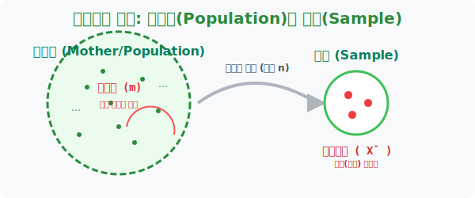
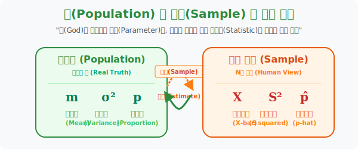

# 2. 전수조사 불가: 모집단(Population)과 표본(Sample)

## [도입부] 학습 목표 (Learning Objectives)
- 추정의 게임에서 우리가 절대 닿을 수 없는 신의 무대 **'모집단(Population)'** 과, 진리를 찾기 위해 쥐어뜯어 온 조각난 힌트 쪼가리 **'표본(Sample)'** 의 핵심 철학을 구분합니다.
- 모집단이 갖고 있는 오리지널 진짜 파라미터(**모평균 $m$, 모표준편차 $\sigma$**) 와, 내가 방금 훔쳐 온 조각들만 계산해 낸 복제품 짝퉁 파라미터(**표본평균 $\bar{X}$, 표본표준편차 $S$**) 의 기호를 철저히 구별합니다.
- 파이썬(Python)의 리스트 조작을 통해 방대한 모집단 리스트 창고 안에서, 뜰채로 딱 $n$개(크기) 만 퍼 올려 나의 미니 표본 데이터를 만들어내는 **난수 추출(Random Sampling)** 로직을 구현합니다.

---

## 1. 전수 조사의 파멸과 표집의 시작

우리가 병원에서 몸의 건강상태(백혈구 수치 등)를 알고 싶다고 합시다. 우리 몸통 안에는 약 5리터의 피가 흐릅니다.
이 $5$리터의 방대한 핏덩어리 우주 전체 물량을 통계학에서는 **어머니 '모' 자를 써서 모집단(Mother Population)** 이라 부릅니다.
만약 내 진짜 백혈구 건강 수치(진리)를 100% 한 치의 오차 없이 알려면, 몸속에 있는 5리터 피를 모조리 주사기로 뽑아서(전수 조사) 원심분리기 1,000만 개에 돌려야 합니다. 
결과는? **진리는 얻겠지만 환자는 피가 말라죽어 버립니다 (파멸).**

그래서 의사(통계학자)는 기적의 꼼수를 부립니다.
환자의 팔뚝에 주삿바늘을 딱 한번 꼽고, 겨우 얄팍한 피 **10ml 한 통만 쭉 뽑아냅니다.** 
통계학에서는 이렇게 거대한 엄마(모집단) 뱃속에서 뜯어낸 미세한 10ml 추출 조각 데이터를 **표본(Sample)** 이라고 부르고, 주사기로 뽑아낸 행위를 **추출(Sampling)** 이라고 부릅니다. 그리고 그 10ml 의 크기(용량)를 **표본의 크기($n$)** 라 명명합니다!



<br>

## 2. 두 세계의 기호학: 진짜(모)와 짝퉁(표본)의 분리



통계학에서는 '진짜 신의 데이터(모집단)' 와 '인간이 퍼낸 짝퉁 데이터(표본)' 를 섞어 쓰면 엄청난 재앙이 발생합니다. 그래서 기호부터 철저하게 차별을 둡니다.

우리가 추정 단원에서 멘탈이 나가는 이유는, "평균" 이라는 단어가 모집단에도 있고 조각(표본)에도 있기 때문입니다. 이 둘의 기호를 목숨 걸고 구별해야 합니다.

1. **[모] 집단의 절대 파라미터 (진리치, 인간은 모름)**
   - **모평균 ($m$)**: 5리터 전체 피의 진짜 오리지널 백혈구 수치 (우리가 추리해서 맞춰야 할 최종 해커 타겟!)
   - **모표준편차 ($\sigma$)**: 원래 5리터 피 집단이 가진 태생적 뚱뚱함(오차).

2. **[표본] 의 복제품(짝퉁) 파라미터 (단서, 인간이 들고 있음)**
   - **표본평균 ($\bar{X}$ - 엑스 바!)**: 내가 방금 뽑은 10ml 쪼가리 피만 검사해서 얻어낸 '우리 밥그릇 안의' 허접한 평균값. (이 녀석이 바로 $m$ 을 유추해 내는 셜록 홈즈의 돋보기가 됩니다)
   - **표본표준편차 ($s$)**: 방금 뽑은 10명짜리 밥그릇 애들 사이에서의 편차.

추정 단원의 궁극적 목표는 오직 하나입니다:
**"내 손에 들린 조약돌 표본평균 $\bar{X}$ (엑스바) 가, 신의 얼굴인 모평균 $m$ 랑 얼마나 똑같이 생겼을까?!"** 이것을 증명하는 게임입니다.

---

## 3. 💻 파이썬(Python)의 대자연 샘플링 뜰채 (`random.sample`)

통계의 추출(Sampling) 과정은 파이썬 리스트 조작의 기초 중의 기초입니다. 창고에 1만 개의 상품이 썩어가는데 전수 검사하기 싫으니, 파이썬에게 딱 10개만 무작위 뜰채 낚시질(Sampling)을 시켜서 표본(Sample)을 떠오는 코드를 돌려봅니다.

### 🐍 파이썬 예제: 1만 개 모집단에서 10개 표본(n=10) 낚시질 하기

```python
import random
import numpy as np

print("--- 💉 혈액 검사소: 모집단(Mother)과 표본(Sample) 뜰채 시스템 ---")

# 1. 환자 몸통의 [모집단]: 10만 개의 거친 핏방울 배열 세포 (인간은 이걸 다 못봅니다)
# 임의로 핏방울 1개의 점수를 1 ~ 100점 이라고 가정
mother_population = [random.randint(1, 100) for _ in range(100000)]

# 절대신이 알고있는 진짜 모평균(m) - 참고용
god_true_mean = np.mean(mother_population)

print("▶ 모집단(10만 개 핏방울)이 혈관을 흐릅니다... (전수조사 불가!)")
print("-" * 50)

# 2. 통계학자의 주사기 꼽기: 뜰채로 딱 10개(크기 n=10)의 핏방울 조각 [표본] 만 추출
sample_size_n = 10
# random.sample() 은 모배열 안에서 10개를 낚아채어 내 손안의 '미니 복제품' 으로 줍니다
my_tiny_sample = random.sample(mother_population, sample_size_n)

# 내 손안의 10개짜리 표본의 평균값인 표본평균(X-Bar) 을 구한다!
x_bar_sample_mean = np.mean(my_tiny_sample)

print(f" 🧪 [추출] 뜰채로 확 건져올린 {sample_size_n}개의 표본(Sample) 핏방울 수치들:")
print(f"    -> {my_tiny_sample}")
print(f" 🔎 [분석] 이 10개짜리 조약돌의 평균(표본평균 X-Bar): {x_bar_sample_mean:.2f}")

print("-" * 50)
print(f" 💡 [결과 배틀] 10만짜리 모평균(m: {god_true_mean:.2f})  VS  10개짜리 표본평균(X-bar: {x_bar_sample_mean:.2f})")
print(f"   (적당한 타격 지점에 안착했는지 확인!)")

# 결과창:
# --- 💉 혈액 검사소: 모집단(Mother)과 표본(Sample) 뜰채 시스템 ---
# ▶ 모집단(10만 개 핏방울)이 혈관을 흐릅니다... (전수조사 불가!)
# --------------------------------------------------
#  🧪 [추출] 뜰채로 확 건져올린 10개의 표본(Sample) 핏방울 수치들:
#     -> [65, 82, 12, 45, 93, 31, 55, 18, 77, 40]
#  🔎 [분석] 이 10개짜리 조약돌의 평균(표본평균 X-Bar): 51.80
# --------------------------------------------------
#  💡 [결과 배틀] 10만짜리 모평균(m: 50.45)  VS  10개짜리 표본평균(X-bar: 51.80)
#    (적당한 타격 지점에 안착했는지 확인!)
```

파이썬의 눈먼 낚시질(`random.sample`)로 건져 올린 겨우 10개($n$) 짜리 조약돌의 평균치 $\bar{X}$ (51.80) 가, 보이지 않던 10만 개짜리 모평균 $m$ (50.45) 과 상당히 소름 돋게 비슷한 영역에 포진해 있음을 확인할 수 있습니다. 저 $\bar{X}$ 가 우리의 무기입니다.

---

## [결론] 학습 정리 (Summary)

1. **전수조사의 멸망 속 진화**: 모집단을 모조리 뜯어보는 비용(시간, 파괴테스트)은 현실 비즈니스에서 죽음과 같습니다. 일부분만 떼어내는 '표본(Sample)' 검사는 타협이 아니라 수학자들의 가장 합리적인 가성비 생존 전략입니다.
2. **기호 체계의 독립**: 모집단의 보스인 오리지널 $m$(모평균)과 $\sigma$(모표준편차)는 그리스/로마어 절대 기호를 쓰며, 우리가 방금 바구니에 담아온 짝퉁 조각 표본들은 $\bar{X}$(표본평균)와 $s$(표본표준편차)라는 귀여운 인간계 소문자 기호표를 붙여 서열을 엄격히 나눕니다.
3. **추출(Sampling) 크기 $n$ 의 등장**: 뜰채의 크기(몇 명을 뽑았는가)인 소문자 **$n$** 은 향후 통계 추정의 모든 공식과 오차를 줄여주는 '돈(Money)' 과도 같은 힘의 매개 변수로 등극합니다.
