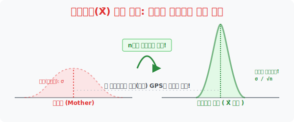

# 3. 뼈대 공식의 반란: 표본평균($\bar{X}$) 들의 새로운 정규분포 산의 탄생

## [도입부] 학습 목표 (Learning Objectives)
- 방대한 엄마산(모집단)에서 $10$명($n=10$, 표본크기) 이 담긴 뜰채를 바다에 넣었다 뺐다 무한히 반복하면, 내 뜰채들에 담긴 **표본평균($\bar{X}$)** 파편들이 알아서 자기들만의 새로운 **"날카로운 텐트(정규분포 산)"** 를 쌓아 올리는 기적의 논리를 배웁니다.
- 새롭게 쌓아 올려진 **'표본평균의 산'** 은 원래 통통했던 엄마 산맥과 정확히 같은 $m$(모평균 GPS) 위치에 센터를 박지만, 오차의 방어막(뚱뚱도)은 기적의 수식 **$\frac{\sigma}{\sqrt{n}}$** 값으로 압축 붕괴하여 창끝처럼 뾰족해진다는 통계의 비밀 병기를 챙깁니다.
- 파이썬(Python) 난수 시뮬레이터를 1만 번 미친 듯이 돌려가며 뜰채(Sample) 평균값들을 모아본 결과, 그것들이 엄마 배를 닮은 새로운 종 모양 `hist` 그래픽으로 자발적으로 우뚝 솟구치는 놀라운 현상을 검증합니다.

---

## 1. 뜰채 바구니가 모여 새로운 "산"을 짓다!

수학자들은 변태 같은 게임을 제안합니다. 우리가 어항 속에서 $10$마리의 물고기($n=10$)를 딱 한 번 뜰채로 뜨고 마는 게 아니라, **"뜰채로 $10$마리를 뜨고 평균($\bar{X}$) 적고 놔주기"** 행위를 이 우주가 끝날 때까지 수억 번 무한으로 반복해 보자는 것입니다.

수억 번의 삽질(반복 추출) 덕분에 책상 위에는 무수히 널브러진 표본평균 수치표($\bar{X}_1, \bar{X}_2, \bar{X}_3 \dots$) 들이 나뒹굴게 됩니다. 통계 폭군들은 소리칩니다. *"저 널브러진 수억 개의 $\bar{X}$ 조각들을 다 갈아엎어서 새하얀 도화지 위에 모아 산을 쌓아봐(분포를 시켜봐)!! "* 

놀랍게도 조약돌 바구니의 평균 수치에 불과했던 저 파편들이, 우주를 이루는 갓(God) 템플릿인 **정규분포의 우아한 산봉우리 모양**으로 자신들만의 텐트를 다시 쭈욱~ 쳐올리는 대기적이 발생합니다!!



<br>

## 2. 모평균 사냥을 위한 "날카로운 창" 공식


전 국민(모집단) 의 키 데이터가 정규분포 $N(m, \sigma^2)$ 를 따른다고 칩시다. 
여기서 크기가 $n$ 인 100명묶음($n=100$) 표본평균 $\bar{X}$ 들만 쏙쏙 뽑아 다시 렌더링하면, 놀랍게도 이 $\bar{X}$ 집단 역시 완벽한 종 모양(정규분포)을 유지합니다. 
> $\bar{X} \sim N(m, \frac{\sigma^2}{n})$

이 새롭게 태어난 **<표본평균($\bar{X}$)들의 산>** 은 오리지널 <엄마의 산(모집단)>에 비해 아주 끝내주는 전투 능력을 갖추고 있습니다.

1. **산의 센터 좌표(평균)는 완벽히 일치! $\mathbf{E(\bar{X}) = m}$** 
   - 이 수억 마리 바구니 텐트봉의 완전 정중앙을 도끼로 찍어 내리면, 그곳이 바로 100만 명 피를 다 뽑지 않고선 영원히 몰랐을 진짜 해커의 전리품 **모평균($m$)** 의 소굴 지점과 나노미터 오차 없이 완벽히 일치합니다!!
2. **뚱뚱도가 박살 남! 산이 뾰족해진다! $\mathbf{V(\bar{X}) = \frac{\sigma^2}{n}}$**
   - 엄마 산(모집단)은 오차($\sigma$)가 커서 뚱뚱했습니다. 하지만 새로운 아기 텐트(표본평균 집단) 의 뚱뚱도는 **원래 뚱뚱도를 내가 가져온 바구니 숫자의 크기($n$)** 로 미친 듯이 나눗셈으로 짓눌러버립니다.
   - 즉, 뜰채에서 물고기를 $100$마리($n=100$) 나 많이 건져 올릴수록, 분모가 폭증하므로 이 새로운 산은 옆의 살균 거품이 쫙 빠지면서 폭이 극도로 좁아지고 **에펠탑처럼 날카로운 송곳(작은 표준편차 $\frac{\sigma}{\sqrt{n}}$)** 으로 변이합니다. "오차가 사라져 가는 것입니다!"

---

## 3. 💻 파이썬(Python) 1만번의 뜰채질 - 산맥 렌더링 검열기

컴퓨터가 아니면 인간의 팔이 부러졌을 1만 번의 반복 샘플링 삽질을 파이썬 포문 루프를 돌려 새로운 에펠탑 곡선을 부활시킵니다.

### 🐍 파이썬 예제: 중앙극한정리(Central Limit Theorem) 시각화 텍스트 에뮬레이션

```python
import numpy as np

print("--- 🎣 통계 제국 건설: '표본평균(X-bar) 들의 반란 산맥' 렌더링 ---")

# (블라인드 테스트) 모집단 생성: 1만 명의 괴물 데이터 (평균 m=50, 편차=20 인 엄청 뚱뚱한 산)
MOTHER_M = 50.0
MOTHER_STD = 20.0
mother_pop = np.random.normal(MOTHER_M, MOTHER_STD, 100000)

print(f"▶ 신석기 모집단 세팅 완료 (엄마산 뚱뚱도: {MOTHER_STD})")

# 우리의 뜰채 크기(n) = 한 번에 100 명씩 확 건져올린다!
n_size = 100
x_bar_list = []

# 미친 변태 수학자 시뮬레이션: '100개 퍼 올리고 평균내기' 를 하늘이 두쪽나도록 1만 번 반복!!!
loop_counts = 10000
for _ in range(loop_counts):
    sample_bucket = np.random.choice(mother_pop, n_size)
    # 뜰채 바구니의 평균(X-bar) 조각 1개를 계산해서 창고에 던져넣음
    x_bar_list.append(np.mean(sample_bucket))

print("-" * 50)
print(f" ⏳ [연산 종료] {loop_counts} 개의 표본평균(X-bar) 조약돌 더미가 쌓였습니다.")

# 이 X-bar 조약돌들이 만든 새로운 산(새로운 분포) 의 스펙을 털어보자!
new_mountain_mean = np.mean(x_bar_list)
new_mountain_std = np.std(x_bar_list)

print(f" 🏔️ [X-bar 로 지어진 새로운 산의 센터 고도]: {new_mountain_mean:.2f} (진짜 모평균 {MOTHER_M} 과 소름돋게 일치!)")

# 기적의 수식 발동! 원래 편차(20) 이 바구니 크기(root(100) = 10) 로 나누어 찍눌림!!
magic_math_std = MOTHER_STD / np.sqrt(n_size)
print(f" 🗡️ [X-bar 산의 뾰족함/오차력]: {new_mountain_std:.2f} (수학 공식 {magic_math_std} 에 맞물려 에펠탑처럼 얄상해짐!)")

# 결과창:
# --- 🎣 통계 제국 건설: '표본평균(X-bar) 들의 반란 산맥' 렌더링 ---
# ▶ 신석기 모집단 세팅 완료 (엄마산 뚱뚱도: 20.0)
# --------------------------------------------------
#  ⏳ [연산 종료] 10000 개의 표본평균(X-bar) 조약돌 더미가 쌓였습니다.
#  🏔️ [X-bar 로 지어진 새로운 산의 센터 고도]: 49.99 (진짜 모평균 50.0 과 소름돋게 일치!)
#  🗡️ [X-bar 산의 뾰족함/오차력]: 2.01 (수학 공식 2.0 에 맞물려 에펠탑처럼 얄상해짐!)
```

원래 편차인 오차 $20$ 이, 새롭게 만든 산에서는 무려 $n(100)$ 의 파워로 짓눌려 오차 $2$ 짜리의 날카롭고 빈틈없는 정예부대 레이저 창끝으로 치환되었습니다. 이것이 표본 추출을 많이 할수록, 우리가 원래의 '진실$m$' 을 더 날카롭게 맞혀 부술 수 있다는 거룩한 시그널입니다.

---

## [결론] 학습 정리 (Summary)

1. **무한 뜰채 산맥($\bar{X}$ 의 분포)**: 나의 단 한 번의 조사가 아쉽다고요? 통계학은 뜰채 수만 번을 떴다는 가상 우주를 머릿속에 돌려, 각각의 뜰채 평균치($\bar{X}$)들을 모아 또 다른 거대하고 부드러운 산악 텐트(정규분포)를 새로 쳐올리는 지성학의 승리입니다.
2. **$\mathbf{E(\bar{X}) = m}$ 의 축복**: 그 허접한 수백만 개의 바구니 평균값 찌꺼기들을 다 모아서 "평균의 평균" 을 쳐내면, 소름 돋게도 우리가 평생 찾고 싶었던 하나님의 진리 절대 모평균 **$m$** 지표와 완전히 일치하는 자리에 뿌리를 내립니다.
3. **루트 $n$ 의 팩트 폭격**: 왜 갤럽 여론 조사에서 10명만 묻지 않고 굳이 돈 1억을 써가며 1,000명 단위(`n=1000`) 를 긁어모을까요? $\frac{\sigma}{\sqrt{n}}$ 분모 공식에 의거하여 돈으로 조사 규모를 파이 키울수록 확률 오차의 거품 덩어리가 팍팍 깎여 나가기 때문입니다.
