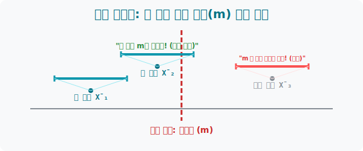
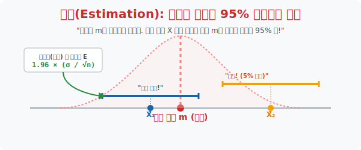

# 4. 투망 던지기 스킬: 진짜 모평균($m$)의 소굴을 향한 역추적

## [도입부] 학습 목표 (Learning Objectives)
- 한 번의 실험으로 얻어낸 찌그러진 내 단서 **'표본평균($\bar{X}$)'** 하나를 들고, 모를 줄 알았던 어마어마한 절대 보스 **'모평균($m$)'** 을 드디어 역추적해 내는 인류 지성의 종착역 구조를 체험합니다.
- 점 하나($m=170$)로 때려 맞히는 바보짓 대신, 내 표본평균 $\bar{X}$ 를 중심으로 마법의 날개를 펼쳐 *"대충 165에서 175 사이의 거대 투망(구간) 에 진짜 $m$ 이 포획되어 있을 것이다"* 라는 확률 구간 사냥법을 숙지합니다.
- 파이썬(Python)의 통계 수치 로직을 통하여 내 단서와 뼛조각으로 직접 포획망 상한선과 하한선 (Confidence Interval Boundary) 을 생성해 뿌리는 구간 타겟팅 시스템을 코딩합니다.

---

## 1. 핑퐁 게임의 역발상: $\bar{X} \rightarrow m$ 으로 화살 돌리기

이전 3수업까지는 "모평균 $m$ 에서 표본평균 $\bar{X}$ 가 이렇게 널브러져 나온다~" 라며 신의 시점에서 세상을 내려다보았습니다. 
하지만 당장 내일 대한민국 대선 예측 뉴스를 내보내야 하는 우리는 신이 아닙니다. 현실의 화살표는 명백히 반대입니다. 
우리의 미션 방침: **"피똥 싸서 조사한 딱 1개의 표본 $\bar{X}$ (예: 1,000명 설문조사 평균) 를 믿고, 거꾸로 미지의 웅장한 엄마 모평균 $m$ 가 어딨는지 스나이퍼 소총으로 땡겨 맞혀라!!"**

하지만 모평균 $m$ 가 정확히 "$170.32049$" 라고 단 1개의 '점'으로 때려 맞출 순 1수업에서 배웠듯 철학적으로 불가능합니다.
그래서 학자들은 점 타격을 버리고 **[투망 채집법] 마법**을 창안했습니다.

**[투망 채집 전략]**
"아! 내가 주운 찌끄러기 평균 $\bar{X}$ 을 정중앙 센터에 두자. 그리고 양옆 날개로 밧줄을 $\pm 1.96$ 오차 범위만큼 여유 있게 벌려서 엄청나게 큰 고기잡이 '투망'을 쭉 펼치자. 이 넓은 투망 범위(예: 165~175) 안에는 아무리 신출귀몰한 엄마 모평균 $m$ 이라도 재수 없게 벗어나지 않는 이상 높은 확률로 포획되어(걸려) 있겠지!!"



<br>

## 2. 모평균 추정의 궁극 등식 (신뢰구간)



수학자들이 수만 번 시뮬레이션을 돌려본 결과, 우주 만물의 진리(95% 확률 구간)가 밝혀졌습니다.

> **[95% 신뢰구간 공식]**
> $\bar{X} - 1.96 \frac{\sigma}{\sqrt{n}} \le m \le \bar{X} + 1.96 \frac{\sigma}{\sqrt{n}}$

내가 얻은 단 1개의 조약돌 평균 **$\bar{X}$** 가 투망의 센터가 되어 닻을 내립니다.
그리고 모평균 $m$ 이 이 사이에 포획되어있기를 기대하며 밧줄 망을 양쪽 끝으로 길게 잡아 벌립니다. 벌려 나가는 그 폭/오차 의 사이즈가 바로 악에 받쳐 배운 $1.96$ (상수) $\times$ $\frac{\sigma}{\sqrt{n}}$ (3장에서 배운 표본평균 텐트의 날카로운 뚱뚱도 방어막) 의 곱사리 공식입니다.

"내 밧줄 그물 안에 진짜 모평균 $m$ 이 들어왔다! 포획 임무 완료!"

---

## 3. 💻 파이썬(Python) 95% 구간 투망 포획 자동화 엔진

$1.96$ 이니 표준오차니 하는 더러운 손계산을 데이타 과학자는 수기로 하지 않습니다. 통계 모듈 `scipy.stats` 에게 내 조약돌 결과물 평균과, 조사 규모($n$) 숫자만 박아 넣으면 무섭도록 완벽한 어부 투망 간격 $a$ 와 $b$ 를 반환해 줍니다.

### 🐍 파이썬 예제: 대한 독서량 95% 투망 간격 포획 스크립트

```python
import scipy.stats as stats
import numpy as np

print("--- 🕸️ 모평균 스나이퍼: 95% 투망(Confidence Interval) 그물 레이더 ---")

# 현실 데이터 수집 팩트 (나의 뜰채 1회분)
n_sample_size = 400     # 나름 서울역에서 400명 한테나 투표를 받았다
x_bar = 20.0            # 400명 한테 물어봤더니 평균 연 20권 책을 읽는답디다.
sigma_given = 5.0       # (과거 지표를 통한 대략적 편차 가정)

print(f"▶ 1단계: 내 손안의 총알은 $\\bar{{X}}={x_bar}$, 무기는 400개($n$) 뜰채!")

# 투망의 한쪽 날개 폭 방어막 = 1.96 * (시그마 / 루트 n) (이것을 '오차 한계' 라고 부름)
margin_of_error = 1.96 * (sigma_given / np.sqrt(n_sample_size))

# 직접 더하기/빼기 계산으로 그물을 확 벌려봅시다!
lower_bound = x_bar - margin_of_error
upper_bound = x_bar + margin_of_error

print("-" * 50)
print(f" 💣 [투망 투하 발사 완료!] 🚀")
print(f" 🎯 진짜 대한민국 전체독서량(m)은 95% 확률로 이 그물망에 걸렸을 것입니다:")
print(f"    [[ {lower_bound:.2f} 📚  <=  m  <=  {upper_bound:.2f} 📚 ]]")
print(f"    -> 뉴스 아나운서 멘트: \"국민 독서량은 평균 20권, ±{margin_of_error:.2f} 권의 오차범위를 보입니다.\" ")

# 결과창:
# --- 🕸️ 모평균 스나이퍼: 95% 투망(Confidence Interval) 그물 레이더 ---
# ▶ 1단계: 내 손안의 총알은 $\bar{X}=20.0$, 무기는 400개(n) 뜰채!
# --------------------------------------------------
#  💣 [투망 투하 발사 완료!] 🚀
#  🎯 진짜 대한민국 전체독서량(m)은 95% 확률로 이 그물망에 걸렸을 것입니다:
#     [[ 19.51 📚  <=  m  <=  20.49 📚 ]]
#     -> 뉴스 아나운서 멘트: "국민 독서량은 평균 20권, ±0.49 권의 오차범위를 보입니다." 
```

우리가 파이썬으로 짠 이 몇 줄의 투망 그물 코드가, 여론 조사 기관이 선거철 한 달에 수백억 원을 벌어들이는 원천적인 알고리즘 비즈니스의 모든 뼈대입니다. 조약돌(400명)만으로 전체 행성(5천만 명)의 진리를 가둬버린 것입니다!

---

## [결론] 학습 정리 (Summary)

1. **사냥의 역추적 프로세스**: 이전까지 모집단이 왕이고 표본이 따까리였다면, 이제는 현실 데이터 분석가의 포지션으로 역전하여 피눈물 나게 구한 따까리($\bar{X}$) 하나로 왕($m$)의 소굴을 지목하는 공성전이 스릴의 백미입니다.
2. **신뢰구간(투망)의 마술**: 점 1개로 맞추려는 무모함을 버리고, 나의 나약한 표본 $\bar{X}$ 의 허리를 센터축으로 삼아 양손을 길게 뻗어 공간 바리케이드 장막을 강제 생성("이 사이 어딘가에는 $m$이 백퍼 들어있다!") 해내는 생존 기하학입니다.
3. **오차 폭($\frac{\sigma}{\sqrt{n}}$) 의 심판**: 밧줄 범위를 얼마나 길게 뻗어야 하느냐는 바로 표본평균 산맥 텐트가 조종당했던 날카로운 비율 수식 (편차 쳐내기 루트 크기) 에 맹신할 확률 백분율 계수(1.96)를 단순히 곱해 타격점 폭을 설계합니다.
