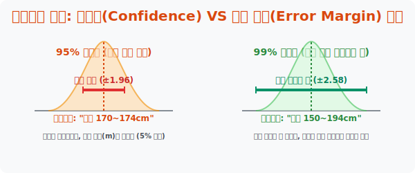
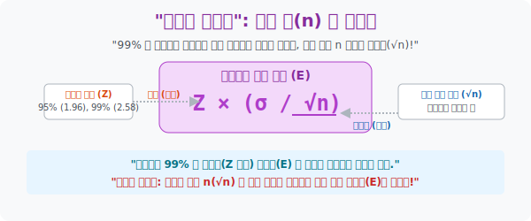




# 5. 장사꾼의 딜레마: 신뢰도(Confidence Level)와 오차 한계

## [도입부] 학습 목표 (Learning Objectives)
- 4수업의 투망 공식에서 말하던 "95% 확률" 이라는 단어의 진짜 수학적 정의를 해부하고, 왜 학자들이 무조건 신뢰도만 100% 로 높이려 하지 않는지 그 **'신뢰도와 오차 크기 간의 잔혹한 반비례 딜레마'** 를 깨닫습니다.
- "내가 던진 투망 안에 $m$이 들어올 확률을 99% 로 올려주쇼!" 라고 사장이 채근할 때, 통계학자들은 "그러면 투망(오차) 크기가 쓰레기처럼 너무 넓어져서 정보의 가치가 상실됩니다!" 라고 맞짱 뜨는 원리를 기하학적으로 증명합니다.
- 파이썬(Python)으로 $n$ (자본투입 조사 규모)을 폭발적으로 증가시켰을 때, 어마어마한 99% 의 맹신적 신뢰도를 유지하면서도 오차 밧줄을 텐트 송곳처럼 타이트하게 조여 버리는 돈의 마력을 시뮬레이션 합니다.

---

## 1. 100% 신뢰도의 헛소리

어떤 점쟁이가 말합니다. "이번 고3 모의고사 전국 평균(모평균 $m$)이 말이지... 음... 0점에서 100점 사이에 무조건 있을 것이여!!"
놀랍게도 이 점쟁이의 예언은 **100% 확률(신뢰도 100%)** 로 무조건 적중합니다. 단 1% 의 거짓도 없는 참입니다. 
하지만 이 결과는 아무짝에도 쓸모가 없는 쓰레기 정보입니다. 
오차 간격(투망 크기)을 0점부터 100점으로 무식하게 넓혀버렸기 때문에 맞출 확률(신뢰도) 자체는 신의 경지에 이르렀지만, 정보의 해상도(Tightness) 가 붕괴해 버린 것입니다.

통계학자는 **[신뢰도(Confidence Level)]** 와 **[예리함(오차의 크기 작음)]** 이라는 두 마리 토끼 사이에서 항상 외줄 타기 딜레마에 시달립니다.
1. "신뢰도를 **95%** ($1.96$배) 방어막으로 칠까? 투망이 나름 쫀쫀하게 조여들긴 하겠지만(예: 키 170~174cm), 100번 중 5번은 내가 던진 그물 바깥으로 모평균 $m$이 빠져나가서 내 목이 물리겠지..."
2. "안전방빵 가자! 신뢰도를 아예 무결점급인 **99%** ($2.58$배) 로 늘려 밧줄 길이를 확 벌려버리자! (예: 키 150~195cm) 거의 다 맞추긴 하겠는데, 오차 범위가 초딩도 맞추는 수준으로 너무 벌어져서 사장한테 결재서류 맞고 쫓겨나겠지..."



<br>

## 2. 딜레마를 박살 내는 유일한 탈출구: 샘플 수 ($n$) 폭탄!



**이 지독한 딜레마를 박살 낼 유일한 치트키는 분모에 있는 $n$(조사 인원수) 하나뿐입니다.**

오차의 한계 (에러, 그물의 반지름) 공식: $E = Z \times \frac{\sigma}{\sqrt{n}}$

신뢰도를 99%($Z=2.58$) 로 높여서 그물이 커져버린 상황입니까? 그렇다면 분모에 있는 $n$(조사 대상 인원) 에 돈과 시간을 퍼부어서 늘리면 됩니다!
분모 $\sqrt{n}$ 이 거대해지면 커졌던 오차 크기 $Z$ 가 상쇄되어 그물이 다시 쪼그라들게 됩니다.
신뢰도는 99% 로 유지하고 싶고, 밧줄은 팽팽하게 쪼아서 아나운서처럼 간지나게 좁은 오차율을 보고하고 싶다면, 방법은 오직 하나입니다. 

저 흉측하게 팽창한 분자 상수 값을 씹어 먹을 정도로 **"분모인 조사 대상 인원 크기 루트 $\mathbf{n}$ ($n$ 표본 뽑기 수) 을 잔인할 정도로 증가시켜 버리는 것(돈을 쏟아붓는 것)"** 입니다. 조사 인원 $n$을 100명에서 10,000명 단위로 무자비하게 폭증시키면, 분모가 너무 비대해져서 신뢰도의 오만함을 압착해 버리고 밧줄구간 간격은 다시 레이저처럼 타이트하게 뾰족해집니다.

결국 통계의 정확도 = 자본력(수백만 명 리서치 패널 돈) 임을 증명하는 자본주의의 정수입니다.

---

## 3. 💻 파이썬(Python) 조사 규모($n$) 팽창에 따른 극악의 오차율 압축 시뮬레이터

동일한 $99\%$ 맹신적 신뢰도 하에서, 우리가 통계청에 돈을 부어 설문 인원 $n$을 100 -> 10000 으로 늘림에 따라 뉴스 자막 하단에 나가는 뻥튀기 기하학 오차율이 얼마나 타이트하게 조여지는지 코드로 관찰합니다.

### 🐍 파이썬 예제: 자본력(표본크기 $n$) 의 돈찍누 오차 밧줄 압착 효과

```python
import numpy as np

print("--- 💸 자본주의 팩트 체크: 샘플(n) 파워가 딜레마를 부술 때 ---")

# (고정 스펙) 한국인 평균 월급 데이터 (편차 100만 원짜리 개판 집단이라 가정)
sigma = 100.0

# 1. 거지 회사 (n = 100명 조사에 그침)
n_poor = 100
# 99% 신뢰도를 위한 K 방어상수는 2.58 로 획일적 고정!
margin_error_poor = 2.58 * (sigma / np.sqrt(n_poor))

print(f"▶ 가난한 조사 (예산 100명, 신뢰도는 99% 보장)")
print(f" 💣 오차 길이: 무려 ±{margin_error_poor:.2f} 만원!")
print("    -> 멘트: \"월급은 평균 300만 원, 오차는 위아래로 무려 ±25만 원!! (범위가 벌어져 신뢰성 체감 쓰레기)\"")
print("-" * 50)

# 2. 대기업 통계청 (n = 10,000명 무작위 무차별 폭심 조사)
n_rich = 10000
margin_error_rich = 2.58 * (sigma / np.sqrt(n_rich))

print(f"▶ 대기업 싹쓸이 조사 (예산 10,000명 패널, 신뢰도는 동일하게 99% 보장)")
print(f" ⚡ 밧줄 오차 압착: 겨우 ±{margin_error_rich:.2f} 만원!")
print("    -> 멘트: \"월급은 평균 300만 원, 오차는 ±2만 5천 원 선(1% 이내)의 거의 오발이 불가능한 수준입니다.\"")

# 결과창:
# --- 💸 자본주의 팩트 체크: 샘플(n) 파워가 딜레마를 부술 때 ---
# ▶ 가난한 조사 (예산 100명, 신뢰도는 99% 보장)
#  💣 오차 길이: 무려 ±25.80 만원!
#     -> 멘트: "월급은 평균 300만 원, 오차는 위아래로 무려 ±25만 원!! (범위가 벌어져 신뢰성 체감 쓰레기)"
# --------------------------------------------------
# ▶ 대기업 싹쓸이 조사 (예산 10,000명 패널, 신뢰도는 동일하게 99% 보장)
#  ⚡ 밧줄 오차 압착: 겨우 ±2.58 만원!
#     -> 멘트: "월급은 평균 300만 원, 오차는 ±2만 5천 원 선(1% 이내)의 거의 오발이 불가능한 수준입니다."
```

코드에서 보듯 딜레마 게임의 유일한 파훼법은 "조사 대상 규모를 우주급으로 팽창시키는 것" 뿐이며, 분모의 파워($n$) 가 커질수록 뉴스 멘트는 훨씬 쫀쫀한 팩트("단 1% 미만의 오차범위") 로 세탁되어 시청자들의 뇌에 박히게 됩니다.

---

## [결론] 학습 정리 (Summary)

1. **신뢰 구간의 양면성**: 99% 맞췄다고 안심하지 마십시오. 정보를 1~100으로 넓히면 바보도 다 100% 당첨 적중률(신뢰도)을 보장합니다. 진정한 수학 데이터 분석가는 확률 보장성은 95% 만 챙기더라도 구간 오차 간격을 좁히는 현실 타협안을 선택합니다.
2. **K 변수의 고정 오만함**: 신뢰도를 넓히고 싶은 인간의 변태적 욕망(오차 K 값이 $1.96 \rightarrow 2.58$ 로 팽창) 은 필연적으로 그물 밧줄 폭투망의 크기를 우주로 팽창시켜 버립니다.
3. **자본주의 $n$ 개 파워**: ఈ 반비례 압박의 나사를 다시 제자리로 팽팽히 쪼매주는 궁극의 열쇠는 무식하게 돈(예산)을 쳐발라 분모에 위치한 표본 크기 루트 $n$ 을 1만, 10만 사이즈로 밀어 넣어 거품 값을 폭발 제어하는 통계청의 깡패 짓뿐입니다.

