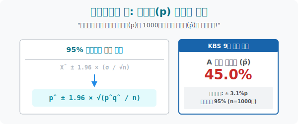

# 6. 여론조사의 단골손님: 뉴스 자막의 지배자, 모비율 추정

## [도입부] 학습 목표 (Learning Objectives)
- 4수업의 '평균(점수)' 투망 던지기 스킬을, 대통령 선거 후보자 지지자들의 백분율 크기를 역추적 타격해 내는 **'비율 추정(Proportion Estimation)'** 세계로 완벽 복제 도용합니다.
- 내 손에 들어온 1,000명짜리 허접한 지지율 **표본비율($\hat{p}$, 피 해트)** 조각을 투망의 중심으로 잡고, 전체 국민 5천만 명의 숨겨진 보스 **모비율($p$)** 덩어리를 그물망 안으로 빨아들이는 여론조사의 수학 해부도를 분해합니다.
- 파이썬(Python)의 비례 연산 코드를 이용해, 어제 뉴스에 나왔던 "모 후보의 지지율은 $45.2\%$ 이고 95% 신뢰 수준 오차는 $\pm 3.1\%p$ 입니다" 라는 아나운서의 숨구멍 멘트를 역산출해 내는 방송국 통계 렌더링을 구현합니다.

---

## 1. 퍼센티지(%) 의 투망 낚시

우리가 1~5장 내내 배운 것은 "우리나라 성인의 평균 몸무게는 얼마인가($m$)?" 를 $100$명짜리 표본의 몸무게 수십 kg 들을 더해서 뚱뚱한 투망을 짜는 게임이었습니다.
그런데 뉴스 데스크에서는 몸무게 따위 나오지 않습니다. 대선 후보 A 의 지지율! 게임 아이템 드랍률! 유튜브 클릭 전환율! 수치(Score)가 아닌 **'비율(퍼센트 비율, $p$)'** 의 전쟁입니다.

이 지형에서도 똑같은 셜록 홈즈 파편 사냥이 시작됩니다.
- 신물 나는 전체 5천만 국민의 가려진 진짜 지지율: **모비율($\mathbf{p}$)**
- 알바 써서 여론조사 돌린 내 손안의 1,000명짜리 허접 지지율 조각: **표본비율($\mathbf{\hat{p}}$ - $p$가 모자를 썼다고 해서 $p$-hat 이라고 부름)**

그리고 이 $\hat{p}$ (나의 1,000명 응답 비율 퍼센트) 는 4수업 때 배운 공식 포메이션과 단 한 줄도 다르지 않은 정규분포 신전 속 복붙 옷으로 갈아입습니다!



<br>

## 2. 뉴스 아나운서의 투망 공식 (신뢰구간 대입)


우리가 방금 04장에서 외웠던 극악의 모평균 추정 신뢰구간이 아래와 같았습니다.
$$ \bar{X} \quad \pm \quad 1.96 \cdot \frac{\sigma}{\sqrt{n}} $$

여기에 '비율'($p$) 의 혼을 불어넣으면 너무나 소름 돋게도 똑같은 포맷의 식이 탄생합니다.
1. 표본평균 $\bar{X}$ 의 자리에 $\rightarrow$ 표본비율 $\hat{p}$ 가 들어갑니다.
2. 뼈저리는 뚱뚱도 방어막이었던 $\frac{\sigma}{\sqrt{n}}$ 대신 $\rightarrow$ 기적처럼 $\sqrt{\frac{\hat{p}\hat{q}}{n}}$ 가 들어갑니다. (왜냐하면 이항분포에서 $V(X) = npq$ 였으므로)

**[최종 모비율 95% 신뢰구간 공식]**
$$ \mathbf{\hat{p} \quad \pm \quad 1.96 \cdot \sqrt{\frac{\hat{p}\hat{q}}{n}}} $$)**: 비율의 분산은 이항분포에서 $pq$ 라고 배웠죠? 그래서 분모 크기 $n$ 으로 짓누르는 건 똑같은데 분자가 얄밉게 루트를 통과해 $\hat{p} \times \hat{q}$ 구조로 셋팅됩니다.

*뉴스 자막 해체:*
"이번 여론조사는 A 후보 지지율 $45\% (\hat{p})$ 로 나타났습니다 (그물을 기준축에 박습니다). 조사는 시민 $1,000$명($n=1000$)을 대상으로 실시했고, 95% 신뢰수준($1.96$배) 하에서 오차 범위는 $\pm 3.1\%p$ (바로 저 요상한 루트 마법 간격의 밧줄 폭) 구간 안에 대한민국 대선 민심 전체($\mathbf{p}$) 가 있다고 사료됩니다!"

---

## 3. 💻 파이썬(Python) 방송국 대선 개표/신뢰도 자막 렌더러

파이썬의 수학 엔진에 여론조사 사무실에 걸려 온 전화 응답수 1,000 명 데이터 파편들을 박아넣어, 뉴스 화면 하단에 흘러갈 방송국용 "오차 범위 퍼센테이지 렌더링 문자열" 을 시뮬레이션 추출합니다.

### 🐍 파이썬 예제: 95% 신뢰 수준 여론조사 팩트 환산기 

```python
import numpy as np

print("--- 📺 자막 렌더러: 95% 대선 지지율 오차 생성소 ---")

# 방송국 야간 알바생이 취합한 오늘의 가혹한 리서치 데이터
# 1000명(n) 에게 전화 돌렸더니 그중 450명이 기호 1번 후보를 찍겠다고 응답!
n_voters = 1000
agree_count = 450

# 1. 쪼가리 내 표본 데이터의 지지율(p-hat, p-모자) 연산
p_hat = agree_count / n_voters   # 0.45 (즉 45%)
q_hat = 1 - p_hat                # 0.55 (반대할 확률 55%)

print(f"▶ 알바생 타격 좌표: 표본비율(p_hat) = {p_hat*100:.1f}%")
print("-" * 50)

# 2. 투망 폭발 스킬: 뉴스 데스크에 나갈 '최종 1.96 밧줄 그물 오차 범위' 산출
# 수식: 1.96 * root( p_hat * q_hat / n)
error_margin = 1.96 * np.sqrt((p_hat * q_hat) / n_voters)
error_percent = error_margin * 100  # 퍼센트로 환산

# 투망의 양 끝점
lower_p = p_hat - error_margin
upper_p = p_hat + error_margin

print(f" 💣 [오차 방어막 연산 붕괴] 계산된 밧줄 폭격 범위: ±{error_percent:.1f}%p")
print(f" 🚨 대한민국 5천만 명의 진짜 숨겨진 지지력(p) 은...")
print(f"    [ {lower_p * 100:.1f} %  <= 실제 모비율 p <=  {upper_p * 100:.1f} % ]")
print(f"    이 덫 안의 영역에 95% 확률로 갇혀있음이 보장됩니다!")

# 결과창:
# --- 📺 자막 렌더러: 95% 대선 지지율 오차 생성소 ---
# ▶ 알바생 타격 좌표: 표본비율(p_hat) = 45.0%
# --------------------------------------------------
#  💣 [오차 방어막 연산 붕괴] 계산된 밧줄 폭격 범위: ±3.1%p
#  🚨 대한민국 5천만 명의 진짜 숨겨진 지지력(p) 은...
#     [ 41.9 %  <= 실제 모비율 p <=  48.1 % ]
#     이 덫 안의 영역에 95% 확률로 갇혀있음이 보장됩니다!
```

코드 한 방으로 45% 주변의 ±3.1%p 오바일 확률 장벽을 뽑아냄으로써, 우리는 방송국 시스템 내부에서 동작하는 "허접한 표본 비율 $\hat{n}$ 을 우주 지존 진짜 비율 $p$ 의 올가미 그물로 세탁해 내는 과정" 의 매트릭스를 터득하게 됩니다.

---

## [결론] 학습 정리 (Summary)

1. **평균 $\bar{X}$ 모자를 비율 $\hat{P}$ 로 교체**: "평균 점수"를 구하는 추정과 공식 판은 전혀 다르지 않으며, 주인공 변수의 타이틀만 "백분율 퍼센트 확률 ($0.45$ 따위)" 의 쌍둥이 형제 렌더링으로 덮어씌운 것뿐입니다.
2. **이항분포(Binomial) 와의 결합**: 왜 갑자기 $pq$ 같은 곱셈식이 루트 안에 등장했는가? 이 여론조사가 본질적으로 "동전을 던져 A후보 지지할래 말래?" 묻는 1만 번짜리 이항분포 곡선(막대 그래프 진화형) 이기 때문에 거기서 파생된 분산 수치가 기어 올라온 것입니다.
3. **루트 $n$ 의 제압력은 동일**: 뉴스 채널별로 오차율 $\pm$ 뒤에 붙는 소수점이 왜 다른지 의심하십시오. 어떤 뉴스는 $\pm 1\%$ 로 촘촘하다면, 그 연구소는 뒤에서 피눈물 흘리며 리서치 표본 크기 **$n$** 명에 돈 수십억 원의 샘플링 자본 파워를 갈아 넣었다는 수학적 영수증입니다.
