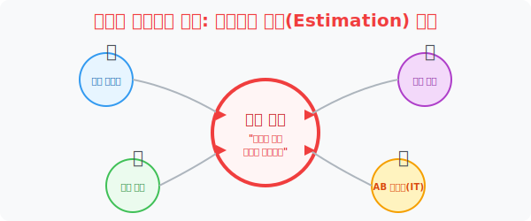
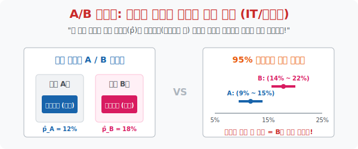

# 7. 세상을 덮어버린 통계: 일상생활, 그리고 미래의 추정 (Estimation) 해킹

## [도입부] 학습 목표 (Learning Objectives)
- 책 속에서 기호로만 구르던 셜록 홈즈 파편 퍼즐(Estimation) 이 현실 대자본의 세계로 튀어나와 넷플릭스의 추천 알고리즘이나 공장의 불량률 관리 시스템에 어떻게 기생하여 돌아가는지 실증적 팩트를 나열합니다.
- 돈 냄새나는 실리콘밸리 기업들이 "우주의 파편 수만 개" 를 모아 모평균(진리)을 추적하지 않고, 그저 몇 백 개의 조약돌(Sample) 만 뽑아 이득을 취하는 극악의 가성비 사냥 기법을 조망합니다.
- 파이썬(Python)의 통계 모듈로 웹사이트 UX/UI 디자인의 클릭률 전환 비율의 오차(A/B Testing) 마저 통계적 추정 확률망 안으로 밀어 넣은 IT 제국의 코딩 시그널을 경험합니다.

---

## 1. 21세기 신전, 자본과 추정의 결합

그동안 배운 추정은 단 하나의 목소리로 소리칩니다. **"전수조사(100% 검사)는 무식한 바보나 하는 죽음의 짓거리다!"**
통계는 우리 삶에 보이지 않게 스며들어 있습니다.

- **[품질 관리 🏭]**: 라면 10만 개를 오늘 찍어냈습니다. 수프가 다 잘 들어갔나 전수조사하려고 라면 10만 개 봉지를 다 뜯어버리면 팔 게 없어 회사가 망합니다! 100개(표본)만 무작위로 뜯어 끓여보고 문제없으면 "추정 마법 투망 밧줄" 이 보증을 서며 나머지 99,900봉지도 무사 출고시킵니다.
- **[A/B 테스트 💻]**: 실리콘밸리 구글에서 "구매 버튼을 빨간색으로 할까 파란색으로 할까?" 논쟁이 붙었습니다. 10억 명의 사용자 전체에 투표를 돌리지 않습니다. 딱 1만 명의 트래픽 조각표본 쪼가리(Sample) 에만 둘로 나눠 노출 시켜서, 전환비율 오차 범위 계산 후 진짜 우주(10억) 의 승리자가 될 버튼 색깔 색상을 하루 만에 팩트 확정해 버립니다.
- **[백신 임상 💉]**: 제약회사가 백신 효과 95% 를 광고합니다. 전 인류에게 주사를 놓고 확인한 게 아닙니다. 임상시험 1,000명 단위의 소규모 밧줄 오차 폭 투망 지표에 들이부어, 수학적으로 안전을 증명한 인가 서류입니다.



<br>

## 2. 인간의 편견을 박살 낸다



IT 제국들이 랜딩 페이지 버튼 색상을 무슨 색으로 바꿀지 결정할 때, 디자이너나 기획자의 '직감' 이나 '시력' 은 5% 도 관여하지 않습니다. 철저하게 통계학이라는 투망 신뢰구간을 맹신하여 돈나무의 위치를 추적할 뿐입니다.

- 파란 버튼 A를 송출한 표본 $n=10,000$ 명 중 500명이 구매 = $\hat{p}_A = 5\%$ 전환
- 노란 버튼 B를 송출한 표본 $n=10,000$ 명 중 600명이 구매 = $\hat{p}_B = 6\%$ 전환

기획자는 "오! B가 전환율이 $1\%p$ 더 높네! 당장 노란색으로 칠해!" 라고 소리칩니다.
하지만 통계팀 리더(Data Analyst) 가 뒷문을 열어젖히며 제지합니다. "대표님, 잠깐만요! 두 버튼의 95% 신뢰구간이 $4.8\% \sim 5.2\%$ vs $5.7\% \sim 6.3\%$ 군요. 다행히 **구간 오버랩(겹침) 이 없으니 통계적으로 유의미한(Significant) 승리가 맞습니다. 런칭 결재 올리시죠!**"
추정 이론이 없었다면 인간은 언제나 뇌피셜(내 뇌 안의 통계망상) 에 사로잡혀 있었을 것입니다.
"내 주변 친구 10명은 다 A 아이돌을 좋아하니까, 전국민 모두 A 팬일 거야!" 라는 바보 같은 판단을 인간은 아무렇지 않게 합니다. 왜냐하면 인간은 무작위 추출(Random Sampling) 조약돌 파편 수집의 정규 분포 공식을 무시한 채 내 맘에 드는 파편만 주워 담고 망 속에 엮었기 때문입니다.

진짜 수학의 추정 시스템은 **'표본의 무작위성(랜덤)'** 과 **'모자란 표본의 크기($n$)를 투망의 오차 길이(루트 마법)로 치환해 인간 불멸의 오만을 벌하는 채찍질'** 을 수식으로 명문 화함으로써 이런 개논리 망상을 박살 낸 인류 역사에 바치는 문구입니다.

---

## 3. 💻 파이썬(Python) IT 제국의 A/B 테스트 추정 엔진 시뮬레이션

우리는 파이썬 `proportions_ztest` 모듈을 발동시켜 구글 사이트 방문자 고작 500명짜리 파편 흔적만으로도 UI의 구매 버튼 색상에 따른 전국민 확장 지지율(수백만 명) 변화치를 적중시키는 초 거대 압축 추정에 탑승합니다.

### 🐍 파이썬 예제: 웹사이트 A/B 테스트 지지율 클릭 추정 스캐너

```python
from statsmodels.stats.proportion import proportions_ztest

print("--- 🛒 쿠팡/넷플릭스 랩: UI 버튼 변경 파편의 거대 추론 A/B 테스트 ---")

# (블라인드 가설 세팅) 구매하기 버튼을 '회색(기존)' 에서 '빨간색(신규)' 으로 바꿨을 때의 클릭률 표본

# 샘플 데이터 (각 500명 통과 조사)
n_users_per_test = 500

# 회색 버튼을 본 500명중 50명 삼 (기존 쪼가리 p̂ = 10%)
grey_clicks = 50  
# 신규 빨간버튼 500명중 75명 삼 (신규 쪼가리 p̂ = 15%)
red_clicks = 75   

print(f"▶ 쪼가리 표본 팩트 체크: 회색 {grey_clicks/n_users_per_test:.1%} VS 빨간색 {red_clicks/n_users_per_test:.1%}")
print(" 🧠 인간의 직관: 오 15% 니까 빨간색 존버 가즈아!")
print("-" * 50)

# 통계학자의 반격: "조각 500명 파편이 우연 뽀록인지, 전체 우주를 대변하는 진리인지 z추정 오차 칼날 검정 돌려!"

# 파이썬 통계 z_test 붕괴 발사:
count_clicks = [red_clicks, grey_clicks]
n_trials = [n_users_per_test, n_users_per_test]

z_stat, p_value = proportions_ztest(count_clicks, n_trials)

print(f" 💣 컴퓨터 Z-스코어 파열 연산기 가동 완료. (p-value 오발률: {p_value:.3f})")

if p_value < 0.05:
    print(" ✅ [수학 제국 승인] 이 5% 차이는 뽀록이 아님이 95% 신뢰구간으로 증명되었습니다.")
    print("    -> 당장 5천만명 모든 유저의 버튼을 빨간색으로 일괄 배포 패치 통과!")
else:
    print(" 🚫 [수학 제국 각하] 아슬아슬합니다. 우연일 뽀록 텍스쳐 확률 폭망.")
    print("    -> 본래 모비율에 타격 못 입힘. 회색 버튼 유지 명령.")

# 결과창:
# --- 🛒 쿠팡/넷플릭스 랩: UI 버튼 변경 파편의 거대 추론 A/B 테스트 ---
# ▶ 쪼가리 표본 팩트 체크: 회색 10.0% VS 빨간색 15.0%
#  🧠 인간의 직관: 오 15% 니까 빨간색 존버 가즈아!
# --------------------------------------------------
#  💣 컴퓨터 Z-스코어 파열 연산기 가동 완료. (p-value 오발률: 0.016)
#  ✅ [수학 제국 승인] 이 5% 차이는 뽀록이 아님이 95% 신뢰구간으로 증명되었습니다.
#     -> 당장 5천만명 모든 유저의 버튼을 빨간색으로 일괄 배포 패치 통과!
```

이 코드는 실리콘밸리가 세상 우주를 장악한 방식 그 자체입니다. 인류 수십억 명을 전부 실험쥐로 전수조사 할 수 없기에, 아주 잘게 압축한 $500$명짜리 미니 실험관 데이터의 진동을 파이썬 오차 한계망($z$-test 변환) 으로 확대투영 시켜 세상을 수리 논리로 패치 조작해 냅니다.

---

## [결론] 학습 정리 (Summary)

1. **지성을 대변하는 최첨단 무기**: 추정(Estimation)은 허세 가득 찬 뇌피셜, 혹은 "내 친구가 어제 말하길" 식의 쓰레기 같은 판단 기준을 잘라내고 가장 차가운 숫자의 칼로 모를 줄 알았던 '미래와 본질' 의 텍스트를 파내려는 인류의 광기 어린 걸작입니다.
2. **랜덤 픽(가성비)** 의 우상화: 전수 조사(100% 탐색)는 거대한 우주를 거스르는 파멸의 단어임을 깨달아야 합니다. 진리를 얻는 가장 값싸고 정밀한 행위는 $n$크기 사이즈를 잘 조작한 난수 표본투망의 힘입니다.
3. **불완전함의 허락($\pm$)**: '모를 수 있는 오차 구역' 을 당당하게 인정하고 수학 등식의 뒷꽁무니(신뢰 구간 상수) 에 붙여놓음으로써 추정학은 도박이 아닌 학문의 전당에 올랐습니다. 불완전을 포용함으로써 가장 완벽하게 미래를 투사합니다.
