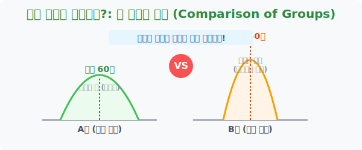

# 1. 진짜 승자는 누구인가?: 두 집단의 비교 (Comparison of Groups)

## [도입부] 학습 목표 (Learning Objectives)
- 데이터 분석의 꽃인 통계학에 발을 들여놓으며, 왜 집단을 묶어서 '그룹 형태' 로 비교해야 하는지 통찰합니다.
- 단순한 평균(Mean)만으로는 데이터 집단의 진짜 속성(퍼짐 정도)을 완벽히 비교할 수 없음을 이해합니다.
- 파이썬(Python)의 기초적인 리스트(List) 통계 계산을 통해 A반과 B반의 수학 성적 분포를 체계적으로 분석해 봅니다.

---

## 1. 숲을 보지 못하면 나무에 깔려 죽는다

우리 반 30명의 수학 성적과 옆 반 30명의 수학 성적 중 어느 반이 공부를 더 잘하는지 승패를 가르려면 어떻게 해야 할까요? 1등끼리 점수를 비교해야 할까요, 꼴찌끼리 비교해야 할까요, 아니면 30명 전체의 점수를 하나하나 칠판에 적어서 1 대 1로 대조해야 할까요?

수십만 명, 수천만 개의 **'빅데이터(Big Data)'**가 쏟아지는 현대 사회에서는 개별 데이터 하나하나를 들여다보는 것은 시간 낭비입니다. 통계학자는 개별 나무를 보는 대신 **'숲의 모양(분포, Distribution)'**을 멀리서 내려다봅니다. 
데이터가 모여 있는 집단(Group)의 덩어리를 통째로 도마 위에 올려두고 두 집단이 우측으로 쏠렸는지, 평평한지, 뾰족한지 거대한 덩어리 대 덩어리의 싸움으로 승패를 분석해 내는 것이 통계학의 근본적인 철학입니다.

<br>

## 2. 평균(Average)이라는 위험한 함정

우리는 집단을 비교할 때 가장 먼저 **"우리 반 평균 몇 점이야?"** 하고 대표되는 점수 하나를 묻습니다. 
하지만 두 반의 평가를 '평균' 하나로만 퉁치면 끔찍한 왜곡이 발생합니다.

- **A반 (평균 60점):** 100점짜리 천재 15명과 20점짜리 수포자 15명이 극단적으로 반씩 섞인 **'양극화'** 된 반
- **B반 (평균 60점):** 30명 전원이 다 같이 59점, 60점, 61점을 사이좋게 맞은 **'균등한'** 반

두 반은 성적 분포가 완전히 딴판이지만, 성적표에 찍히는 평균은 똑같이 $60$점입니다. 만약 교육부 장관이라면 A반에는 상위권/하위권 분반 수업을 처방해야 하고, B반에는 전체 학생 수준을 70점으로 끌어올리는 공통 심화 보충수업을 처방해야 합니다. 이렇게 두 집단의 진짜 모습 묘사를 하기 위해 우리는 앞으로 '대푯값'과 '산포도'라는 무기를 코딩에 실어 발사하게 될 것입니다.



---

## 3. 💻 파이썬(Python)으로 데이터 집단 싸움 붙이기

수만 명의 통계 데이터 집단을 사람의 눈으로 비교하는 건 불가능합니다. 데이터 분석가(Data Analyst)들은 무조건 파이썬 기반의 데이터 분석 패키지를 물려 한 번에 분포를 뽑아냅니다.

### 🐍 파이썬 예제: A반 vs B반 성적 그룹 분석 파이프라인

```python
print("--- 📊 통계청 데이터 분석 스크립트 가동 ---")

# (데이터 셋) A반과 B반의 가상의 11명 수학 성적 리스트
class_A = [10, 15, 20, 25, 30, 60, 90, 95, 100, 100, 100]  # 극단적으로 퍼져있음 (천재 아니면 수포자)
class_B = [55, 56, 57, 58, 59, 60, 61, 62, 63, 64, 65]     # 60점 근처에 옹기종기 모여있음

def get_basic_stats(group_name, scores_list):
    # 1. 집단의 데이터 수 확인 (len)
    total_students = len(scores_list)
    # 2. 총합 (sum)
    total_score = sum(scores_list)
    # 3. 마법의 평균 (총합 / 학생수)
    average = total_score / total_students
    # 4. 일치단결 수준 확인 (최고점과 최저점의 차이)
    gap = max(scores_list) - min(scores_list)

    print(f"[{group_name}반 통계 리포트]")
    print(f" - 응시 인원: {total_students}명")
    print(f" - 산술 평균: {average:.1f}점")
    print(f" - 최고-최저 격차: 무려 {gap}점 차이 벌어짐")
    print("-" * 40)

get_basic_stats("A", class_A)
get_basic_stats("B", class_B)

print("🚨 [결론] 두 반의 평균은 59점으로 완벽히 똑같지만, \n데이터의 속성(벌어진 격차)은 완전히 다른 별개의 집단입니다!")

# 결과창:
# --- 📊 통계청 데이터 분석 스크립트 가동 ---
# [A반 통계 리포트]
#  - 응시 인원: 11명
#  - 산술 평균: 58.6점
#  - 최고-최저 격차: 무려 90점 차이 벌어짐
# ----------------------------------------
# [B반 통계 리포트]
#  - 응시 인원: 11명
#  - 산술 평균: 60.0점
#  - 최고-최저 격차: 무려 10점 차이 벌어짐
# ----------------------------------------
# 🚨 [결론] 두 반의 평균은 59점(어림잡아)으로 완벽히 똑같지만, 
# 데이터의 속성(벌어진 격차)은 완전히 다른 별개의 집단입니다!
```

이 코드는 실무에서 아마존 평점 $3.0$짜리 물건(모두가 보통이라고 평가한 제품)과, 다른 평점 $3.0$짜리 물건(별 다섯 개 아니면 별 한 개로 극명하게 호불호가 갈린 제품)을 분리해 내는 가장 기초적인 **군집 필터링(Clustering)** 엔진의 원형입니다.

---

## [결론] 학습 정리 (Summary)

1. **빅데이터의 철학**: 데이터가 폭포수처럼 쏟아질 때 하나하나를 비교하지 않고, 집단(Group)이라는 거대한 덩어리로 압축시킨 후 전체 숲의 굴곡을 비교하는 것이 통계입니다.
2. **동일 평균, 다른 민낯**: A그룹과 B그룹의 계산된 지표(평균)가 완벽하게 동일하더라도, 그 내부를 구성하는 점수들의 흩어짐(편차)은 완전히 정반대일 수 있습니다.
3. **코딩의 필연성**: 이 착시현상을 사람 눈으로 찾아내는 건 자살행위이므로 파이썬 코드 리스트를 이용한 최고/최저 점수 격차 등 입체적인 수치 함수를 통해 집단 싸움의 진짜 승자를 판별합니다.
