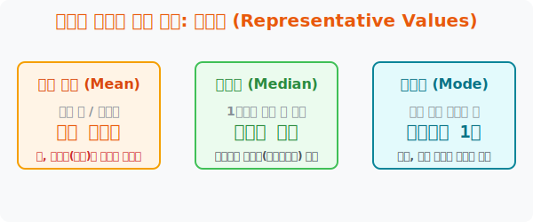

# 2. 집단의 멱살을 잡는 세 명의 대장: 대푯값 (Representative Values)

## [도입부] 학습 목표 (Learning Objectives)
- 수만 개의 잡다한 데이터 덩어리들을 단 '반장 한 명'의 숫자로 시크하게 압축해 버리는 **'대푯값(Representative Value)'**의 세 가지 무기를 배웁니다.
- 우리가 흔히 쓰는 **평균(Mean)**이 왜 빌게이츠가 동네에 이사 오면 마을 평균 소득이 100억이 되는 '왜곡'을 낳는지 깨닫습니다.
- 파이썬(Python) 내장 라이브러리를 통해 이상치를 방어하는 **중앙값(Median)**과 인기투표 **최빈값(Mode)**을 구하는 알고리즘을 터득합니다.

---

## 1. 수백만 데이터를 1개로 찍어 누르는 압축 엔진

친구에게 "너네 반 수학 성적 어때?" 라고 물었는데, 친구가 수첩을 꺼내더니 "응, 1번은 50점이고 2번은 45점, 3번은..." 하고 30명의 점수를 모조리 읊는다면 답답해서 화가 날 것입니다.
인간의 뇌는 복잡한 숫자를 싫어합니다. 그래서 우리는 집단 전체의 성격(점수대)을 가장 잘 대변해 주는 단 1개의 '짱(대장)' 숫자를 골라서 브리핑합니다. 통계학에서는 이 대장 숫자를 **대푯값(Representative Value)**이라고 부릅니다. 보통 세 명의 대장이 상황에 맞게 출격합니다.

1. **산술 평균 (Mean):** 모조리 다 합쳐서 사람 수(n)로 나누는 가장 대중적인 계산법.
2. **중앙값 (Median):** 1등부터 꼴찌까지 한 줄로 쭉 세운 다음, 정확히 "정중앙" 에 서 있는 녀석의 점수.
3. **최빈값 (Mode):** 가장 흔하게 다수가 받은(제일 많이 출제된) 인기투표 넘버 1 점수.

<br>

## 2. 평범한 시민 마을에 '빌게이츠'가 이사 오다

대푯값으로 그냥 1번 '평균'만 쓰면 제일 편할 텐데, 왜 굳이 중앙값과 최빈값이 필요할까요? **평균의 악랄한 치명타(함정)** 때문입니다.

어느 평범한 시골 마을 9명의 한 달 월급이 모두 $300$만 원입니다. 현재 이 마을의 대푯값(평균)은 $300$만 원입니다. 
그런데 우연히 옆집에 세계갑부 빌게이츠($10$번째 주민)가 이사 와서 전입신고를 했습니다. (빌게이츠 월급: $100$억).
갑자기 이 마을의 '산술 평균'을 계산하면 동네 사람들의 평균 월급이 **약 수익 10억 원**으로 폭등합니다. 
분명 9명은 서민인데 서류상으로는 모두가 재벌 동네로 둔갑해 버린 것입니다. 이걸 통계학에서 **이상치(Outlier, 극단값)** 에 의한 데이터 오염이라고 부릅니다.

이럴 때 2번 대장 **'중앙값(Median)'**을 등판시킵니다. 1등 빌게이츠부터 10등 촌장님까지 한 줄로 세운 다음, 정중앙에 있는 5등, 6등 아저씨의 월급을 대충 대푯값으로 쓰는 것입니다. 중앙값은 여전히 $300$만 원 근처를 가리키게 되어 외계인 같은 빌게이츠의 장난질을 강력하게 방어해 냅니다.



---

## 3. 💻 파이썬(Python)의 대푯값 산출 AI

프로그래머들이 넷플릭스 영화 평점 알고리즘이나 쇼핑몰 리뷰를 설계할 때, 진상 고객 1명이 평점을 $1$점으로 테러하고 가더라도 영화의 전체 평점이 곤두박질치지 않도록 평균 대신 중앙값 패키지를 장착시킵니다.

### 🐍 파이썬 예제: 빌게이츠 출현에 대응하는 통계청 방어 코딩

```python
import statistics # 파이썬에 기본 내장된 통계학 계산기 모듈

print("--- 💰 통계청 이상치(Outlier) 방지 알고리즘 ---")

# (데이터 셋) 평범한 서민 9명과 재벌 빌게이츠 1명의 월급 리스트 (단위: 만원)
# 300만원씩 버는 서민 9명 
salaries = [300, 310, 290, 300, 305, 295, 300, 310, 290]
# + 갑자기 불청객 외계인 부자 빌게이츠(100억원 = 1,000,000 만원) 편입!
salaries.append(1000000)

print(f"주민 10명의 실제 월급 나열: {salaries}")
print("-" * 50)

# 1. 속아 넘어가는 멍청한 분석 (단순 산술 평균)
fake_mean = statistics.mean(salaries)
print(f"❌ 단순 평균 대푯값 (Mean): 이 마을의 평균 월급은 {int(fake_mean):,} 만원입니다. (모두가 재벌이네?)")

# 2. 통계학자의 단단한 방어막 (중앙값)
real_median = statistics.median(salaries)
print(f"✅ 서열 중앙 대푯값 (Median): 나래비 세웠을 때 정중앙 월급은 {int(real_median):,} 만원입니다. (정상화!)")

# 3. 추가로 신발 사이즈, 옷 사이즈 등 주문에 쓰는 최빈값
popular_mode = statistics.mode(salaries)
print(f"👟 최고 인기(다수결) 월급 대푯값 (Mode): {int(popular_mode):,} 만원")

# 결과창:
# --- 💰 통계청 이상치(Outlier) 방지 알고리즘 ---
# 주민 10명의 실제 월급 나열: [300, 310, 290, 300, 305, 295, 300, 310, 290, 1000000]
# --------------------------------------------------
# ❌ 단순 평균 대푯값 (Mean): 이 마을의 평균 월급은 100,270 만원입니다. (모두가 재벌이네?)
# ✅ 서열 중앙 대푯값 (Median): 나래비 세웠을 때 정중앙 월급은 300 만원입니다. (정상화!)
# 👟 최고 인기(다수결) 월급 대푯값 (Mode): 300 만원
```

코딩된 결과를 보면 단순 '평균(mean)' 함수를 맹신하다가는 프로그램이 통비례로 치명적인 버그를 일으킬 수 있음을 뼈저리게 느낄 수 있습니다. 대한민국 통계청 역시 전 국민 가구 소득을 발표할 때 항상 '평균' 함정을 경계하며 '중위 소득(중앙값)' 수치를 병행 보도하는 원리가 바로 이것입니다.

---

## [결론] 학습 정리 (Summary)

1. **대푯값(Representative Value)**: 셀 수 없이 방대하게 펼쳐진 무작위 데이터 집단을 단숨에 제압하여, 전체 모양새를 깔끔하게 설명하는 '한 명의 반장 숫자' 입니다.
2. **평균의 치명적 오류**: 전체를 $1/n$ 로 나누는 **평균(Mean)** 은 가장 직관적이지만, 집단 내에 미친 듯이 크거나 작은 외계인 수치(**이상치, Outlier**)가 하나라도 있으면 전체 체계가 심각하게 오염됩니다.
3. **방패막이 중앙값(Median)**: 점수의 높낮이를 무시하고 오로지 1등부터 줄을 세운 뒤 "가운데 등수" 의 점수를 채택하므로, 빌게이츠가 오든 스티브 잡스가 오든 극단값의 테러를 완벽하게 튕겨내는 가장 안전한 파이썬 필터링 함수입니다.
