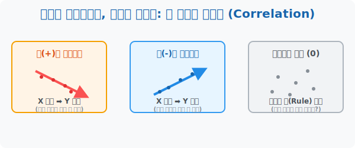

# 4. 여름엔 아이스크림, 겨울엔 붕어빵: 두 변수의 관계성 (Correlation)

## [도입부] 학습 목표 (Learning Objectives)
- 혼자 노는 1차원 데이터 집단($X$)을 넘어서, 다른 데이터 집단($Y$)에게 어떤 영향을 끼치는지 파악하는 **상관관계(Correlation)** 매트릭스를 탐험합니다.
- 기온이 오를수록 에어컨이 잘 팔리는 정비례(+) 쌍둥이와, 기온이 오를수록 난로가 안 팔리는 반비례(-) 엇박자 속성을 구별해 냅니다.
- 파이썬(Python) 반복문을 엮어 두 리스트가 과연 "서로 눈이 맞은 사이"인지 "생판 남" 인지 추적해 내는 빅데이터 필터링의 심장을 이식합니다.

---

## 1. 나 혼자가 아니야, 두 녀석의 댄스파티

1단원~3단원까지는 오직 한 집단(수학 성적)의 대푯값, 평균, 표준편차만 죽어라 팠습니다. 
하지만 현실 세상에서 "키가 큰 학생($X$)"은 "몸무게($Y$)"도 많이 나갈 확률이 높고, 
"여름 기온($X$)"이 수직 상승하면 "아이스크림 매출액($Y$)"도 덩달아 폭등합니다.

이렇게 어떤 원인 데이터 묶음($X$)이 춤을 출 때마다, 결과 데이터 묶음($Y$)이 멱살을 잡힌 채 같이 춤을 추는 소름 돋는 연결고리 스킬을 우리는 **상관관계(Correlation)** 라고 부릅니다. 현대 빅데이터 마케팅(Big Data Marketing)은 고객의 행동 데이터 2개를 엮어 팔아먹는 이 상관관계 장사라고 해도 과언이 아닙니다.

<br>

## 2. 양(+)의 절친과 음(-)의 앙숙

상관관계에는 세 가지 종류의 부족이 있습니다.

1. **양(+)의 상관관계 (의리파 절친)**
   - "네가 가면 나도 간다!" 둘 다 손잡고 위로 올라가는 우상향($\nearrow$) 그래프입니다.
   - 예) 게임 접속 시간이 길수록($X\uparrow$), 게임머니 보유량 증가($Y\uparrow$)

2. **음(-)의 상관관계 (청개구리 앙숙)**
   - "네가 오르면 나는 죽는다!" 한놈이 높아지면 우하향($\searrow$)으로 곤두박질치는 그래프입니다.
   - 예) 오늘 내리는 비의 양이 폭증할수록($X\uparrow$), 야구장 관중 수 감소($Y\downarrow$)

3. **상관관계 없음 (0, 아무 사이도 아님)**
   - "네가 오르든 말든 나는 마이웨이!" 점들이 둥둥 떠다니며 아무 룰도 짓지 않습니다.
   - 예) 학생들의 키($X$)와, 어벤져스를 좋아하는 선호도($Y$). 아무 관계가 없죠!



---

## 3. 💻 파이썬(Python) 빅데이터 마케팅 추천 알고리즘 

쇼핑몰에서 "이 상품을 본 고객이 함께 장바구니에 담은 상품" 을 추천해 줄 때 파이썬은 무거운 머신러닝을 돌리기 전, 1차적으로 가장 기본적인 상관관계 필터 봇을 쏘아 보냅니다. 

### 🐍 파이썬 예제: 쇼핑몰 매출액 상관관계 추론 필터

```python
print("--- 🛒 쿠팡 아마존 빅데이터 상관관계 봇 ---")

# (가상 데이터) 5일간의 요일별 데이터 관측치
temp_X = [28, 30, 32, 35, 38]       # 기온 계속 오름 (무더위 폭발)
sales_Icecream = [50, 60, 80, 100, 150]    # 아이스크림 매출 (오름!)
sales_Heater   = [30, 20, 10, 5, 0]        # 전기난로 매출 (죽어감!)

print("1. [기온] vs [아이스크림] 의 움직임 스캔")
pos_count = 0 
# 두 리스트를 비교하며 함께 올라가는지(정방향) 파이썬 For 루프로 체크
for i in range(1, 4):
    if temp_X[i] > temp_X[i-1] and sales_Icecream[i] > sales_Icecream[i-1]:
        pos_count += 1

if pos_count == 3:
    print(" ☞ 💥 [분석결과] 둘 다 손잡고 폭등하는 양(+)의 상관관계가 의심됩니다!")
    print(" ☞ [마케팅 전략] 기온이 30도 넘을 시 앱 홈화면에 아이스크림 배너 노출!")

print("\n2. [기온] vs [전기난로] 의 움직임 스캔")
neg_count = 0
for i in range(1, 4):
    # 온도는 오르는데 난로 매출은 뚝뚝 떨어지는지 체크
    if temp_X[i] > temp_X[i-1] and sales_Heater[i] < sales_Heater[i-1]:
        neg_count += 1

if neg_count == 3:
    print(" ☞ 🧊 [분석결과] 한 놈이 오르면 한 놈은 죽는 음(-)의 상관관계가 의심됩니다!")
    print(" ☞ [마케팅 전략] 기온 폭염 경보 시 전기난로 상품을 추천 리스트에서 모조리 삭제!")

# 결과창:
# --- 🛒 쿠팡 아마존 빅데이터 상관관계 봇 ---
# 1. [기온] vs [아이스크림] 의 움직임 스캔
#  ☞ 💥 [분석결과] 둘 다 손잡고 폭등하는 양(+)의 상관관계가 의심됩니다!
#  ☞ [마케팅 전략] 기온이 30도 넘을 시 앱 홈화면에 아이스크림 배너 노출!
# 
# 2. [기온] vs [전기난로] 의 움직임 스캔
#  ☞ 🧊 [분석결과] 한 놈이 오르면 한 놈은 죽는 음(-)의 상관관계가 의심됩니다!
#  ☞ [마케팅 전략] 기온 폭염 경보 시 전기난로 상품을 추천 리스트에서 모조리 삭제!
```

온라인 쇼핑몰, 넷플릭스 영화 추천, 심지어 틱톡의 숏폼 릴레이 추천 알고리즘의 최하단 근원지(Root)는 이렇게 $X, Y$ 좌표의 싱크로율(상관관계)을 매칭 시키는 `1 0 판단문`에서부터 출발합니다.

---

## [결론] 학습 정리 (Summary)

1. **상관관계 (Correlation)**: 독립적으로 따로 노는 두 얼굴의 데이터 집단 $X$, $Y$ 를 한 방에 몰아넣었을 때, 서로 짜고 치듯 유사한 패턴(오름, 내림)을 보여주는 현상을 뜻합니다.
2. **양성(+)과 음성(-)**: 한 놈이 오를 때 같이 오르면 플러스 양의 상관관계(우상향 직선), 한 놈이 오를 때 삐져서 떨어지면 마이너스 음의 상관관계(우하향 직선) 로 점이 흩뿌려집니다.
3. **AI 추천 알고리즘의 심장**: 인공지능이 "기저귀를 사는 사람은 맥주도 사갈 확률이 빡세게 높다(+)" 라는 월마트의 전설적인 기적을 찾아냈듯, 파이썬 기반 데이터 파이프라인의 핵심은 두 변수 간의 숨겨진 상관관계를 크롤링해 도출하는 데 있습니다.
