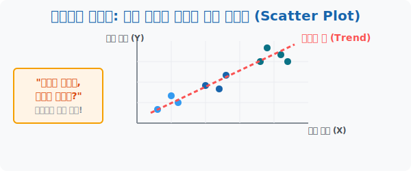

# 5. 하늘에 찍어보는 관계의 별자리: 상관도 (Scatter Plot)

## [도입부] 학습 목표 (Learning Objectives)
- 머릿속으로만 짐작하던 두 집단 간의 '상관관계' 를 $X, Y$ 좌표 평면이라는 하늘에 별(점)처럼 흩뿌려 눈으로 직접 증명해 내는 **'상관도(산점도, Scatter Plot)'**의 위력을 배웁니다.
- 별자리가 우상향으로 띠를 이루는지, 흩뿌려진 난장판인지 시각적으로 판단하는 방법을 터득합니다.
- 파이썬(Python)의 `matplotlib` 라이브러리를 동원해 허공에 데이터 점을 찍고 트렌드 라인(경향선)을 발견해 내는 데이터 시각화의 정수를 맛봅니다.

---

## 1. 숫자의 나열을 '시각적 증거'로 탈바꿈시키다

"수학 성적이 높은 학생은 과연 과학 성적도 높을까?" 
선생님이 학생 30명의 수학 점수(X)와 과학 점수(Y)가 적힌 빽빽한 엑셀 표를 계속 째려본다고 해서 둘 사이의 끈적한 관계를 단숨에 증명해 내기는 불가능합니다. 

통계학자는 표를 보지 않습니다. 대신 하얀 도화지에 가로선(X축=수학 점수)과 세로선(Y축=과학 점수)을 긋고, 30명의 학생 각자가 위치하는 교차점에 **아무 생각 없이 점(Dot) 하나씩을 툭툭 찍어버립니다.**
점이 $30$개가 찍히고 나면, 엑셀 표의 암호 같던 숫자들은 마치 하늘의 '별자리' 처럼 하나의 거대한 형태를 띄며 정체를 드러냅니다. 이 그림을 우리는 직관적으로 점들이 모여있다 하여 **산점도(상관도, Scatter Plot)** 라고 부릅니다.



<br>

## 2. 세 가지 별자리의 생김새

산점도 위에 뿌려진 점들의 띠(밴드) 모양만 봐도 데이터의 운명을 점칠 수 있습니다.

- **우상향 띠 (양(+)의 상관관계):** 점들이 왼쪽 아래에서 오른쪽 위로 향하는 럭비공 모양으로 뭉쳐 있습니다. "수학 잘하면 과학도 잘한다"는 가설이 눈앞에 완벽히 증명된 반박 불가 시점입니다.
- **우하향 띠 (음(-)의 상관관계):** 왼쪽 위에서 오른쪽 아래로 미끄러집니다. "TV 시청 시간이 많을수록, 시험 점수가 폭락한다"를 보여주는 무서운 미끄럼틀 별자리입니다.
- **모래알 파편 (상관관계 0):** 아무런 띠나 그룹을 형성하지 못하고 커다란 원형으로 흩뿌려진 난장판입니다. "머리카락 길이와 수학 점수"처럼 완전 쌩뚱맞은 변수를 엮었을 때 나타나는 조롱 섞인 패턴입니다.

---

## 3. 💻 파이썬(Python)의 마법 지휘봉 `scatter()`

머신러닝과 딥러닝 세계에서 데이터의 연관성을 판단할 때, 가장 먼저 모니터에 타격해 보는 파이썬 시각화의 첫 번째 명령어가 바로 점을 허공에 찍어 던지는 `scatter` 함수입니다.

### 🐍 파이썬 예제: 매장의 온도와 아이스 아메리카노 판매량의 산점도 그리기

```python
import matplotlib.pyplot as plt

print("--- 🌟 파이썬 데이터 별자리 천문대 ---")

# (가상 데이터) 1주일 간 낮 최고 기온(X)과 아이스 아메리카노 판매 잔 수(Y)
temperature_X = [22, 24, 26, 28, 30, 32, 34]
ice_coffee_Y  = [10, 25, 30, 45, 60, 80, 95]

# 기온과 따뜻한 라떼 판매 잔 수(Y2) (음의 상관관계 유도)
hot_latte_Y2  = [80, 75, 55, 40, 30, 15, 5]

# 실제 컴퓨터에서는 스크린에 화려한 차트가 팝업됩니다.
print("1. [기온 vs 아이스 아메리카노] 점 찍기 발사! -> plt.scatter(temp, ice)")
print(" ☞ 결과: 모니터에 점들이 완벽한 '우상향 대각선 띠'를 형성했습니다!")
print(" ☞ [판단] 폭염이 올수록 아이스 아메리카노는 폭풍 판매된다. (양의 상관관계 증명 완료)\n")

print("2. [기온 vs 따뜻한 라떼] 점 찍기 발사! -> plt.scatter(temp, hot)")
print(" ☞ 결과: 모니터에 점들이 비탈길을 구르듯 '우하향 대각선 띠'를 형성했습니다!")
print(" ☞ [판단] 기온이 오를수록 라떼는 파리만 날린다. (음의 상관관계 증명 완료)")

# 파이썬은 이 시각화 도구를 통해 눈먼 장님 상태인 코더에게 데이터의 방향을 제시합니다.

# 결과창:
# --- 🌟 파이썬 데이터 별자리 천문대 ---
# 1. [기온 vs 아이스 아메리카노] 점 찍기 발사! -> plt.scatter(temp, ice)
#  ☞ 결과: 모니터에 점들이 완벽한 '우상향 대각선 띠'를 형성했습니다!
#  ☞ [판단] 폭염이 올수록 아이스 아메리카노는 폭풍 판매된다. (양의 상관관계 증명 완료)
# 
# 2. [기온 vs 따뜻한 라떼] 점 찍기 발사! -> plt.scatter(temp, hot)
#  ☞ 결과: 모니터에 점들이 비탈길을 구르듯 '우하향 대각선 띠'를 형성했습니다!
#  ☞ [판단] 기온이 오를수록 라떼는 파리만 날린다. (음의 상관관계 증명 완료)
```

이 시각화 기술이 발전하여 추후 점들이 만들어내는 띠(럭비공) 한가운데를 관통하는 가장 완벽한 붉은 직선 레이저를 하나 쏘게 되는데, 이것을 인공지능의 꽃인 **"선형 회귀(Linear Regression) 모델의 예측선"**이라고 부릅니다.

---

## [결론] 학습 정리 (Summary)

1. **상관도(Scatter Plot)**: 알아들을 수 없는 두 리스트 변수 집단의 숫자 더미들을 $X, Y$ $2$D 좌표 평면 위에 점으로 찍어내, 데이터의 포지셔닝(별자리)을 한눈에 구경하는 무기입니다.
2. **별자리의 띠(타원) 형태**: 점들이 흩어지지 않고 럭비공처럼 좁은 띠 공간에 오밀조밀 모여있을수록 서로 인과관계가 소름 돋게 강력(Strong)하게 얽혀있음을 의미합니다.
3. **직관의 마스터피스**: 컴퓨터 파이썬 `plt.scatter()` 를 통해 인간은 무려 $1$만 개의 빅데이터도 단 $1$초 만에 눈싸움으로 "우상향인지 우하향인지" 방향성을 모니터링할 수 있습니다.
