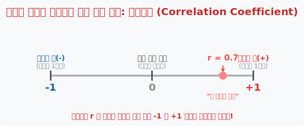

# 6. 애매모호한 그림에 도장을 찍다: 상관계수 (Correlation Coefficient)

## [도입부] 학습 목표 (Learning Objectives)
- '산점도'라는 그림의 "대충 이런 느낌적인 느낌이네" 식 비과학적 평가를 넘어서, 둘 사이의 끈적함을 $-1$부터 $+1$까지의 절대 수치 도장으로 콱 박아버리는 **상관계수(r)**의 공학적 매력을 체감합니다.
- 왜 이 상관계수의 절댓값이 $1$에 가까워질수록 점들이 빈틈없는 대각선 $1$직선으로 늘어서는지, 그 치밀한 배열 메커니즘을 학습합니다.
- 복잡한 분수로 점철된 통계 공식을 무시하고, 파이썬(Python)의 마법 명령어 하나로 두 데이터 간의 운명 지수(r값)를 타격하여 팩트를 체크하는 방법을 알아냅니다.

---

## 1. 뼈 때리는 팩트 체커: 네 감정을 숫자로 말해봐

이전 장에서 허공에 점을 찍어본 결과, 럭비공처럼 띠가 구불구불 우상향하고 있다면 우리는 "저 둘은 양(+)의 성질로 친해 보여"라고 느낌적으로 말했습니다.
하지만 논문을 쓰거나 회장이 주주총회에 결산 보고를 할 때 "작년에 우리 마케팅 캠페인이 효과가 꽤(~) 좋아 보입니다" 따위의 두루뭉술한 보고를 하면 바로 해고당할 것입니다. 

수학자 칼 피어슨(Karl Pearson)은 이 **"친해 보이는 정도"를 정확하게 소수점 단위의 숫자 한 줄로 압축해 내는 천재적인 공식**을 남겼습니다. 우리는 이 팩트 폭격 숫자를 **상관계수(Correlation Coefficient, 알파벳 소문자 $r$)** 라고 부릅니다. 



<br>

## 2. -1과 +1이라는 뚫리지 않는 절댓값 감옥

상관계수 $r$ 의 가장 소름 돋는 특징은 아무리 우주 스케일의 빅데이터를 때려 부어도 값자기 **무조건 $-1.0$에서 $+1.0$ 사이의 범위율에 영원히 갇힌다**는 점입니다.

- **$r = +1.0$ :** 한 치의 오차도 없이 우상향 대각선 일직선으로 점들이 줄지어 선 상태. (아인슈타인도 놀랄 완벽한 정비례 쌍둥이 파트너)
- **$r = -1.0$ :** 완벽한 일직선의 우하향 대각선 침몰 상태. (한쪽이 오르면 다른 쪽은 100% 확률로 박살 나는 영혼의 앙숙)
- **$r \approx 0.7$ 근처:** 꽤 통계적으로 의미 있게 같이 움직이는 끈끈한 양의 상관관계 (마케터들이 소리 지르는 마의 장벽)
- **$r = 0.0$ :** 아무 사이도 아닌 철저한 남. 흩뿌려진 난장판.

이렇게 단 두 자리 정수 세팅으로 복잡한 데이터 별자리들의 궁합을 즉각 판별하는 것이 통계 데이터 스캐닝의 궁제 엔진입니다.

---

## 3. 💻 파이썬(Python)으로 궁합 점수(r) 뽑아내기

인공지능이나 구글의 검색 추천 엔진 내부에서는 수천만 명의 유저 클릭 데이터와 수백만 개의 상품 데이터 간의 `상관계수(r)` 를 쉬지 않고 돌리며 짝짓기 파트너를 점지해 주고 있습니다.

### 🐍 파이썬 예제: 영혼의 파트너 매칭을 위한 `corrcoef` 판독기

```python
import numpy as np # 숫자를 씹어먹는 파이썬 넘파이(Numpy) 요리사 로드

print("--- 💔 피어슨의 운명 수치(r) 짝짓기 측정소 ---")

# (데이터 셋 1) 수학과 과학의 친밀도 
math_scores = [30, 45, 60, 80, 95]
science_scores = [35, 50, 65, 82, 90] # 숫자가 매우 비슷하게 따라 움직임

# (데이터 셋 2) 게임 접속시간과 불운한 시험점수
game_hours = [1, 2, 4, 6, 8]
exam_scores = [90, 85, 60, 40, 15] # 쥐약 먹은 듯 엇박자로 뚝뚝 떨어짐

# 1. 넘파이 빔 발사 (corrcoef: 상관계수 도출 함수)
# 다소 복잡한 행렬이 나오지만 0행 1열 위치의 값이 바로 우리가 찾는 r 값!
r_math_sci = np.corrcoef(math_scores, science_scores)[0, 1]
r_game_exam = np.corrcoef(game_hours, exam_scores)[0, 1]

print(f"1. [수학 vs 과학] 상관계수 r = {r_math_sci:.3f}")
if r_math_sci > 0.8:
    print(" ☞ [분석] 우상향 일직선에 가까운, 소름돋게 강력한 양(+)의 베프 짝꿍입니다.")

print(f"\n2. [게임시간 vs 시험점수] 상관계수 r = {r_game_exam:.3f}")
if r_game_exam < -0.8:
    print(" ☞ [분석] r이 거의 -1 에 육박! 네가 살면 내가 죽는 소름돋는 음(-)의 앙숙입니다.")

# 결과창:
# --- 💔 피어슨의 운명 수치(r) 짝짓기 측정소 ---
# 1. [수학 vs 과학] 상관계수 r = 0.993
#  ☞ [분석] 우상향 일직선에 가까운, 소름돋게 강력한 양(+)의 베프 짝꿍입니다.
# 
# 2. [게임시간 vs 시험점수] 상관계수 r = -0.990
#  ☞ [분석] r이 거의 -1 에 육박! 네가 살면 내가 죽는 소름돋는 음(-)의 앙숙입니다.
```

데이터 사이언스와 파이썬 실무에서 복잡하고 눈 돌아가는 수명 수식 공식은 몰라도 됩니다. $np.corrcoef()$ 와 같은 막강한 단축 마법 코드 한 줄이면, 두 세력이 얼마나 진득하게 얽혀있는지 그 운명의 족쇄 크기(r 값)를 1초 만에 디지털 모니터 위로 끄집어낼 수 있으니까요!

---

## [결론] 학습 정리 (Summary)

1. **상관계수 (Correlation Coefficient, r)**: 산포도에 흩날려 있던 구름 같은 점들의 애매모호함을 버리고, 객관적인 짝꿍 게이지 퍼센티지의 역할을 하는 "진퉁 소수점 한방 숫자"입니다.
2. **벗어날 수 없는 굴레**: 수식에 의해 $r$값은 절대로 $-1$에서 $+1$이라는 양극단 감옥을 벗어날 수 없으며, 양 끝 극단값 쪽으로 도달할수록 점들은 두께가 얇은 대각선 송곳 일직선으로 좁혀집니다.
3. **가설의 팩트 체크**: 어떤 가짜 뉴스가 "A를 먹으면 탈모가 방지된다"라고 아무리 떠들어도, 파이썬 넘파이 패키지로 A섭취량과 머리숱의 상관계수 $r$을 돌려서 $0$ 근처가 나오면 그것은 완벽한 사기로 입증되는 것이 현대 정보사회의 필터 법입니다.
