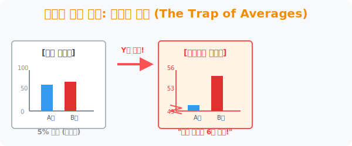

# 8. 숫자에 속지 마라 2: 평균의 함정과 사기 그래프 (The Trap of Averages)

## [도입부] 학습 목표 (Learning Objectives)
- 방송국이나 마케팅 전단지에서 데이터 시각화라는 명장포 아래 대중의 눈을 속이는 'Y축 스케일 장난질' 수법을 적발합니다.
- 심슨의 역설(Simpson's Paradox)을 통해, 전체 평균이 아무리 높아도 그 내부를 나이별/성별로 쪼개보면 정반대의 통계가 나오는 통계학의 공포를 체험합니다.
- 파이썬(Python)으로 사기 그래프와 정직한 그래프를 어떻게 `plt.ylim` 범위를 조작하여 생성하는지 해킹(?) 실습을 진행합니다.

---

## 1. Y축을 싹둑 자르는 마법의 가위 장난

"우리 회사 약효 성분은 경쟁사 대비 압도적으로 높습니다!"
TV 광고에 등장하는 막대그래프를 보면 A회사 막대는 개미 똥구멍만 하고 B회사 약품 막대는 남산타워처럼 우뚝 솟아있습니다. 그런데 눈을 가늘게 뜨고 세로축(Y축) 숫자를 가만히 세어봅니다.

- B회사 효능: $55.0$%
- A회사 효능: $50.0$%
- 차이는 고작 $5$ 퍼센트 포인트입니다!

어떻게 이런 일이 일어났을까요? 사기꾼들은 세로축이 $0$부터 시작하는 정상적인 그래프 대신, $0$부터 $49$까지의 밑둥을 가위로 싹둑 잘라버리고 **Y축이 $49$부터 시작하도록 (Y축 시작점 조작)** 그려 넣습니다. 
그러면 $50$짜리 막대는 $49$ 기준선에서 고작 $1$칸 위로 그려지고, $55$짜리 막대는 무려 $6$칸 위로 치솟아 눈으로 볼 때 무려 $6$배 격차가 나는 것처럼 엄청난 시각적 착시와 왜곡을 완성하는 것입니다. 



<br>

## 2. 전체 통계 vs 세부 통계: 심슨의 역설

어느 거대 로스쿨 두 곳의 변호사 합격률 통계입니다.
- **A대학 전체 합격률:** $80$%
- **B대학 전체 합격률:** $70$%
당연히 뉴스에서는 A대학이 명문이라고 대서특필합니다. 

그런데 통계 검시관이 안으로 들어가 '문과출신'과 '이과출신'으로 데이터를 쪼개어 속살을 들여다봅니다.
- [문과출신] A대학 합격률(82%) **< B대학 합격률(90%)**
- [이과출신] A대학 합격률(10%) **< B대학 합격률(20%)**
충격적이게도 문과출신이든 이과출신이든 **모든 분야에서 B대학의 합격률이 압도적으로 높았습니다.** 

어떻게 이런 미친 모순이 계산될까요? 이것이 바로 가중치가 어그러져 발생하는 **'심슨의 역설(Simpson's Paradox)'** 입니다. 그냥 덩어리를 뭉쳐놓은 '전체 평균' 값 하나만 맹신하고 섣불리 무덤으로 뛰어들지 말라는 무서운 경고입니다.

---

## 3. 💻 파이썬(Python)의 사기 그래프 렌더링 실습

악덕 데이터 과학자들은 파이썬의 `matplotlib` Y축 조작 함수 단 한 줄( `plt.ylim()` )을 이용하여 사활을 건 회사 피칭 프레젠테이션의 착시 그래프를 찍어냅니다.

### 🐍 파이썬 예제: Y축 자르기를 통한 실적 뻥튀기 해킹

```python
import matplotlib.pyplot as plt

print("--- 📉 블랙해커의 차트 왜곡 스튜디오 ---")

companies = ['A_Competitor', 'B_OurCompany']
performance = [50, 55]  # 실적 차이는 겨우 5 (미미함)

# 파이썬은 정직하게 0부터 60까지 Y축을 그립니다.
# plt.bar(companies, performance)
print("1. [정상 그래프 렌더링]")
print(" ☞ Y축이 0부터 시작하므로 두 회사의 막대기 크기가 고작 10% 차이나 보입니다.")

# 🚨 블랙코더의 사기 스킬 발동! (Y축 리미트 조작)
# plt.ylim(49, 56)  <-- Y축 밑둥인 0~49 구간을 투명 망토로 지워버림!
print("2. [사기 그래프 렌더링: YLim(49, 56) 가동]")
print(" ☞ A회사의 기준 바닥이 49가 되어 막대기가 1mm 가 됩니다.")
print(" ☞ B회사의 막대기는 하늘로 치솟으며 무려 6배 차이나는 기적의 홍보물 완성!")

# 결과창:
# --- 📉 블랙해커의 차트 왜곡 스튜디오 ---
# 1. [정상 그래프 렌더링]
#  ☞ Y축이 0부터 시작하므로 두 회사의 막대기 크기가 고작 10% 차이나 보입니다.
# 2. [사기 그래프 렌더링: YLim(49, 56) 가동]
#  ☞ A회사의 기준 바닥이 49가 되어 막대기가 1mm 가 됩니다.
#  ☞ B회사의 막대기는 하늘로 치솟으며 무려 6배 차이나는 기적의 홍보물 완성!
```

이처럼 모니터에 출력되는 삐까뻔쩍한 3D 데이터 시각화 차트는 사실 파이썬 프로그래머가 마음만 먹으면 좌표축(`lim`)을 엿가락처럼 늘리고 줄여 군중의 시선을 완벽히 통제할 수 있는 디지털 마술이라는 것을 명심해야 합니다.

---

## [결론] 학습 정리 (Summary)

1. **Y축 절단 트릭**: 막대그래프나 선그래프의 시각적 경사를 극한으로 가파르게 보이도록 만들기 위해, 0점을 날려버리고 비교 데이터 구간만 현미경 줌인(Zoom-in)하는 언론의 교묘한 통계 왜곡술입니다.
2. **심슨의 역설**: 집단 전체를 싸잡아 합산한 '거대 평균(전체 생존율 등)' 통계가, 집단을 항목별 세부 클래스로 쪼갰을 때의 개별 확률 양상과 완벽히 정반대로 뒤집히는 소름 돋는 산술 착시 현상입니다.
3. **데이터 문해력 방어**: 엑셀이나 파이썬이 던져주는 화려한 시각 도출물에 속지 않으려면 세로축 시작점이 0인지, 데이터 모집단 크기 가중치가 공정한지 인간 특유의 비판적 팩트 체크가 알고리즘의 최종 방화벽이 되어야 합니다.
