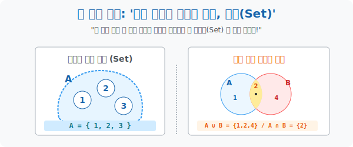

# 1. 모든 수학의 재료: '집합과 연산'

## [도입부] 학습 목표 (Learning Objectives)
- 인류가 가지고 있던 수만 가지의 잡다한 수학 법칙들을 모조리 초기화한 뒤, 아무런 특징도 없는 무색무취의 덩어리들을 바구니에 담는 가장 밑바닥 언어인 **'집합(Set)'** 의 본질을 통찰합니다.
- 집합이야말로 "너와 내가 겹치는가?(교집합)", "우리가 합치면 누가 되는가?(합집합)" 를 따지는 가장 순수한 **블록 조립 공장**임을 이해합니다.
- 파이썬(Python)의 기본 자료형 `set` 과 비트 논리 연산자 `&, |, -` 를 통해, 19세기에 탄생한 집합론이 어떻게 현대 컴퓨터 공학의 빅데이터 중복 제거 및 필터링 엔진으로 그대로 구동되는지 체험합니다.

---

## 1. 뼈대만 앙상하게 남은 우주의 시작

중학교나 고등학교에 입학하면 수학책 첫 단원에 지루하기 짝이 없는 '집합(Set)' 이 항상 등장합니다. "조건에 맞는 대상들의 모임"... 
이건 사실 학생들을 지루하게 만들려는 목적이 아니라, 이제부터 우리가 만들 거대 수학 건축물인 **'현대 대수학(Abstract Algebra)'** 의 콘크리트 기초 공사를 치는 작업입니다.

숫자 $1, 2, 3$ 이든, $\sqrt{2}$ 나 파이($\pi$) 같은 무리수든, 심지어 고양이나 사과 같은 우주 물질이든, 수학자들은 이것들을 하나하나 부르기 귀찮아합니다.
"이봐, 비슷한 놈들끼리 저 **결계 주머니 $A$ ($=\{1, 2, 3\}$)** 안에 싹 다 집어넣어 놔! 이제부터 저 덩어리를 통째로 $A$ 라고 부를 거니까!"

**[집합의 2가지 절대 헌법]**
1. **중복 용납 불가**: 주머니 안에 사과가 2개 있다고 $\{사과, 사과\}$ 라고 쓰지 않습니다. 집합 안에서는 그저 $\{사과\}$ 라는 단 하나의 아이디(ID) 만 고유하게 취급됩니다.
2. **순서 무시(Unordered)**: $\{1, 2, 3\}$ 이나 $\{3, 1, 2\}$ 나 완전히 동일한 주머니입니다. "누가 1등으로 들어왔냐?" 는 중요하지 않습니다. "누가 그 울타리 안에 소속(멤버) 되어 있느냐?" 가 100% 의 가치를 가집니다.

<div align="center">
  
</div>

<br>

## 2. 주머니들끼리의 화학 반응: 집합 연산

주머니(집합) 들을 만들었으니, 그 주머니들을 들고 서로 렌더링 폭발(연산) 을 시켜볼 차례입니다.
수학자들은 덧셈, 뺄셈, 곱셈, 나눗셈($+, -, \times, \div$) 이라는 유치한 숫자 계산을 버리고, 덩어리들을 융합하는 **'메타 연산'** 을 창조합니다.

- **[ ∪ 합집합 (Union) ]**: "A 주머니와 B 주머니를 공터에 싹 다 엎어버려! 그리고 겹치는 놈들은 하나만 남기고 버려." $\rightarrow$ 모든 자원의 통폐합.
- **[ ∩ 교집합 (Intersection) ]**: "A 에도 소속되어 있고, 동시에 B 에도 소속되어 있는 박쥐 같은 스파이 놈들만 선별해내!" $\rightarrow$ 이중 필터링 (AND 논리곱).
- **[ - 차집합 (Difference) ]**: "A 식구들 중에서 혹시라도 B 놈들과 연락하는 친일파 놈들이 있다면 다 쫓아내버려!" $\rightarrow$ 순수 혈통 추출기.

이런 소속 그룹 간의 포함 배제 논리 구조가, 페이스북이나 구글에서 "운동을 좋아하면서(A) 동시에 음악도 좋아하는(B) 유저" 를 뽑아낼 때 데이터베이스 벤다이어그램 구조를 가동하는 본질입니다.

---

## 3. 💻 파이썬(Python)의 고유 자료구조 `set` 구현

파이썬 개발자들은 이 19세기 수학자들의 집합론을 너무 사랑한 나머지, 아예 언어 내부 자체에 `set` 이라는 데이터 타입을 하드코딩으로 박아버렸습니다. (리스트 `[]` 와 딕셔너리 `{}` 에 이어지는 `{1, 2, 3}` 형태의 슈퍼 자료원)

### 🐍 파이썬 예제: 집합(Set) 의 위력과 중복 파괴 엔진

```python
print("--- 📦 데이터 렌더링: 파이썬 고속 집합(Set) 매칭 엔진 ---")

# 1. 엉망진창으로 수집된 센서 빅데이터 리스트 
# (중복이 엄청나게 발생함, 순서도 뒤죽박죽)
raw_data_A = [1, 2, 2, 3, 1, 4, 4, 5]
raw_data_B = [4, 5, 5, 6, 7, 7, 8, 4]

# 2. [위대한 집합 선언] 수학적 집합 우주로 캐스팅 (Casting)
# 이 순간, 모든 중복 찌꺼기가 폭발하며 순수 고유 ID만 남습니다!
set_A = set(raw_data_A)
set_B = set(raw_data_B)

print(f" [A 정화 완료] 순수 ID 주머니 A: {set_A}")
print(f" [B 정화 완료] 순수 ID 주머니 B: {set_B}")
print("-" * 50)

# 3. 집합 기하학 렌더링 (Union, Intersection, Difference)
# 파이썬은 &, |, - 등 비트 연산자 기호로 집합 연산을 0.001초만에 쳐냅니다.

# (1) 합집합 (A ∪ B) : 두 센서 망이 발견한 모든 고유 에이전트 통합
union_set = set_A | set_B
print(f" 🌐 [망 통합 (A ∪ B)] 파괴적 합병: {union_set}")

# (2) 교집합 (A ∩ B) : 두 센서 망에 동시에 포착된 중복 스파이 (AND Gate)
intersection_set = set_A & set_B
print(f" 🎯 [교차 타겟 (A ∩ B)] 이중 스파이 발견!: {intersection_set}")

# (3) 차집합 (A - B) : A에만 있고 B에는 없는 완전한 A만의 순수 자원
diff_set = set_A - set_B
print(f" 🛡️ [순수 혈통 (A - B)] 오직 A만의 자원: {diff_set}")

# 결과창:
# --- 📦 데이터 렌더링: 파이썬 고속 집합(Set) 매칭 엔진 ---
#  [A 정화 완료] 순수 ID 주머니 A: {1, 2, 3, 4, 5}
#  [B 정화 완료] 순수 ID 주머니 B: {4, 5, 6, 7, 8}
# --------------------------------------------------
#  🌐 [망 통합 (A ∪ B)] 파괴적 합병: {1, 2, 3, 4, 5, 6, 7, 8}
#  🎯 [교차 타겟 (A ∩ B)] 이중 스파이 발견!: {4, 5}
#  🛡️ [순수 혈통 (A - B)] 오직 A만의 자원: {1, 2, 3}
```

만약 여러분의 웹사이트에 100만 명의 방문자 ID 기록 배열 중 "얼마나 많은 유니크(Unique) 한 사람이 방문했어?" 를 셀 때, 멍청하게 for 루프로 하나씩 대조하면 1시간이 걸리지만 파이썬 `len(set(데이터))` 를 쓰면 내부 해시맵(Hash Map) 충돌 폭파에 의해 0.1초 만에 정답이 튀어나옵니다. 이것이 수학의 힘입니다.

---

## [결론] 학습 정리 (Summary)

1. **집합(Set)**: 우주 만물의 잡다한 원소들을 중복 없이(Unique) 순서에 구애받지 않고(Unordered) 묶어놓은 현대 추상수학의 가장 강력하고 기본적인 레고 블록 플랫폼입니다.
2. **연결과 필터링**: 숫자 값들을 덧셈 뺄셈하는 것을 넘어, 주머니 전체의 덩어리를 쏟아붓고(합집합 ∪), 공통 찌꺼기만 채로 걸러내고(교집합 ∩), 불순물을 빼버리는(차집합 $-$) 거시적 메타 연산의 틀을 세웠습니다.
3. 파이썬과 최신 프로그래밍 언어들은 이 수학적 집합 구조를 해시(Hash) 메모리 체계로 완벽하게 1:1로 이식하여 놓았으며, 인공지능이 두 그룹 간의 패턴 유사도를 검사할 때(Jaccard Similarity 등) 항상 1순위로 호출하는 기본 엔진입니다.
