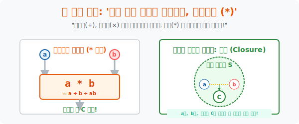

# 2. 우주의 덧셈 곱셈 법칙: '이항연산과 닫힘'

## [도입부] 학습 목표 (Learning Objectives)
- 인류가 강박적으로 외우고 있던 덧셈($+$, 곱셈 $\times$) 같은 초등학교의 연산 기호를 폐기하고, 개발자가 입력을 집어넣으면 내 맘대로 볶아서 새로운 값을 내뱉는 커스텀 함수 **'이항연산(Binary Operation, $a * b$)'** 의 본질을 파악합니다.
- 집합 식구들끼리 수백 번 마법 연산을 시켜도 절대로 그 결과물이 자신의 울타리 밖으로 도망치지 못하는 가장 완벽한 수학적 철가방, **'닫혀있다(Closure)'** 라는 개념을 체화합니다.
- 파이썬(Python)의 `lambda` 익명 함수 문법을 통하여, 매개변수 $a, b$를 집어넣으면 미친 괴물 수식으로 값을 뿜어내는 개발자 마음대로의 이항연산 시스템을 구현해 봅니다.

---

## 1. 1+1 이 2가 아니라 3이라면? (이항연산의 자유도)

초등학교에선 $1 + 1 = 2$, $2 \times 3 = 6$ 이 다입니다. 하지만 '대수학(Algebra)' 의 우주에서는 이렇게 묻습니다. 
> "왜 두 개체를 합병하는 방식이 맨날 더하고 곱하는 것밖에 없지? 내 맘대로 새로운 '폭파 합병(Fusion)' 규칙을 창조하면 안 되나?"

이 거대한 추상 세계에서 수학자들은 이 새로운 융합 규칙을 십자가도 사선도 아닌, 그저 추상적인 별표 무늬인 **'* (Star 혹은 연산자)'** 하나로 퉁칩니다. 
우리는 이 별표 기계(믹서기) 에다가 어떤 규칙이든 주입할 수 있습니다. 끄집어낸 원소 2개를 매개로 작용한다고 해서 **'이항(Binary) 연산'** 이라고 부릅니다.

새로운 룰을 세워봅시다.
**"우주법칙 선언: $a * b$ 가 만나면, 각자를 더하고 둘이 곱한 것도 더해버린다. (즉, $a * b = a + b + ab$)"**
자, 이 새로운 우주 시스템 안에서 $2 * 3$ 은 몇입니까?
$2 * 3 = 2 + 3 + (2 \times 3) = 5 + 6 = \mathbf{11}$ 입니다. $1+1 = 1 + 1 + 1 = \mathbf{3}$ 이 됩니다!
이처럼 $+$, $-$ 같은 기호는 인류가 정한 수많은 편한 이항연산 믹서기 중 흔한 2가지 모델에 불과할 뿐입니다.

<br>

## 2. 절대로 도망칠 수 없는 철가방: "닫혀 있다 (Closure)"

이제 우리가 특정 원소들이 들어있는 '집합(Set $S$)' 을 만들었고, 거기에 우리가 발명한 커스텀 믹서기 별표 '**$*$**' 를 장착했습니다.
그런데 이 시스템이 완벽한 하나의 우주로 인정받으려면 **무시무시한 결벽증 테스트** 하나를 통과해야 합니다. 바로 **'닫혀 있다(Closure)'** 테스트입니다.

- **[닫힘의 법칙]**: 집합 안에 있는 어떤 놈(a) 과 어떤 놈(b) 을 무작위로 꺼내서 가혹한 이항연산 $\mathbf{(*)}$ 믹서기에 돌려도, **그 뿜어져 나온 결과물 $\mathbf{C}$ 가 무조건 다시 그 집합 $S$ 울타리 속 식구 명단에 있어야 한다!** 

**테스트 예시 1: 자연수 집합($S=\{1,2,3 \dots\}$) + '뺄셈($-$)' 믹서기**
- $3$과 $2$를 꺼내서 돌림: $3 - 2 = 1$ (자연수 안에 있음. 생존?)
- 반대로 $2$와 $5$를 꺼내서 돌림: $2 - 5 = \mathbf{-3}$ 
- 결과: 어라?! 음수 $-3$ 은 자연수 명단에 없는데?! 결계 바깥으로 튕겨 나갔습니다.
- **판정: 자연수 집합은 뺄셈($-$) 에 대해 "닫혀 있지 않다(Not Closed)!" 생태계 붕괴!**

**테스트 예시 2: 정수 집합($S=\{ \dots -1, 0, 1 \dots\}$) + '덧셈($+$)' 믹서기**
- 어떤 양수, 음수, 0을 두 개 뽑아 미친 듯이 더해도, 결괏값은 또 다른 정수가 되어 무조건 정수 주머니 안으로 떨어진다.
- **판정: 정수는 덧셈($+$) 에 대해 "완벽히 닫혀 있다(Closed)!" 완벽한 우주 생태계.**

현대 수학은 이렇게 믹서기를 돌려댈 때 시스템의 결계(메모리 락) 가 터져나가는지 아닌지를 증명하는 '닫힘' 구조 게임입니다.

<div align="center">
  
</div>

---

## 3. 💻 파이썬(Python)의 이항연산 마법: `lambda` 시스템

파이썬의 마법 같은 익명 함수 체계 `lambda` 를 이용하면, 매번 `def func():` 와 같이 거창하게 엔진을 짤 필요 없이 수학책의 이항연산 기호인 **$a * b = a + b + ab$** 를 한 줄짜리 변수 하나에 우겨넣어 믹서기로 구동시킬 수 있습니다.

### 🐍 파이썬 예제: 나만의 커스텀 이항연산(Binary Operation) 정의하기 

```python
print("--- ⚙️ 커스텀 우주 연산 팩토리: Lambda 이항연산 주입 ---")

# 파이썬 lambda의 위엄: 입력 두개(a, b)를 받고 내가 정한 수식대로 섞어 배출하라!
# 수학책의 이항연산자 '*' 를 'star_op' 이라는 함수 믹서기로 지정
star_op = lambda a, b: a + b + (a * b)

print(" [우주법칙 선포] a * b 의 결과는 무조건 a + b + ab 로 결정된다.")
print("-" * 50)

# 시뮬레이션: 2 * 3 을 돌려보자
val1, val2 = 2, 3
result1 = star_op(val1, val2)
print(f" 🧪 [실험 1] 2 * 3 의 연산 결과 = 2 + 3 + (2 * 3) = [{result1}]")

# 시뮬레이션: 5 * -4 를 돌려보자
val3, val4 = 5, -4
result2 = star_op(val3, val4)
print(f" 🧪 [실험 2] 5 * -4 의 연산 결과 = 5 + -4 + (5 * -4) = [{result2}]")

print("-" * 50)
print(" 🔐 [닫힘(Closure) 검증]")
print(" 만약 이 세계가 '정수 집합' 이라면, a, b에 어떤 정수를 넣어도 결과값(합, 곱의 짬뽕) 도 무조건 '정수' 로 떨어지므로, 해당 연산에 대하여 [닫혀 있다] 고 선언할 수 있습니다!")

# 결과창:
# --- ⚙️ 커스텀 우주 연산 팩토리: Lambda 이항연산 주입 ---
#  [우주법칙 선포] a * b 의 결과는 무조건 a + b + ab 로 결정된다.
# --------------------------------------------------
#  🧪 [실험 1] 2 * 3 의 연산 결과 = 2 + 3 + (2 * 3) = [11]
#  🧪 [실험 2] 5 * -4 의 연산 결과 = 5 + -4 + (5 * -4) = [-19]
# --------------------------------------------------
#  🔐 [닫힘(Closure) 검증]
#  만약 이 세계가 '정수 집합' 이라면, a, b에 어떤 정수를 넣어도 결과값(합, 곱의 짬뽕) 도 무조건 '정수' 로 떨어지므로, 해당 연산에 대하여 [닫혀 있다] 고 선언할 수 있습니다!
```

이 고수준의 프로그래밍 개념은 파이썬의 `reduce(lambda a, b: a+b, list)` 와 같은 빅데이터 분산 처리(Hadoop/Spark의 MapReduce 알고리즘) 에서 두 데이터를 계속 이어붙이는 압축 코어 엔진의 수학적 원형입니다.

---

## [결론] 학습 정리 (Summary)

1. **이항연산(Binary Operation)**: 집합 안의 요소 두($2$, 이항) 마리($a, b$) 를 끌어와서 조립 공장 기계($*$) 에 돌려 뭔가 새로운 결과물 하나를 토해내게 만드는 커스텀 규칙(함수) 의 최상위 형태입니다.
2. **닫힘(Closure) 의 절대성**: 기껏 기계를 돌려서 내놓은 결과가 우리가 선언한 우주(집합 울타리) 바깥의 생태계에 없는 놈으로 튕겨져 나간다면, 그 기계는 에러를 뿜은 것으로 간주하여 '수학적 구조' 로 쳐주지 않습니다.
3. 이런 **[집합 + 이항연산 기계 + 닫혀있는지(에러 나지 않는지) 확인]** 이라는 거대한 3종 세트의 결합 구조가 컴퓨터 공학에서 클래스(Class) 와 캡슐화, 그리고 순수 함수형 프로그래밍 아키텍처를 이루는 초석입니다.
