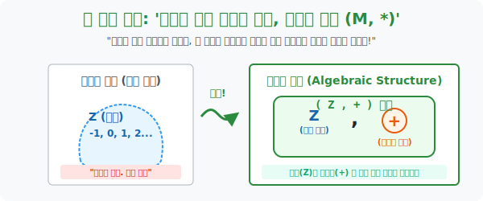

# 3. 우주의 재료와 조리법 세트 장착: '대수적 구조 ($M, *$)'

## [도입부] 학습 목표 (Learning Objectives)
- '정수', '실수' 와 같이 식구들만 바구니에 내팽개쳐 놓은 단순한 집합(Set) 은 수학에서 멈춰있는 고철 덩어리일 뿐임을 직시합니다.
- 재료 창고(집합 $M$) 와, 그 재료들을 찢고 붙이는 조리 기구(이항연산 $*$) 를 괄호 하나로 묶어낸 **'대수적 구조(Algebraic Structure, $M, *$)'** 가 어떻게 돌아가는 하나의 우주 생태계를 창조하는지 해부합니다.
- 파이썬(Python)의 `Class` 객체 지향 프로그래밍 문법 구조가 정확히 내부 데이터(집합 변수) 와 내부 메서드(이항연산 함수) 를 하나로 묶은 완벽한 대수적 구조의 클론임을 코드 레벨에서 증명해 봅니다.

---

## 1. 정수 집합은 우주가 아니다

"수학자님, 제가 무한하게 많은 정수 $\{-100, \dots -1, 0, 1, 2 \dots 100\}$ 들을 아름답게 모은 주머니 $\mathbf{Z}$ 를 가져왔습니다! 위대하죠?"
추상 대수학자는 이 정수 주머니를 보고 비웃습니다.
"그래서, 그 숫자들로 뭐 어쩌란 거니? 얘는 그냥 창고에 처박힌 재료일 뿐이야."

아무리 숫자가 많고 깔끔해도, 그들이 서로 상호작용하지 않으면 아무런 학문적 의미가 없습니다. 생명력을 불어넣으려면 지난 시간에 배운 **'이항연산 $(*)$ 믹서기'** 를 이 주머니에 구비해야 합니다.

> 1. 내가 가진 재료 창고들의 명부 $\rightarrow$ 집합 **$M$** (예: 정수 주머니)
> 2. 그 재료 2개를 꺼내서 융합시키는 기계 $\rightarrow$ 이항연산 **$*$** (예: 덧셈 $+$)

수학자들은 이 거대한 결합을 괄호로 묶어 **$ (M, *) $** 구조라고 부르며, 이것을 **'대수적 구조 (Algebraic Structure)'** 의 완벽한 한 세트로 인정합니다. 즉, 수학의 생명체 하나가 조립된 것입니다.

우주 생태계 예시:
- **$( \mathbf{Z}, + )$**: 정수 주머니 안에서, 두 개를 꺼내 무조건 **더하는(+)** 빡센 규칙을 가진 우주 세계. (다행히 결과도 정수라서 닫혀있음!)
- **$( \mathbf{Z}, - )$**: 정수 주머니 안에서, 두 개를 꺼내 무조건 **빼버리는(-)** 규칙을 가진 세계.

<div align="center">
  
</div>

<br>

## 2. 연산 기계(조리법) 에 따라 생태계 등급이 나뉜다

동일한 정수 주머니(재료) 가 있더라도, 내가 장착한 **연산 기계($*$) 별로 우주의 레벨(구조 체계) 이 하늘과 땅 차이로 갈립니다.**

**[케이스 A: $( \mathbf{Z}, \div )$ 나누기 우주]**
- 정수 3과 2를 꺼내서 나눗셈 $\div$ 믹서기에 넣습니다. $3 \div 2 = 1.5$.
- 맙소사. 결과물 1.5 는 소수라서, 정수 주머니 결계 밖으로 튕겨 나갔습니다. 
- $\rightarrow$ 이 우주는 시작하자마자 **'닫혀 있지 않음' 시스템 판정**을 받고 붕괴(Error) 당해 폐기됩니다.

**[케이스 B: $( \mathbf{Z}, - )$ 뺄셈 우주]**
- 정수들끼리 아무리 빼도 정수로 닫혀 있습니다. (합격)
- 그러나 교환 법칙: $3 - 2 = 1$ 인데, $2 - 3 = -1$. 앞뒤를 바꾸면 우주 법칙이 틀어집니다. 불편한 미개 세계.
- 결합 법칙: $(5 - 3) - 2 = 0$ 인데, $5 - (3 - 2) = 4$. 내가 어디서부터 먼저 묶어서 뺐냐에 따라 결괏값이 요동칩니다. 
- $\rightarrow$ 시스템이 살아는 있지만 엉망진창, 최하급 등급(마그마 Magma 등급) 을 받습니다.

**[케이스 C: $( \mathbf{R}, \times )$ 실수와 곱셈 우주]**
- 소수점, 유리수, 무리수를 전부 포괄하는 완벽한 실수 주머니 $\mathbf{R}$ 에 **곱셈 $\times$** 을 도입했습니다.
- 실수 2개를 곱해도 항상 실수고, $2 \times 3$ 이나 $3 \times 2$ 나 똑같이 6이고(교환 법칙 성립), 어디서부터 곱하든(결합 법칙 성립) 값이 고정됩니다.
- 심지어 $1$이라는 '곱하나 마나 결과가 똑같이 나오는 무적의 투명인간 부품(항등원)' 마저 들어있습니다. 
- $\rightarrow$ **이런 구조를 가진 우주를, 드디어 '군(Group)' 혹은 '환(Ring)', '체(Field)' 같은 초특급 최상위 랭크 우주로 격상시킵니다!**

---

## 3. 💻 파이썬(Python) 객체 지향: Object = Set + Method

대수학에서 $(M, *)$ 구조로 명사와 동사를 한 묶음으로 파는 아이디어가, 1980년대 컴퓨터 공학의 근간을 뒤흔든 **'객체 지향 프로그래밍 (OOP, Object-Oriented Programming)'** 의 정확한 원형입니다!
클래스(Class) 라는 소우주 안에, 데이터 변수(집합) 와 함수(연산자) 를 묶어서 유닛 하나($M, *$) 를 찍어냅니다.

### 🐍 파이썬 예제: OOP 로 구현하는 대수적 구조 우주 공장

```python
print("--- 🪐 대수학 렌더러: 나만의 [대수적 구조] 우주 생성기 ---")

# (M, *) 를 컴퓨터 메모리에 한 덩어리로 묶기 위한 파이썬 Class 정의
class AlgebraicStructure:
    def __init__(self, name, elements, operation):
        self.name = name           # 이 우주의 이름
        self.M = set(elements)     # 재료 창고: 우주의 원소 집합 (Set)
        self.star = operation      # 믹서기: 이 우주를 굴러가게 할 이항연산 (Operation)
        
    def test_closure(self):
        print(f"\n 🔭 [{self.name}] 우주 생태계의 '닫힘(Closure)' 안전망 테스트 가동...")
        # 이 우주의 모든 부품(a, b) 을 가져와 믹서기에 돌려본다
        for a in self.M:
            for b in self.M:
                try:
                    result = self.star(a, b)
                    # 만약 믹서기를 거친 괴물(result) 이 다시 우주 집합(M) 에 없으면 붕괴!
                    if result not in self.M:
                        print(f" 🔴 [시스템 에러] {a} * {b} = [{result}] 로 변이!!")
                        print(f"    -> 생명체 {result} 는 우리 우주({self.name}) 주민이 아닙니다! 생태계 붕괴!")
                        return False
                except ZeroDivisionError: # 파이썬 식 에러
                    print(f" 💥 [블랙홀 폭발] {a} 별표연산 {b} 시도 중에 우주가 물리적으로 폭발했습니다!")
                    return False
        
        print(" 🟢 [시스템 합격] 그 어떤 돌연변이 합성을 거쳐도 우리 주민의 품을 벗어나지 않습니다. 완벽히 닫혀 있습니다!")
        return True

# 1. 정수 집합의 부분 우주: S = {0, 1}
# 연산 룰: a + b
universe_plus = AlgebraicStructure(
    name="0과 1의 덧셈 우주",
    elements=[0, 1],
    operation=lambda a, b: a + b
)

# 2. 정수 집합의 부분 우주: S = {0, 1}
# 연산 룰: a * b (파이썬 곱셈)
universe_mul = AlgebraicStructure(
    name="0과 1의 곱셈 우주",
    elements=[0, 1],
    operation=lambda a, b: a * b
)

# 시스템 테스터 가동!
universe_plus.test_closure()  # 불합격함 (1+1=2 인데 2가 집합에 없음)
universe_mul.test_closure()   # 합격함 (모조리 어차피 0이나 1)

# 결과창:
# --- 🪐 대수학 렌더러: 나만의 [대수적 구조] 우주 생성기 ---
#
#  🔭 [0과 1의 덧셈 우주] 우주 생태계의 '닫힘(Closure)' 안전망 테스트 가동...
#  🔴 [시스템 에러] 1 * 1 = [2] 로 변이!!
#     -> 생명체 2 는 우리 우주(0과 1의 덧셈 우주) 주민이 아닙니다! 생태계 붕괴!
#
#  🔭 [0과 1의 곱셈 우주] 우주 생태계의 '닫힘(Closure)' 안전망 테스트 가동...
#  🟢 [시스템 합격] 그 어떤 돌연변이 합성을 거쳐도 우리 주민의 품을 벗어나지 않습니다. 완벽히 닫혀 있습니다!
```

이 코드는 양자 컴퓨터가 연산 큐비트(Qubit) 를 조합해 나올 수 있는 결과물 상태(State) 가 허가된 양자 역학 결계(Hilbert Space) 에 잘 보존되어 있는지를 검증하는 핵심 매트릭스 알고리즘 아키텍처입니다.

---

## [결론] 학습 정리 (Summary)

1. **단순 집합의 무의미성**: 숫자를 만 개 모아놓은 집합이라도, 그 숫자들끼리 합체하는 공식이 없으면 쓰레기장에 불과합니다.
2. **대수적 구조 (M, \*)**: 그래서 반드시 1번 재료 창고(집합 $M$) 와 2번 화학 반응식(이항연산 $*$) 두 개를 하나로 엮어 묶었을 때 이를 완결된 대수적 구조라고 부릅니다.
3. 이 $(M, *)$ 구조가 **교환/결합 여부, 항등원과 역원의 존재 유무**라는 까다로운 마검사 오디션을 어떻게 통과하느냐에 따라 군(Group), 환(Ring), 체(Field) 라는 어마어마한 수학계의 귀족 계급으로 승급하게 됩니다.
