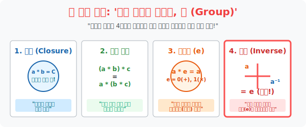

# 4. 모든 것을 되돌리는 마법의 조건: '군(Group)'

## [도입부] 학습 목표 (Learning Objectives)
- 지난 시간에 배운 수많은 '대수적 구조 ($M, *$)' 생태계들 중에서, 오직 수학적으로 극도의 완전 무결함을 자랑하는 시스템에게 영광스럽게 부여되는 칭호, **'군(Group)'** 의 절대 조건 4가지를 터득합니다.
- 단순한 닫힘과 결합 법칙을 넘어, 거울 같은 **'항등원(Identity, $e$)'** 의 발견과 모든 궤적을 0으로 롤백(상쇄) 시킬 수 있는 블랙홀 쌍둥이 **'역원(Inverse, $a^{-1}$)'** 의 유무가 가지는 철학적 의미를 이해합니다.
- 파이썬(Python) 암호학의 RSA 공개키 기반 모듈 연산에서, 왜 하필 소수(Prime Modulo) 생태계를 '역원(Inverse)' 이 무조건 존재하는 '유한군(Finite Group)' 으로 만들어 디코딩 폭탄을 폭발시키는지 렌더링 검열을 돌려봅니다.

---

## 1. 4단계 지옥 훈련: '군(Group)' 으로 가는 길

현대 수학에서 가장 아름잡고 고귀한 단어 하나를 꼽으라면 무조건 **'군(Group)'** 입니다. 루비크 큐브 돌리기부터 입자 물리학의 끈이론까지 온 우주는 이 군(Group) 의 법칙 아래 지배를 받습니다.
어떤 하찮은 대수 구조 $(M, *)$ 가 이 위대한 칭호를 받으려면 다음 **4가지 관문**을 모두 통과해야 합니다. 단 한 개라도 삐끗하면 가차 없이 쫓겨납니다.

**[군(Group) 의 4대 절대 공리 법칙]**

- **[1관문] 닫혀 있을 것 (Closure)**: $a * b$ 가 무조건 명단($M$) 안에 떨어져야 한다! (가장 기본 등급: `Magma` 칭호 획득)
- **[2관문] 결합 법칙 성립 (Associativity)**: $(a * b) * c = a * (b * c)$. 순서만 안 바꾸면 괄호를 앞에 치든 뒤에 치든 돌연변이가 일어나지 않아야 한다! (등급 업: `Semigroup` 반군 획득)
- **[3관문] 항등원의 존재 여부 (Identity, $e$)**: 이 우주 어딘가에, 누구랑 합성해도 "상대방을 그대로 튕겨내는 거울" 같은 원소 $e$ 가 딱 1개라도 무조건 숨어 있어야 한다! ($a * e = a$) $\rightarrow$ 정수의 덧셈에서는 `0`, 실수 곱셈에서는 `1` (등급 업: `Monoid` 모노이드 획득)

여기까지는 그나마 쉽게 옵니다. 대망의 마지막 끝판왕 방어선이 남았습니다. 

- **[4관문] 완전 소멸: 역원의 존재 (Inverse, $a^{-1}$)**:
  모든 원소 $a$ 마다, 자신과 융합($*$) 했을 때 하필 아까 [3관문] 의 거울 $e$ (아무것도 아님을 상징하는 무) 로 폭발하며 산화시켜 버리는 강력한 쌍둥이 파트너($a^{-1}$) 가 존재해야 한다!
  $a * a^{-1} = e$
  정수의 덧셈 우주에서는 $5$ 의 파트너인 $-5$ 가 항상 존재해서 합치면 거울($0$) 로 무효화시킵니다! 합격!

이 4관문을 모두 뚫어 낸 완벽한 조화의 우주를, **'군 (Group, $G$)'** 이라고 부릅니다. 

<div align="center">
  
</div>

<br>

## 2. 역원(Inverse) 의 무서움: 시간을 거스르는 자

보통 수학 포기자들은 3관문 항등원, 4관문 역원 글씨를 보는 순간 고등학교 책을 덮었습니다. 의미를 절대 파악하지 못했기 때문입니다.

역원이 무서운 이유는 **'Ctrl + Z (실행 취소)'** 기능 그 자체이기 때문입니다.
내가 시스템에 어떤 조작 $a$ 를 가해버려서 상태가 오염되었다 칩시다. 
이 생태계가 군(Group) 이라면? 걱정할 필요 없습니다.
무조건 $a$ 를 무효화시키는 $a^{-1}$ 폭탄 입자가 우주 어딘가에 존재한다는 뜻이므로, 그 파트너를 찾아서 발사($*$) 해주면 둘이 서로를 끌어안고 항등원 $e$ (초기화) 로 터져버리기 때문입니다!

가장 치명적인 붕괴 케이스를 보겠습니다. 
**자연수 우주는 절대 곱셈 군이 되지 못합니다.**
이유: 자연수 $3$ 을 가져옵니다. $3 * x = 1$ (곱셈 항등원은 1이므로). 이를 터뜨릴 역원 $x$ 는 $\frac{1}{3}$ 이어야 합니다.
하지만 자연수 주머니 결계 안에 $\frac{1}{3}$ 이라는 부품은 애초에 판매하지 않습니다!
$\rightarrow$ 자연수 우주는 역원이 없으므로 "실행 취소 불가 (Non-reversible)", 즉 한 방향으로만 파멸로 치닫는 불안정한 반쪽짜리 우주입니다. 군(Group) 칭호 박탈!

---

## 3. 💻 파이썬(Python)의 시계 연산(Modulo) 암호 역원 추출기

전 세계 은행의 SSL 보안 서버와 해커들은 암호를 걸 때(조작 $A$), 암호를 푸는 마스터키인 **'역원($A^{-1}$)'** 을 찾지 못하면 해독 자체를 못 하게 만드는 모듈로(Modulo) 유한군(Finite Group) 시스템을 설계합니다. 파이썬을 이용해 무식하지만 확실하게 어떤 소수(Prime) 우주에서 역원 짝꿍을 찾아 브루트포스 폭파를 돌리는 로직을 짭니다.

### 🐍 파이썬 예제: 모듈로 체계에서의 융합 역원(Inverse) 브루트포스 해킹

```python
print("--- ⚔️ 암호 파동 통신기: 유한 군(Group) 내부의 역원 파트너 추출 ---")

# 시계판 세계 (Modular Arithmetic): 0부터 6까지 7개의 부품만 파는 우주 (M = {0,1,2,3,4,5,6})
# 이 우주는 어떤 두 수를 곱하고 7로 나눈 '나머지(%)' 모듈로 곱셈에 대해 완벽한 [군(Group)] 입니다!
p_universe = 7

# 실험 타겟: 내 스파이 암호 번호 3
target_a = 3

print(f" [시스템 부팅] 현재 작동 우주: 7로 나눈 나머지 세계 (Modulo 7)")
print(f" [규칙 점검] 이 우주의 곱셈 항등원(거울 e) 은 무조건 '1' 입니다.")
print(f" [타겟 점검] 내 요소 '3' 과 곱해서 최종 결과가 '1(e)' 로 터지게 할 파트너(3의 역원) 를 탐색합니다...")
print("-" * 50)

found_inverse = None

# 우주에 있는 모든 파편 후보를 하나씩 조립기에 넣어 폭발 테스트를 거칩니다.
# 후보 부품 x는 1부터 6까지 
for x_candidate in range(1, p_universe):
    # 이항 연산: 내 타겟(3) * 후보 부품(x) 를 7로 나눈 나머지
    result = (target_a * x_candidate) % p_universe
    print(f" 🧪 [조립 실험] 3 * {x_candidate} = {target_a * x_candidate} -> 모듈로 7 파킹 완료 값: {result}")
    
    # [핵심 검열] 융합 결과가 항등원 e(1) 로 터졌는가?!
    if result == 1:
        print(f" 💥 [BINGO!] 마침내 3을 1(무화) 로 만들어버리는 '역원 쌍둥이 폭탄' 을 발견했습니다!!")
        found_inverse = x_candidate
        # 찾았으므로 무자비한 루프 중단
        break

print("-" * 50)
if found_inverse:
    print(f" 🏁 해킹 종료: 요소 [3] 의 곱셈 역원(x^-1) 은 [{found_inverse}] 입니다. (3 * 5 = 15 % 7 == 1)")
else:
    print(f" 🔴 실패: 역원이 없는 닫힌 우주가 아닙니다. 이 세계는 군(Group) 이 아닙니다.")

# 결과창:
# --- ⚔️ 암호 파동 통신기: 유한 군(Group) 내부의 역원 파트너 추출 ---
#  [시스템 부팅] 현재 작동 우주: 7로 나눈 나머지 세계 (Modulo 7)
#  [규칙 점검] 이 우주의 곱셈 항등원(거울 e) 은 무조건 '1' 입니다.
#  [타겟 점검] 내 요소 '3' 과 곱해서 최종 결과가 '1(e)' 로 터지게 할 파트너(3의 역원) 를 탐색합니다...
# --------------------------------------------------
#  🧪 [조립 실험] 3 * 1 = 3 -> 모듈로 7 파킹 완료 값: 3
#  🧪 [조립 실험] 3 * 2 = 6 -> 모듈로 7 파킹 완료 값: 6
#  🧪 [조립 실험] 3 * 3 = 9 -> 모듈로 7 파킹 완료 값: 2
#  🧪 [조립 실험] 3 * 4 = 12 -> 모듈로 7 파킹 완료 값: 5
#  🧪 [조립 실험] 3 * 5 = 15 -> 모듈로 7 파킹 완료 값: 1
#  💥 [BINGO!] 마침내 3을 1(무화) 로 만들어버리는 '역원 쌍둥이 폭탄' 을 발견했습니다!!
# --------------------------------------------------
#  🏁 해킹 종료: 요소 [3] 의 곱셈 역원(x^-1) 은 [5] 입니다. (3 * 5 = 15 % 7 == 1)
```

이 알고리즘이 바로 비트코인 타원 곡선 암호($ECDSA$) 와, 애플페이 RSA 보안 토큰 검증 시스템에서 "암호를 푸는 유일한 백도어 모듈 연산 역원(Inverse Hash Key)" 을 연산하는 근본 수학 골격입니다.

---

## [결론] 학습 정리 (Summary)

1. **지상 최고 계급, 군(Group)**: 단순한 집합을 넘어 (1) 닫힘, (2) 결합 법칙 유지, (3) 항등원의 존재, (4) 역원의 존재라는 악마 같은 4대 공리를 한 치의 거짓 없이 완수해 낸 불멸의 수학 구조 신전입니다.
2. **항등원(자아 유지자 e)**: 어떤 부품이 나에게 날아와 폭발해도, 나 자신을 그대로 복사해서 다시 돌려주는 우주의 거울. 덧셈의 $0$, 곱셈의 $1$ 이 그 절대 권력자입니다.
3. **역원(자아 파괴자 $x^{-1}$)**: 나와 합체하는 순간 둘 다 터져버리고 우주의 기초값인 항등원 $e$ 로 흩어버리는 무자비한 분쇄 메커니즘. 큐브가 엉망진창으로 꼬여도(조작), 항상 반대 역원(원래대로 푸는 공식) 이 존재하여 해결 가능함을 군론은 증명합니다!
