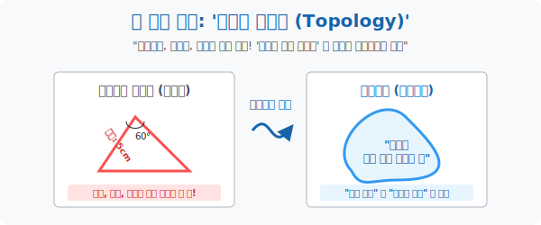

# 1. 길이와 각도를 버린 수학: '고무판 기하학'

## [도입부] 학습 목표 (Learning Objectives)
- 수천 년간 기하학을 지배해 온 유클리드의 절대적 원리(길이, 각도, 면적) 를 쓰레기통에 던져버리고, **'연결된 상태'** 와 **'구멍의 개수'** 만을 따지는 혁명적인 공간 철학 **'위상수학(Topology)'** 을 체화합니다.
- 점탄성이 있는 고무 찰흙으로 만들어진 세계관 안에서 삼각형, 사각형, 원이 사실은 모두 동일한(모서리를 구부리면 원이 됨) 구멍 0개짜리 같은 혈통임을 깨닫습니다.
- 파이썬(Python)의 `NetworkX` 라이브러리를 이용하여, 지하철 노선도가 구불구불하든 직선이든 상관없이 "어느 역과 어느 역이 이어져 있는가?" 스펙만 보존하는 위상 데이터 렌더링을 체험합니다.

---

## 1. 딱딱한 우주(유클리드) vs 말랑한 우주(위상)

기원전부터 우리는 **유클리드 기하학**이라는 잣대에 맞춰 살아왔습니다. 
"삼각형의 내각의 합은 180도이다."
"두 변의 길이는 5cm로 동일하다."
이처럼 길이나 각도, 면적을 자와 각도기로 철저히 재는 **'딱딱한(Rigid) 기하학'** 입니다.

그러나 **위상수학(Topology)** 의 우주는 거대한 고무판(Rubber-sheet) 으로 만들어져 있습니다.
이 세계의 유일한 규칙은 단 두 가지뿐입니다.
> 1. 마음대로 늘리고, 구부리고, 짓눌러도 된다! (합법)
> 2. **하지만 가위로 찢거나, 구멍을 새로 뚫거나, 떨어져 있는 것을 접착제로 붙이는 것은 절대 금지! (불법)**

이 규칙 안에서 점토(고무찰흙) 로 만든 '완벽한 원형 반지원'을 손으로 대충 주물럭거려 세 군데 각을 세우면 '삼각형'이 됩니다. 즉, 위상수학의 관점에서는 **원 = 삼각형 = 정사각형 = 별모양** 모두 그저 '구멍 1개짜리 고무 밴드' 로 완전히 똑같은 녀석들입니다.
위상수학자들은 길이 5cm가 5km로 늘어나는 것은 전혀 신경 쓰지 않습니다. 오직 **"이것이 원래 어떻게 이어져(연결되어) 있었는가?"** 라는 본질적 구조 정보만 집착합니다.

<div align="center">
  
</div>

<br>

## 2. 우리가 매일 보는 위상기하학 '지하철 노선도'

도대체 길이와 각도를 무시하는 이 괴상한 기하학을 어디에 써먹느냐고요?
그것이 바로 세계적인 발명품인 **지하철 노선도(Subway Map)** 입니다.

실제 현실 세계(유클리드 기하학) 의 지하철 2호선 철로는 강남역에서 교대역으로 갈 때 꼬불꼬불 휘어져 있고, 거리는 몇 백 미터이며, 역 사이의 꺾인 각도가 존재합니다.
하지만 우리가 스마트폰으로 보는 2호선 노선도는 어떤가요? 모든 선을 쭉쭉 핀 직선, 완벽한 초록색 원형, 각도는 보기 편한 45도와 90도로 완전히 **왜곡(늘리고 구부림)** 시켜 놓았습니다!

역과 역 사이의 실제 거리가 1km든 10km든 중요하지 않습니다. 
"강남역 다음에 교대역이 **이어져(Connected) 있다**" 라는 연결망(Topology) 성질만 완벽하게 보존했기 때문에, 인간은 그 노선도만 보고도 지도를 보지 않고 정확히 목적지에 갈 수 있는 것입니다.

---

## 3. 💻 파이썬(Python) 네트워크 토폴로지 렌더러 (`NetworkX`)

통신 장비나 서버실의 네트워크 케이블 구조를 데이터화할 때, 장비 간의 물리적 거리(10m냐 100m냐) 는 무시하고 **오직 연결 상태(Node & Edge)** 만을 그려내는 위상수학 기반 맵핑 시스템을 돌려봅니다.

### 🐍 파이썬 예제: 컴퓨터 통신망 위상 변환 (Topology Connectivity)

```python
import networkx as nx
import matplotlib.pyplot as plt

print("--- 🌐 네트워크 인프라: 위상수학(Topology) 맵 스캐너 ---")

# (빈 허공) 토폴로지 그래프 뼈대 생성
G = nx.Graph()

# 컴퓨터 노드(역) 4대 생성
nodes = ["서버A", "라우터B", "DB서버C", "클라이언트D"]
G.add_nodes_from(nodes)

# 연결(Edge/간선) 상태 삽입: 랜선으로 누가 이어져 있는가? (물리적 거리 무시)
connections = [
    ("서버A", "라우터B"),
    ("라우터B", "DB서버C"),
    ("라우터B", "클라이언트D"),
    # 서버A 와 클라이언트D 도 연결 (원형 루프 생성)
    ("서버A", "클라이언트D")
]
G.add_edges_from(connections)

print(f" [스캔 완료] 총 네트워크 노드(역) : {G.nodes()}")
print(f" [스캔 완료] 랜선 연결(교량) 상태 : {G.edges()}")

# 화면에 이 위상 구조를 시각적으로 렌더링 (그릴 때마다 위치나 모양은 마음대로 늘어나고 줄어듦!)
# 하지만 연결된 "본질(Topology)" 은 절대 변하지 않음
plt.figure(figsize=(6, 4))
nx.draw(G, with_labels=True, node_color='lightblue', node_size=3000, font_family='sans-serif', font_weight='bold', edge_color='red', width=2)
plt.title("Network Topology (Rubber-Sheet Map)")
# plt.show() # 실제 환경에서 팝업창 띄움

# 결과창:
# --- 🌐 네트워크 인프라: 위상수학(Topology) 맵 스캐너 ---
#  [스캔 완료] 총 네트워크 노드(역) : ['서버A', '라우터B', 'DB서버C', '클라이언트D']
#  [스캔 완료] 랜선 연결(교량) 상태 : [('서버A', '라우터B'), ('서버A', '클라이언트D'), ('라우터B', 'DB서버C'), ('라우터B', '클라이언트D')]
#  (팝업 렌더링: 모양은 대충 그려져도 연결망 선의 관계는 완벽히 보존됨)
```

인터넷 라우터 기기들은 이 Topology Table을 교환하며 "우리 사이에 끊어진 구멍(Hole) 이 있는지, 이어져 있는지" 만을 감지해 최단 데이터 전송 경로를 동적으로 개척합니다.

---

## [결론] 학습 정리 (Summary)

1. **위상수학(Topology)**: 크기, 모양, 길이, 각도 따위의 겉껍질 스펙에 집착하지 않고, 점과 선이 **'어떻게 연결되어 있는가(Connectivity)'** 와 공간에 **'구멍이 몇 개인가'** 이 두 가지 절대 뼈대만 스니핑하는 현대 기하학입니다.
2. **합법과 불법**: 고무판 우주 모델에서 도형들을 잡아 늘리거나 구부리는 것은 연속적 변환이므로 위상적 본질이 유지되지만, 칼로 끊어내거나 구멍을 파버리는 짓은 해당 객체의 아이디(ID) 를 파괴하는 불법 행위입니다.
3. 이 본질을 추출한 가장 대표적인 시스템이 지하철 노선도 전기 회로도이며, 컴퓨터 공학의 자료구조(Data Structure) 인 그래프(Graph) 와 트리(Tree) 네트워크의 심장부에 위상수학이 영구 탑재되어 있습니다.
