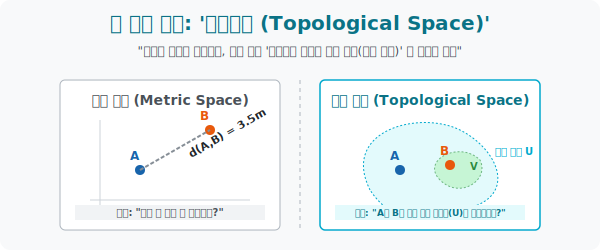

# 2. 자(Ruler) 가 부러진 세계: '위상공간'

## [도입부] 학습 목표 (Learning Objectives)
- '거리를 잴 수 있다($d(x,y)$)' 는 절대 법칙을 잃어버린 극한의 추상 공간에서, 수학자들이 **'열린 집합(Open Set)'** 이라는 주머니를 통해 어떻게 "가깝다" 라는 개념을 재창조했는지 통찰합니다.
- 점들의 모임 구조를 다루는 **위상공간(Topological Space)** 의 3가지 엄격한 헌법(공리) 을 이해하고, 집합론(Set Theory) 이 어떻게 공간 기하학으로 진화하는지 구경합니다.
- 파이썬(Python)의 부분집합(Subset) 검사 로직을 통해, 우주에 정의된 요소들이 위상 공간의 3대 공리를 만족하여 '위상(Topology)' 타이틀을 딸 수 있는지 검증기(Validator) 를 코딩합니다.

---

## 1. 줄자가 없는 우주에서의 질문

유클리드가 발명한 거리 공간(Metric Space) 에서는 모든 점 사이에 거리를 나타내는 숫자가 있었습니다.
"A와 B가 가까워? B와 C가 가까워?" 라고 묻는다면, 자를 대고 $(\sqrt{(x_2-x_1)^2 + (y_2-y_1)^2})$ 피타고라스 공식을 돌려 숫자가 작은 놈이 이기는 쉬운 룰이었습니다.

하지만 자가 모조리 박살 나고 크기가 제멋대로 늘어나는 고무판 우주, **위상공간(Topological Space)** 에서는 거리를 잴 숫자가 없습니다. 그렇다고 공간의 근간인 "누가 누구랑 가까운 이웃사촌이냐?" 를 정의하지 않으면 수학이 붕괴됩니다.

수학자들은 거리가 적힌 줄자 대신, **'울타리 치기(주머니 묶기)'** 신공을 발휘합니다.
거리를 재는 대신 공간 속에 무수히 많은 가상의 주머니 덩어리들(**열린 집합, Open Sets**) 을 그려 놓고는 선언합니다.
> "A와 B가 거리는 모르겠지만... 내가 친 **'동일한 이웃 주머니(V)'** 안에 함께 들어가 있으니, 쟤네 둘은 가까운 이웃이야!"

이렇게 오직 '속해 있는가(집합론)' 로만 근접성(Proximity) 을 정의한 극한의 추상 공간이 위상공간입니다.

<div align="center">
  
</div>

<br>

## 2. 위상 공간의 절대 공리 3원칙

아무 주머니나 막 그려 넣는다고 위상공간이 허락되는 것은 아닙니다. 어떤 집단 가계도가 완벽한 생태계(위상, Topology $\tau$) 로 인정받으려면 무조건 **3가지 헌법(공법)** 을 지켜야 합니다.

어떤 우주 집합 $X = \{1, 2, 3\}$ 가 있습니다.
여기에 부분집합들을 모아놓은 네트워크 주머니들의 모임 $\tau$ (타우) 를 만듭니다.

1. **[전체와 허무의 법칙]**: 텅 빈 공집합 $\emptyset$ 과 우주 전체 표본 집합 $X$ 는 무조건 가장 근본 주머니로서 $\tau$ 안에 소속되어 있어야 한다.
2. **[교집합의 법칙]**: $\tau$ 식구들끼리 두 개씩 골라서 겹치는 부분(교집합 $\cap$) 을 추출해도, 그 결과물 역시 이 가족 $\tau$ 안에 있어야 한다! (유한 교집합 보존)
3. **[합집합의 법칙]**: $\tau$ 식구들 중 아무거나 마구잡이로 가져와서 거대한 한 덩어리로 뭉쳐도(무한 합집합 $\cup$), 그 결과 괴물 역시 $\tau$ 식구명단에 무조건 존재해야 한다!

이 3가지 결벽증 같은 닫힘 시스템을 유지하는 묶음 $\tau$ 만을 우리는 **'위상(Topology)'** 이라 부르며 수학적 시민권을 부여합니다.

---

## 3. 💻 파이썬(Python) 공간법칙(Topology) 검열기

우리가 수동으로 만든 집합 주머니 모델 $\tau$ 가 방금 배운 세 가지 헌법을 완벽히 지키고 있는 올바른 '위상(Topology)' 인지를 `set(집합)` 교차 테스트를 통해 스캐닝하는 재판관 AI를 코딩합니다.

### 🐍 파이썬 예제: 위상 공간(Topological Space) 공리 Validator

```python
print("--- ⚖️ 집합론 재판관: 위상공간(Topology) 3대 공리 검증 엔진 ---")

# 전체 우주 공간 X
space_X = {1, 2, 3}

# 우리가 임의로 설계한 주머니(열린 집합) 들의 가문 묶음: 2개의 후보
# 후보 A: {공집합, {1,2,3}, {1}, {1,2}}
topology_A = [set(), {1, 2, 3}, {1}, {1, 2}]

# 후보 B: {공집합, {1,2,3}, {1}, {2}} 
topology_B = [set(), {1, 2, 3}, {1}, {2}] 
# (스포일러: 후보 B는 {1} U {2} = {1,2} 인데 {1,2}가 명단에 없어서 3번 공리 위반으로 탈락함)

def check_topology(tau, base_space):
    # 공리 1: 공집합과 전체집합이 존재하는가?
    if set() not in tau or base_space not in tau:
        return False, "❌ 공리 1 위반: 공집합이나 전체 우주 주머니가 빠져 있습니다!"
    
    # 공리 2 & 3: 가족들끼리 교집합(Intersection), 합집합(Union) 을 쥐어짜도 식구 명단에 있는가?
    for s1 in tau:
        for s2 in tau:
            # 두 열린 집합의 합쳐진 형태
            union_set = s1.union(s2)
            if union_set not in tau:
                return False, f"❌ 공리 3 위반: 합집합 {union_set}가 명단에 없습니다! (이단 발생: {s1} ∪ {s2})"
            
            # 두 열린 집합의 겹치는 형태
            intersection_set = s1.intersection(s2)
            if intersection_set not in tau:
                return False, f"❌ 공리 2 위반: 교집합 {intersection_set}가 명단에 없습니다! (이단 발생: {s1} ∩ {s2})"
                
    return True, "✅ 완벽합니다! 이 집합 묶음은 공식적인 '위상(Topology)' 으로 합격입니다."

# 검증 엔진 가동
is_valid_A, msg_A = check_topology(topology_A, space_X)
print("\n [타겟 스캔] 후보 A 구축망:", topology_A)
print(" ->", msg_A)

is_valid_B, msg_B = check_topology(topology_B, space_X)
print("\n [타겟 스캔] 후보 B 구축망:", topology_B)
print(" ->", msg_B)

# 결과창:
# --- ⚖️ 집합론 재판관: 위상공간(Topology) 3대 공리 검증 엔진 ---
#
#  [타겟 스캔] 후보 A 구축망: [set(), {1, 2, 3}, {1}, {1, 2}]
#  -> ✅ 완벽합니다! 이 집합 묶음은 공식적인 '위상(Topology)' 으로 합격입니다.
#
#  [타겟 스캔] 후보 B 구축망: [set(), {1, 2, 3}, {1}, {2}]
#  -> ❌ 공리 3 위반: 합집합 {1, 2}가 명단에 없습니다! (이단 발생: {1} ∪ {2})
```

데이터 마이닝 알고리즘이나 분산 클러스터링(머신러닝이 고객층을 VVIP, VIP등의 주머니로 쪼갤 때) 은 집단들의 소속과 교집합 파편화가 시스템 내에 잘 수렴하는지 এই 위상 공간 수학법칙 렌더러로 오류를 캐치합니다.

---

## [결론] 학습 정리 (Summary)

1. **거리 공간의 폐기**: "강남역에서 교대역까지 몇 미터(d) 냐?" 라는 것을 물을 수 없고 측정 단위가 녹아버린 극한 우주에서는, 집합론을 끌고 와 **"너네 둘이 같은 이웃 주머니($U$) 에 속해 있어?"** 로 구조를 파악합니다.
2. **열린 집합의 모호함**: 위상 공간 내의 원소들을 포위하는 점선 테두리(조건 묶음) 를 '열린 집합(Open Sets)' 이라 부르며 이 주머니들의 가족 명단($\tau$) 자체가 곧 우주의 형태인 위상입니다.
3. **위상의 강철 3법칙**: 자격 없는 묶음이 위상 행세를 하지 못하게, 반드시 (1) 전체/공집합 소유 (2) 교집합의 소속 (3) 합집합의 소속이라는 세 가지 강력한 방어막을 거쳐야만 수학적 공간 모델링으로 채택됩니다.
