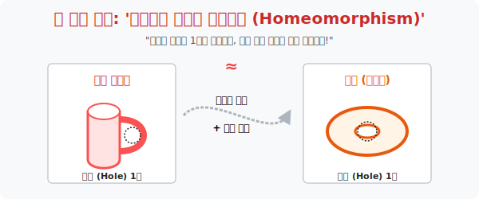

# 3. 우주의 쌍둥이 식별법: '위상동형 (Homeomorphism)'

## [도입부] 학습 목표 (Learning Objectives)
- 위상수학의 가장 유명한 난제이자 유머인 **"수학자는 커피 머그컵과 도넛을 구별하지 못한다"** 의 진정한 의미를 파헤치고, 형태가 전혀 다른 두 물체가 '위상동형' 임을 증명해 냅니다.
- 찰흙 반죽 모델링을 통해 머그컵의 몸통 부분이 어떻게 눌려서 도넛의 두꺼운 빵결로 흡수되고, 손잡이 구멍 하나만이 살아남아 완벽한 동치 관계로 진화하는지 연속 변환(Continuous Deformation) 을 터득합니다.
- 파이썬(Python)의 `scipy.spatial` 모듈이나 형상 분석 알고리즘에서 위상수학의 뼈대인 '구멍 개수 추출(Betti Number)' 구조를 흉내 내어 두 물체가 같은 종류인지를 판단하는 AI 필터를 만들어봅니다.

---

## 1. 도넛을 커피잔으로 진화시키다

딱딱한 유클리드 세계에서 높이 15cm짜리 원통형 머그컵과 지름 8cm짜리 납작한 원형 도넛은 전혀 다른 두 물체입니다. (부피도 다르고, 표면적도 다르고, 모양도 다릅니다.) 
하지만 말랑말랑한 고무 찰흙 세계에 들어서면 이야기가 달라집니다. 위상수학자들은 찰흙으로 만들어진 도넛을 집어 들고 묻습니다. 

> "여기 구멍이 하나 뚫려있는 도넛 반죽이 있습니다.
> 이걸 가위로 찢거나, 이어 붙이지 않고 **손으로 조물딱거려서** 커피 잔 모양으로 바꿀 수 있나요?"

가능합니다! 
1. 도넛 링의 한쪽 부분을 엄지로 꾹 눌러 오목하게 팝니다. (머그컵의 몸통 부분 생성)
2. 오목하게 판 부분을 위로 쑥쑥 잡아당겨 길쭉한 컵 몸체를 만듭니다.
3. 나머지 얇은 도넛 링 부분은 쫙 펴서 컵의 허리에 붙어있는 '손잡이' 로 둔갑시킵니다!

이렇게, 찢어버리거나 접착제를 바르는 '불법' 을 저지르지 않고 오직 늘리고 줄이는 '합법(연속 변환 기법)' 만으로 두 도형이 서로 완벽하게 형태를 바꿀 수 있는 호환 상태를 위상수학에서는 **'위상동형 (Homeomorphic)'** 이라 부릅니다. 
결국 커피잔과 도넛은 위상수학자들의 데이터베이스에서 **[구멍 1개짜리 우주 종족 (Torus)]** 으로 식별 코드가 완전히 같은 쌍둥이 클론입니다.

<div align="center">
  
</div>

<br>

## 2. 구멍(Hole) 의 개수가 곧 신분증

위상 공간에서 도형들을 계급으로 분류하는 가장 완벽한 바코드는 **'구멍의 개수' (전문 지너스, Genus)** 입니다.

- **[Genus = 0] 구멍 없는 놈들**: 농구공(구형), 주사위(정육면체), 피라미드, 숟가락
  - 이들은 모두 찰흙을 어떻게 뭉치든 서로 변환이 가능한 위상동형 종족입니다.
- **[Genus = 1] 구멍 1개짜리 놈들**: 도넛, 커피 머그컵, CD(가운데 뚫린 원판)
- **[Genus = 2] 구멍 2개짜리 놈들**: 숫자 8모양 빵, 콧구멍, 손잡이가 2개 달린 양은 냄비
- **[Genus = 3] 구멍 3개짜리 놈들**: 프레첼(Pretzel) 과자!

이 위상수학적 분류표는 의료용 AI 가 사람 몸속 MRI 를 스캔할 때 심장(내부 빈 공간이 4개), 혈관(긴 원통 터널) 등의 장기를 왜곡된 뼈 구조 속에서도 정확히 장기 종류별로 분류해 내는 위상 스캐닝의 핵심 기술력이 됩니다. 

---

## 3. 💻 파이썬(Python) 객체 위상 식별기 (Genus 판별)

3D 프린팅 모델이나 복잡한 3D 그래픽 스캐너에서, 모양이 아무리 찌그러져 있어도 "구멍 개수(Holes)" 가 같다면 같은 계열의 물체(Homeomorphic) 로 분류해 버리는 알고리즘을 흉내 내 봅니다.

### 🐍 파이썬 예제: 홈오모피즘(위상동형) 분류 엔진

```python
print("--- 🍩 3D 기하 스캐너: 물체 간 위상동형(Homeomorphism) 일치 판독기 ---")

# 3D 스캔된 수많은 객체들의 데이터베이스 (위상학적 구멍의 개수(Genus) 를 추출해 놓았다고 가정)
scanned_objects = {
    "농구공(Sphere)": 0,
    "주사위(Cube)": 0,
    "커피머그잔(Mug)": 1,
    "도넛(Torus)": 1,
    "훌라후프(Hula Hoop)": 1,
    "숫자8모양 빵(Figure-8)": 2,
    "프레첼(Pretzel)": 3,
    "티셔츠(T-shirt)": 4 # 목(1), 몸통아래(1), 양팔(2) 의 위상 구조는 4개의 입출구를 가짐
}

def check_homeomorphism(obj1, obj2):
    genus1 = scanned_objects[obj1]
    genus2 = scanned_objects[obj2]
    
    print(f"\n [분석 시작] 타겟 A: {obj1} (구멍 {genus1}개) VS 타겟 B: {obj2} (구멍 {genus2}개)")
    
    if genus1 == genus2:
        print(" 🟢 [판독 결과]: 두 물체는 [위상동형(Homeomorphic)] 입니다!")
        print("    -> 고무 찰흙으로 찢거나 붙이지 않고 서로 완벽하게 변형이 가능합니다.")
    else:
         print(" 🔴 [판독 결과]: 두 물체는 [위상 이질체] 입니다. 서로 절대 변형할 수 없습니다!")
         print("    -> 연결된 구멍(Hole) 의 구조가 근본적으로 달라 이종족으로 판별합니다.")

# 테스트 케이스 실행
check_homeomorphism("커피머그잔(Mug)", "도넛(Torus)")
check_homeomorphism("농구공(Sphere)", "프레첼(Pretzel)")
check_homeomorphism("농구공(Sphere)", "주사위(Cube)")

# 결과창:
# --- 🍩 3D 기하 스캐너: 물체 간 위상동형(Homeomorphism) 일치 판독기 ---
#
#  [분석 시작] 타겟 A: 커피머그잔(Mug) (구멍 1개) VS 타겟 B: 도넛(Torus) (구멍 1개)
#  🟢 [판독 결과]: 두 물체는 [위상동형(Homeomorphic)] 입니다!
#     -> 고무 찰흙으로 찢거나 붙이지 않고 서로 완벽하게 변형이 가능합니다.
#
#  [분석 시작] 타겟 A: 농구공(Sphere) (구멍 0개) VS 타겟 B: 프레첼(Pretzel) (구멍 3개)
#  🔴 [판독 결과]: 두 물체는 [위상 이질체] 입니다. 서로 절대 변형할 수 없습니다!
#     -> 연결된 구멍(Hole) 의 구조가 근본적으로 달라 이종족으로 판별합니다.
#
#  [분석 시작] 타겟 A: 농구공(Sphere) (구멍 0개) VS 타겟 B: 주사위(Cube) (구멍 0개)
#  🟢 [판독 결과]: 두 물체는 [위상동형(Homeomorphic)] 입니다!
```

자율주행 자동차가 길가에 떨어진 장애물이 빈 비닐봉지(구멍 1개 이상) 인지, 쇳덩어리 바위(구멍 0개) 인지를 레이더 점 데이터 맵으로 찍어서 회피 기동 여부를 판단할 때, 이 위상학적 성질을 1차 레이어 분석으로 사용합니다.

---

## [결론] 학습 정리 (Summary)

1. **위상동형(Homeomorphism)**: 인간의 눈에는 전혀 다른 모양의 두 물체라 할지라도, 고무찰흙 속성을 적용하여 **찢거나 새로 붙이는 행위 없이 주물러서 대입할 수 있다면 수학적으로 완벽히 동일한 객체**로 취급하는 신원 감별 체계입니다.
2. **구멍(Genus) 이 절대 기준**: 이 동형 여부를 판가름 짓는 절대 우주의 법칙은 물체 내부를 관통하는 '개방된 터널 구멍의 개수' 입니다. (머그잔 손잡이 구멍 = 도넛 가운데 빵 구멍)
3. 3D 컴퓨터 그래픽스(Blender/Maya) 시스템에서 이 개념은 수만 개의 거친 폴리곤 메시 면을 스무딩(Smoothing) 시켜 부드러운 형태로 렌더링해도 물체의 정체성이 유지되는 변환 로직의 기반 알고리즘입니다.
