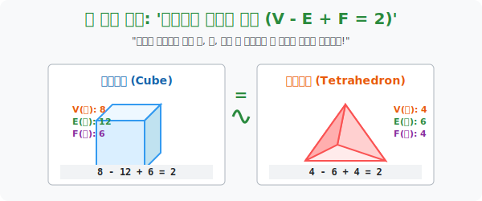

# 4. 결코 변하지 않는 숫자 하나: '오일러의 다면체 정리'

## [도입부] 학습 목표 (Learning Objectives)
- 크기도 변하고, 길이도 변하고, 각도도 변하는 미친 고무판(위상) 우주 속에서, 수학자들이 찾아낸 "절대로 훼손되지 않는 영원불멸의 유전자 숫자", **위상 불변량(Topological Invariant)** 을 경험합니다.
- 점(Vertex), 선(Edge), 면(Face) 의 개수들의 교묘한 덧셈 뺄셈 규칙을 담은 **오일러 공식 ($V - E + F = 2$)** 이 왜 세상의 모든 찌그러진 다면체(기하학) 에 적용되는 절대 진리인지 깨닫습니다.
- 파이썬(Python)의 데이터 딕셔너리로 각종 정다면체의 꼭짓점/모서리/면 데이터를 입력받아 오일러의 상수(2) 가 우주 만물에 침투해 있음을 계산하는 검열 코드를 짜봅니다.

---

## 1. 뼈대만 남기고 다이어트 하라

유클리드 기하학에서 정육면체 큐브(Cube) 와 피라미드 같은 정사면체(Tetrahedron) 는 길이, 각도, 면 부피가 완전히 다르므로 절대 같은 놈으로 취급할 수 없습니다.
그러나 "연결된 상태와 구멍 통로 개수" 만 보는 위상수학자의 눈에는, **정육면체에 펌프로 바람을 불어넣어 부풀리면 둥근 축구공(구) 이 되고, 정사면체에 펌프를 불어도 둥근 축구공이 됩니다.** 즉 둘은 본질적으로 "구멍 없는 (Genus=0) 같은 종족" 입니다.

스위스의 대수학자 레온하르트 오일러(Euler)가 이 찌그러지는 찰흙 속에서, 기적적인 속성을 하나 뽑아냅니다.
"고무로 만든 정다면체를 찌그러뜨려서 뭉개는 동안 길이, 넓이 이런 건 다 버리고, 대신 겉껍질을 이루는 **점, 선, 면 3가지 뼈대의 '개수'** 에 덧뺄셈 마법을 걸면 어떨까?"
그 결과 찾아낸 우주의 거대 비밀이 바로 이것입니다.

> **$V$ (꼭짓점 개수) $-$ $E$ (모서리 개수) $+$ $F$ (면의 개수) $=$ 항상 $\mathbf{2}$**

1. **정육면체 (주사위)**: 점(8개) - 선(12개) + 면(6개) $\rightarrow$ **$8 - 12 + 6 = 2$**
2. **정사면체 (삼각뿔)**: 점(4개) - 선(6개) + 면(4개) $\rightarrow$ **$4 - 6 + 4 = 2$**
3. **정이십면체 (D&D 주사위)**: 점(12개) - 선(30개) + 면(20개) $\rightarrow$ **$12 - 30 + 20 = 2$**

위상수학이 늘리고, 찌그러뜨리고 난리를 쳐도 이 **'2'** 라는 최종 결과값(오일러 지표 $\chi$) 은 무조건 고정되어 있습니다. 그래서 이 숫자를 **'위상 불변량(Invariant)'** 이라고 부릅니다.

<div align="center">
  
</div>

<br>

## 2. 구멍이 하나 파이면, 우주의 법칙이 깨진다

그런데 이 평화롭던 $V - E + F = 2$ 시스템에, 앞서 배운 불법 행위, 즉 **"다면체 가운데에 구멍(Tunnel) 을 하나 대포를 쏴서 뚫어버리면 (Genus=1의 도넛형)"** 어떻게 될까요?

구멍이 파이는 순간, 면과 선의 위상 균형이 박살 나면서 값이 바뀝니다! 도넛 구조의 오일러 지표를 계산해 보면 놀랍게도 **'0'** 이 튀어나옵니다. 
수학자들은 여기서 더 일반화된 거대한 공식을 유도해 냅니다.

> $V - E + F = 2 - 2g$  **(여기서 $g$ 는 구멍의 개수)**
> - 공이나 주사위 (구멍 0개): $2 - 2(0) = \mathbf{2}$
> - 커피머그잔/도넛 (구멍 1개): $2 - 2(1) = \mathbf{0}$
> - 프레첼 (구멍 3개): $2 - 2(3) = \mathbf{-4}$

건축 그래픽 렌더링에서 폴리곤(면) 과 버텍스(점) 개수를 계속 깎아내는 최적화(Decimation) 작업을 할 때 시스템은 틈틈이 이 오일러 공식이 망가졌는지(모델링 껍질에 오류 구멍이 났는지) 를 이 숫자 2와 0을 통해 모니터링합니다.

---

## 3. 💻 파이썬(Python) 3D 모델오일러 검증기

마야(Maya) 나 언리얼 엔진(Unreal) 과 같이 폴리곤 면과 점, 선을 이어 붙이는 3D 렌더링 코어에서, 개발자가 만든 입체 모형에 치명적인 '구멍 버그' 나 '면 인식 오류' 가 나지 않았는지 오일러의 식 $V-E+F$ 을 돌려 구조를 진단합니다.

### 🐍 파이썬 예제: 폴리곤 모델 오일러 불변량 체커 로직

```python
print("--- 📐 3D 렌더링 엔진: 폴리곤 모델 위상 결함 판독기 (Euler Checker) ---")

# 게임이나 수학 시간에 다루는 여러 폴리곤 다면체 오브젝트 데이터
# 구조: {모델명: (단위 점 Vertex 수, 단위 선방향 Edge 수, 면 Face 수)}
polyhedron_models = {
    "정사면체(Tetrahedron)": (4, 6, 4),
    "정육면체/큐브(Hexahedron)": (8, 12, 6),
    "정팔면체(Octahedron)": (6, 12, 8),
    "정이십면체(Icosahedron)": (12, 30, 20),
    "버그난괴물상자(Bugged_Box)": (8, 11, 6) # 선 하나가 끊어져 버린 나쁜 객체
}

print(" [진단 시작] 오일러의 상수인 '2' 를 뱉어내는지 점검합니다...")
print("-" * 50)

for model_name, (v, e, f) in polyhedron_models.items():
    # 오일러 지표 (Euler Characteristic): X = V - E + F
    euler_chi = v - e + f
    
    print(f" 📦 3D 모델: {model_name}")
    print(f"    - 데이터 (V:{v}, E:{e}, F:{f}) -> 계산식: {v} - {e} + {f} = [{euler_chi}]")
    
    if euler_chi == 2:
        print("    ✅ [형태 정상] 위상수학적인 에러가 없으며 완벽히 바람을 불면 '둥근 공' 형태가 됩니다.")
    else:
        print("    🚨 [치명적 렌더링 오류] 폴리곤 구조가 붕괴되었습니다!")
        print("       (선분이 제대로 모서리를 맺지 못했거나 메시에 구멍(Torus)이 물리적으로 뚫림)")
    print("")

# 결과창:
# --- 📐 3D 렌더링 엔진: 폴리곤 모델 위상 결함 판독기 (Euler Checker) ---
#  [진단 시작] 오일러의 상수인 '2' 를 뱉어내는지 점검합니다...
# --------------------------------------------------
#  📦 3D 모델: 정사면체(Tetrahedron)
#     - 데이터 (V:4, E:6, F:4) -> 계산식: 4 - 6 + 4 = [2]
#     ✅ [형태 정상] 위상수학적인 에러가 없으며 완벽히 바람을 불면 '둥근 공' 형태가 됩니다.
# 
#  📦 3D 모델: 정이십면체(Icosahedron)
#     - 데이터 (V:12, E:30, F:20) -> 계산식: 12 - 30 + 20 = [2]
#     ✅ [형태 정상] 완벽
# 
#  📦 3D 모델: 버그난괴물상자(Bugged_Box)
#     - 데이터 (V:8, E:11, F:6) -> 계산식: 8 - 11 + 6 = [3]
#     🚨 [치명적 렌더링 오류] 폴리곤 구조가 붕괴되었습니다!
```

이 알고리즘은 실제 의료 영상, 즉 CT 나 MRI 데이터를 통해 생성된 혈관의 3D 튜브 렌더링 도면이 중간에 피가 새 거나 막힌 곳(Topology Error) 없이 매끄럽게 잘 모델링되었는지를 판별하는 1차원 자동 진단 코어의 베이스입니다.

---

## [결론] 학습 정리 (Summary)

1. **위상 불변량(Topological Invariant)**: 고무판 위에서 형태를 아무리 찌그러뜨리고 변환해도, 오직 찢거나 구멍 뚫지만 않으면 절대로 그 값이 변하지 않는 고유한 수학적 지문(숫자) 입니다.
2. **오일러 공식 ($V-E+F=2$)**: 구멍이 없는(공 모양으로 부풀려지는) 모든 다면체(폴리곤 객체) 우주에서는 꼭짓점 빼기 방사 선분 더하기 면적이 항상 '2' 로 귀결되는 기하학적 신비의 지배를 받습니다.
3. 구멍이 늘어나면 이 숫자가 깎여 내려가며, 3D 그래픽 엔진(OpenGL, Unity) 은 이 오일러 상수 변동을 계산해, 메가 폴리곤 모델의 표면에 픽셀 텍스쳐 파핑이나 충돌 영역 연산 붕괴가 없는지를 방어하고 있습니다.
