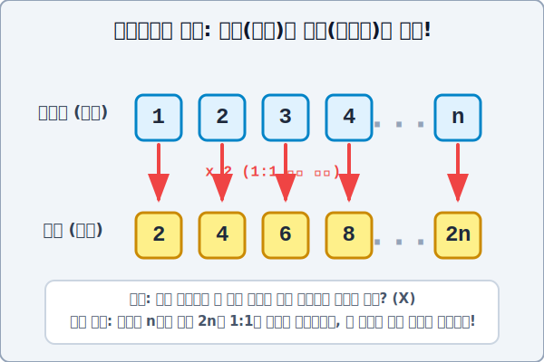

# 03. 부분은 전체와 같다: 갈릴레오의 역설(Galileo's Paradox)

## 1. 학습 목표 (Learning Objectives)
* 인간의 상식을 지배하던 유클리드의 제1공리 "전체는 어떤 부분보다도 항상 크다"라는 명제가 무한대의 세계에서 어떻게 산산조각 붕괴하는지 목격합니다.
* 자연수(전체)와 그 절반에 불과한 짝수(부분)가 수천 가닥의 1대1 매핑(Mapping) 밧줄로 연결되는 갈릴레오의 무한 집합 역설 다이어그램(SVG)을 추적합니다.

## 2. 유클리드의 대원칙: 부분 < 전체
수천 년 동안 인류를 지배한 기하학과 철학의 제일원칙(공리) 중에는 위대한 고대 수학자 유클리드의 명언이 있습니다.
> **"전체는 그 한 부분보다 항상 크다! (The whole is strictly greater than the part!)"**

너무나 당연한 말이죠? 사과 10알(전체)이 담긴 바구니에서 절반을 떼어낸 사과 5알(부분) 뭉치는 결코 전체 10알의 크기를 이길 수 없습니다. 그런데 17세기, 지동설로 유명한 천재 과학자 **갈릴레오 갈릴레이(Galileo Galilei)** 가 자신의 저서에서 이 진리에 기괴한 균열을 냅니다.

## 3. 갈릴레오의 직관 폭격: "자연수 vs 짝수"
갈릴레오가 다음과 같은 두 개의 숫자 상자를 들이댑니다.
* A 상자 (자연수: 전체) : `1, 2, 3, 4, 5, 6, 7, 8, ... ∞`
* B 상자 (짝수: 부분) : `2, 4, 6, 8, ... ∞` (A상자에서 짝수만 빼냄)

상식적으로 B 상자(짝수)는 A 상자(전체 자연수)의 정확히 '절반'에 불과한 소규모 부분 파편입니다. 따라서 당연히 전체인 A상자의 무한 크기가 훨씬 커야 합니다.

하지만 갈릴레오는 미소 지으며 **1:1 대응 짝짓기 파이프라인(기능)** 인 곱하기 규칙 $f(x) = 2x$ 밧줄을 묶어버립니다.

  

**[칸토어식 1:1 해킹 결과]**
* 자연수 `1` $\rightarrow$ 짝수 `2` 로 연결 ($1 \times 2$)
* 자연수 `2` $\rightarrow$ 짝수 `4` 로 연결 ($2 \times 2$)
* 자연수 `3` $\rightarrow$ 짝수 `6` 로 연결 ($3 \times 2$)
* 자연수 `100억` $\rightarrow$ 짝수 `200억` 으로 연결 ($100억 \times 2$)
* 자연수 $\mathbf{n}$ $\rightarrow$ 짝수 $\mathbf{2n}$ 으로 영원히 연결!

어떤 초거대 자연수(1조 경..)를 가져와도, 우리는 파이썬 컴퓨터 함수처럼 그냥 `x 2` 만 돌려주면, 아무도 선점하지 않은 새로운 '초거대 짝수' 녀석과 잔여 인원 한 명 없이 완벽하게 1:1 커플 매칭을 영원토록 해낼 수 있습니다!!

## 4. 직관의 붕괴와 칸토어의 확립
갈릴레오는 충격적인 사실을 도출해 내고도 무한을 다루길 주저하며, "어휴, 그러니까 인간의 머리로는 무한에 크다 작다를 비교하면 안 돼!" 하고 피장파장의 결론으로 물러나 버렸습니다. 

하지만 앞선 00장에서 배운 미친 천재 **칸토어(Cantor)** 는 이 역설을 피하지 않고 오직 수학적 바구니 정리법으로 완전히 뒤집어 판결해 버립니다.
> **칸토어 집합론의 진리**
> "역설이 아니라 이게 진짜 사실(Fact)이다! 무한의 세계에 진입하면, 유클리드의 상식 따윈 터져버린다. **어떤 집합의 일부를 떼어낸 부분 집합이 본래의 원래 전체 덩어리 집합과 1:1 일대일 짝짓기(동급 크기)가 완전히 빙의되는 현상! 그것이 바로 그 덩어리가 수학적인 『무한(Infinity)』 집합임을 증명해 내는 유일한 기준이자 성질이다!!**"

부분이 전체와 동급의 위력을 가질 수 있다는 이 소름 끼치는 사실이야말로, 인간의 뇌가 시공간의 무한성을 직관이 아닌 철저한 코드(식)의 계산을 통해서만 다뤄낼 수 있음을 압도적으로 증명한 수학의 아름다움입니다.

## 5. 학습 정리 (Summary)
1. **부분 $\mathbf{=}$ 전체의 역설**: 전체 집합 속에 포함된 일부분(짝수)이더라도, 수학 곱셈 규칙($y=2x$) 하나만으로 모든 전체 원소(자연수)와 빈틈없이 끝없이 1대1 튜플 결속이 가능하므로 두 무한은 크기가 완벽히 같습니다.
2. **무한 집합의 진정한 정의**: 갈릴레오가 피했던 이 역설적 모순 현상을, 칸토어는 도리어 집합론의 잣대로 사용하여 **"자기 자신의 진부분집합과 일대일 대응이 가능한 기괴한 성질을 가진 집합이야말로 진짜 '무한 집합'이다"** 라고 확립하는 기초 토대가 되었습니다.
