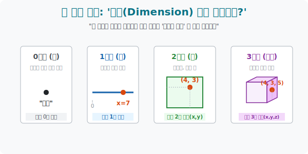

# 1. 좌표의 개수가 우주를 결정한다: '차원(Dimension)'

## [도입부] 학습 목표 (Learning Objectives)
- '차원' 이라는 단어가 공상과학 영화의 마법 공간이 아니라, 수학적으로 **"네 위치를 정확히 설명하기 위해 필요한 '숫자(좌표)' 의 최소 개수"** 라는 매우 건조하고 논리적인 정의임을 깨닫습니다.
- 0차원(점) 에서 시작해 선, 면, 공간으로 뻗어 나가는 좌표계의 진화 과정을 컴퓨터 배열(Array) 의 길이에 빗대어 완벽히 이해합니다.
- 파이썬(Python)의 `NumPy` 배열 차원(shape) 출력을 통해, 프로그래머들이 데이터의 차원을 1D, 2D, 3D 텐서(Tensor) 로 다루는 실전 감각을 장비합니다.

---

## 1. 개미의 우주와 드론의 우주

누군가 당신에게 "지금 어디 있어?" 라고 물었을 때, 당신이 살고 있는 우주가 몇 차원이냐에 따라 대답의 길이가 달라집니다.

* **0차원의 우주 (점)**: 이동 자체가 불가능합니다. 크기도 방향도 없는 완벽한 구속의 세계. 대답은 그냥 **"나 여기 있어"** 입니다. 숫자는 0개 필요합니다.
* **1차원의 우주 (선)**: 당신은 앞뒤로만 움직일 수 있는 기찻길 위의 개미입니다. 대답은 **"기준점(역) 에서 기찻길 따라 7km 앞에 있어"** 입니다. 거리라는 **숫자 1개($x$)** 만 있으면 위치가 결정됩니다.
* **2차원의 우주 (면)**: 당신은 넓은 체스판이나 빙판 위를 미끄러지는 피겨스케이팅 선수입니다. 대답은 **"가로로 4칸, 세로로 3칸 위치에 있어"** 입니다. 좌표 **숫자 2개($x, y$)** 가 필요합니다.
* **3차원의 우주 (공간)**: 당신은 하늘을 나는 드론입니다. 체스판 위 허공에 떠 있습니다. 대답은 **"가로 4칸, 세로 3칸 지점에서, 고도 5m 높이에 떠 있어"** 입니다. 좌표 **숫자 3개($x, y, z$)** 가 필요합니다.

**[차원의 절대 정의]**
> 차원(Dimension) 이란, 어떤 공간에서 특정 물체의 위치를 완벽하게 특정하기 위해 **구별해야 하는 '독립적인 좌표(숫자)' 의 개수**입니다.



<br>

## 2. 컴퓨터 과학에서의 차원 (Tensor)

우리는 인간이라 3차원까지밖에 눈으로 볼 수 없지만, 컴퓨터는 차원의 한계가 없습니다. 숫자를 콤마(,) 로 계속 이어 붙이기만 하면 100차원의 우주도 거뜬히 만들어냅니다.

머신 러닝에서 인공지능이 강아지 사진 1장을 분석할 때, 그 사진은 몇 차원일까요?
우리가 볼 땐 2차원 '평면' 사진 같지만, 컴퓨터는 색상값까지 고려하여 이렇게 분석합니다.
> **(세로 1920 픽셀, 가로 1080 픽셀, 색상 RGB 3채널)**
> "이 데이터는 3개의 독립된 숫자가 좌표계를 이루는 **3차원 데이터 배열(3D Tensor)** 이군!"

만약 이 강아지 사진이 1초에 60장씩 나오는 10초짜리 동영상이라면 어떨까요?
> **(시간 프레임 600개, 세로 1920, 가로 1080, 색상 RGB 3)**
> $\rightarrow$ 시간이라는 축이 하나 더 추가되어 **4차원 공간(4D Tensor)** 에 데이터가 안착합니다.

---

## 3. 💻 파이썬(Python) 배열 차원 스캐너

파이썬의 인공지능 필수 라이브러리인 NumPy 에서는 배열의 차원을 `.ndim` (Number of Dimensions) 이라는 변수로 관리합니다. 변수가 겹겹이 쌓인 대괄호 `[[[]]]` 를 보며 프로그램이 차원을 인식하는 법을 살펴봅시다.

### 🐍 파이썬 예제: N-차원 텐서(Tensor) 스캐닝

```python
import numpy as np

print("--- 📡 매트릭스 스캐너: 데이터 차원 판독기 연동 ---")

# 1. 0차원 (스칼라: 단일 숫자 한 개) - 점
data_0d = np.array(42)

# 2. 1차원 (벡터: 숫자들의 리스트) - 선 (기찻길)
data_1d = np.array([10, 20, 30, 40])

# 3. 2차원 (행렬: 표, 모니터 픽셀) - 면 (엑셀 시트)
data_2d = np.array([
    [1, 2, 3],
    [4, 5, 6]
])

# 4. 3차원 (텐서: 큐브, 동영상 프레임 더미) - 공간
data_3d = np.array([
    [ [1,2], [3,4] ],
    [ [5,6], [7,8] ]
])

# AI 가 해석하는 차원(ndim) 판독
print(f" [0D] 스칼라 데이터의 차원 : {data_0d.ndim} 차원 / 형태: {data_0d.shape}")
print(f" [1D] 벡터 궤도선의 차원   : {data_1d.ndim} 차원 / 형태: {data_1d.shape}")
print(f" [2D] 매트릭스 평면의 차원 : {data_2d.ndim} 차원 / 형태: {data_2d.shape}")
print(f" [3D] 큐브 공간의 차원     : {data_3d.ndim} 차원 / 형태: {data_3d.shape}")

print("-" * 50)
print(" 💡 [해커의 진실] 컴퓨터에게 차원이란, \n    데이터를 감싸고 있는 껍질(대괄호 '[' )의 깊이 뎁스(Depth) 와 일치합니다.")

# 결과창:
# --- 📡 매트릭스 스캐너: 데이터 차원 판독기 연동 ---
#  [0D] 스칼라 데이터의 차원 : 0 차원 / 형태: ()
#  [1D] 벡터 궤도선의 차원   : 1 차원 / 형태: (4,)
#  [2D] 매트릭스 평면의 차원 : 2 차원 / 형태: (2, 3)
#  [3D] 큐브 공간의 차원     : 3 차원 / 형태: (2, 2, 2)
# --------------------------------------------------
#  💡 [해커의 진실] 컴퓨터에게 차원이란, 
#     데이터를 감싸고 있는 껍질(대괄호 '[' )의 깊이 뎁스(Depth) 와 일치합니다.
```

데이터베이스 시스템(SQL) 이나 엑셀 스레드시트는 완벽한 '2차원 공간' 의 대표 주자입니다. 행(Row) 과 열(Column) 2개의 숫자만 주면 정확히 어떤 셀인지 저격할 수 있기 때문입니다. 

---

## [결론] 학습 정리 (Summary)

1. **차원의 본질**: 차원이란, 공간 내에서 상대방에게 나침반 위치를 알려주기 위해 필요한 '숫자의 총개수 (자유도의 개수)' 이며 마법의 공간 같은 것이 아닙니다. 
2. **0부터 3차원까지**: 점$(0) \rightarrow$ 방향만 있는 선$(x) \rightarrow$ 넓이가 생긴 면$(x, y) \rightarrow$ 부피가 생긴 입체 공간$(x, y, z)$ 으로 진화하며 변수값이 하나씩 늘어납니다.
3. 이 차원의 확장을 프로그래밍 언어의 배열(Array) 시스템이 완벽하게 이어받았으며, 인공지능은 100만 차원(변수 100만 개) 의 공간에서도 수학적 거리 공식 하나로 유사도(가까운 정도) 를 측정해 내고 있습니다.
