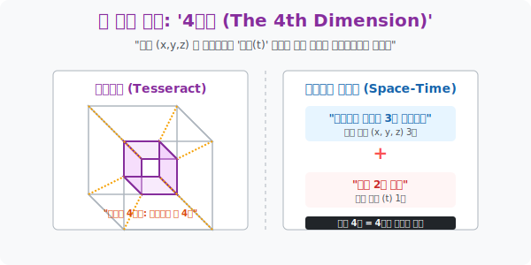

# 2. 시간을 찢는 수학적 상상: '4차원의 세계'

## [도입부] 학습 목표 (Learning Objectives)
- 공간적 3차원에 더해진 '시간(Time)' 이라는 4번째 축을 통해 아인슈타인의 **'4차원 시공간(Spacetime)'** 의 개념을 일상생활의 '약속 잡기' 로 완벽하게 비유하여 이해합니다.
- 기하학적으로 "모서리가 수직으로 직교하는 4번째 가상의 평면" 을 상상해 구현해 낸 4차원 입방체, **테서랙트(Tesseract, 초입방체)** 의 투영 원리를 파악합니다.
- 파이썬(Python)으로 $x, y, z, t$ 의 4차원 좌표 데이터를 가진 운송장(택배 배송) 객체를 모델링하여, 컴퓨터 메모리 어레이 안에서 4차원 우주가 어떻게 관리되는지 구축해 봅니다.

---

## 1. 약속을 잡는 완벽한 좌표 (물리학적 4차원)

당신이 친구와 약속을 잡습니다. 
"우리 강남역 스타벅스 3층에서 만나자!" 
이 문장에는 3차원 우주의 정보 좌표 3개가 모두 들어있습니다. 
> 1. 경도 (x축 - 동서)
> 2. 위도 (y축 - 남북)
> 3. 건물 층수 (z축 - 고도)

자, 당신은 이 공간 3차원 좌표 $(x, y, z)$ 에 정확히 도착했습니다. 하지만 문제가 생겼습니다. 친구가 보이지 않습니다!
**왜냐하면 '언제(Time)' 만나는지에 대한 정보가 빠졌기 때문입니다.**

"내일 오후 3시" 라는 4번째 숫자가 입력되는 순간, 비로소 인간계의 이벤트(사건) 가 성립합니다. 
우주의 모든 물질과 사건을 특정하기 위해서는 위치 3개와 시간 1개, 즉 $x, y, z, t$ 라는 4개의 좌표계가 절대적으로 필요합니다. 아인슈타인은 이 4개의 실을 엮어 우리가 사는 우주를 **'4차원 시공간(4D Space-Time Continuum)'** 이라 정의했습니다. 

<br>

## 2. 테서랙트: 기하학적 4차원 (하이퍼큐브)

물리학적인 시간이 아니라, 순수한 수학 기하학에서 4차원 도형을 만들 수는 없을까요?
* 점(0차원) 이 직선으로 슬라이딩하면 $\rightarrow$ 선(1차원)
* 선(1차원) 이 수직(+90도) 으로 슬라이딩하면 $\rightarrow$ 면(2차원 정사각형)
* 면(2차원) 이 공중으로 수직(+90도) 슬라이딩하면 $\rightarrow$ 입체(3차원 정육면체 큐브)

그렇다면 **3차원의 큐브를, 우리가 볼 수 없는 가상의 제4의 수직 방향으로 슬라이딩시키면?**
만들어진 것이 바로 4차원 입방체인 **테서랙트(Tesseract)** 입니다. 영화 <인터스텔라> 후반부에 서재 벽 뒤편 시간의 방을 시각적으로 구현했던 그 기이하게 일렁이던 정육면체 겹겹의 방들이 수학적 하이퍼큐브의 단면을 상상해 렌더링한 것입니다.
우리는 3차원 생명체라 4차원 도형을 볼 수 없지만, 그림자가 3차원의 종이 위에 2차원으로 맺히듯, 스크린 위에 4차원 큐브의 '그림자 패턴' 을 선으로 그어 추측할 뿐입니다.



---

## 3. 💻 파이썬(Python) 4D 텐서 물류 트래킹 

운송 회사 시스템(쿠팡, 아마존) 백엔드에서는 드론이나 트럭의 배달 상태를 실시간으로 저장합니다. "어떤 물체가, 어느 3차원 위치에, 어느 시간에 있었는가?" 를 담은 거대한 $4D$ 좌표 구조를 클래스(Class) 로 짜봅니다.

### 🐍 파이썬 예제: 4차원 시공간(Spacetime) 데이터 구조체

```python
import time

print("--- 📦 글로벌 물류 트래커: 4차원 시공간 로깅 엔진 ---")

# 4차원 시공간 이벤트를 기록하는 커스텀 패킷
class SpacetimeEvent:
    def __init__(self, item_name, x, y, z, t_timestamp):
        self.item = item_name
        self.x = x          # 경도 (Longitude)
        self.y = y          # 위도 (Latitude)
        self.z = z          # 고도/층수 (Altitude)
        self.t = t_timestamp # 타임스탬프 (Time)
        
    def display_event(self):
        # 파이썬 시간을 인간이 읽을 수 있게 변환
        readable_time = time.strftime('%Y-%m-%d %H:%M:%S', time.localtime(self.t))
        print(f" [상태 로그] 물품: '{self.item}'")
        print(f"    -> 우주 좌표 (X:{self.x}, Y:{self.y}, Z:{self.z}m)")
        print(f"    -> 시간 좌표 (T:{readable_time})")
        print("-" * 50)

# 현재 시각(t축 좌표)을 캡처
current_t = time.time()

# 4차원 우주에 데이터 2개를 투입(기록)
event1 = SpacetimeEvent("드론 화물 A", x=37.5665, y=126.9780, z=50, t_timestamp=current_t)

# 2시간 뒤(7200초), 드론이 위치를 이동한 다른 4차원 좌표
event2 = SpacetimeEvent("드론 화물 A", x=37.5700, y=126.9800, z=15, t_timestamp=current_t + 7200)

event1.display_event()
event2.display_event()

print(" 💡 [시스템 요약] 두 이벤트는 x, y, z 공간 좌표도 다르지만,")
print("    가장 중요한 t(시간) 축 레이어에서 완전히 다른 차원의 레이스(Trace)를 긋고 있습니다.")

# 결과창:
# --- 📦 글로벌 물류 트래커: 4차원 시공간 로깅 엔진 ---
#  [상태 로그] 물품: '드론 화물 A'
#     -> 우주 좌표 (X:37.5665, Y:126.978, Z:50m)
#     -> 시간 좌표 (T:2026-03-07 19:42:01)
# --------------------------------------------------
#  [상태 로그] 물품: '드론 화물 A'
#     -> 우주 좌표 (X:37.57, Y:126.98, Z:15m)
#     -> 시간 좌표 (T:2026-03-07 21:42:01)
# --------------------------------------------------
#  💡 [시스템 요약] 두 이벤트는 x, y, z 공간 좌표도 다르지만,
#     가장 중요한 t(시간) 축 레이어에서 완전히 다른 차원의 레이스(Trace)를 긋고 있습니다.
```

자율주행 자동차의 라이다(LiDAR) 시스템은 앞차의 현재 위치(x, y, z) 와 함께 수 밀리초 전의 과거 위치(t) 들을 연속된 4D 베지어 곡선 배열로 들고 다니며 충돌 여부를 수학 매트릭스로 계산합니다.

---

## [결론] 학습 정리 (Summary)

1. **물리적 4차원**: 우리 우주(물질 세계) 는 가로, 세로, 높이라는 3차원 공간 틀 위에, 변화의 궤적을 기록하는 '시간($t$)' 이라는 차원이 단단히 융합되어 있는 4차원의 세계입니다.
2. **기하학적 4차원 (테서랙트)**: 눈에 보이지 않는 제4의 축 방향을 상상으로 설정하여, 3차원 정육면체를 4차원으로 팽창시킨 '하이퍼큐브' 가 존재하며, 그 그림자를 통해 고차원 그래픽스를 이해할 수 있습니다.
3. 4차원에 진입할 때 일상에서의 괴리감이 크게 느껴지지만, 파이썬 배열 리스트에 콤마(,) 를 하나 찍고 매개변수를 하나 추가하는 단순 행위가 프로그래밍 관점에서의 완벽한 4차원 공간 다이브입니다.
